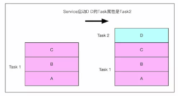
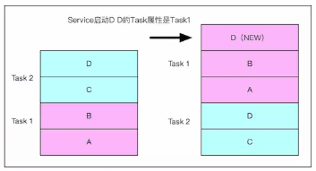
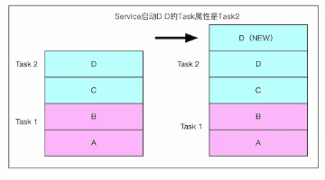
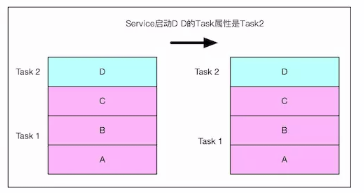
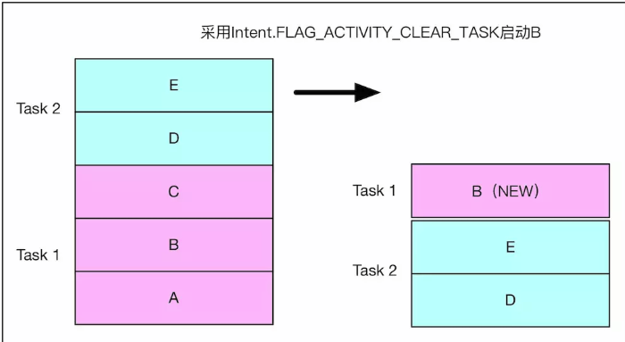
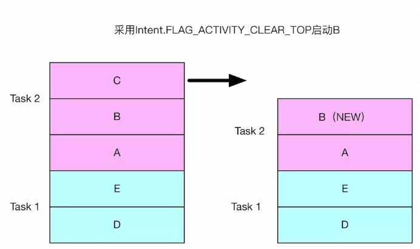
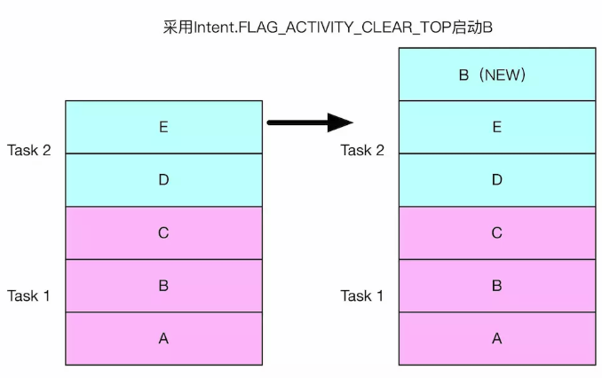
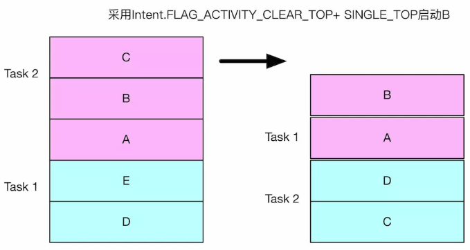
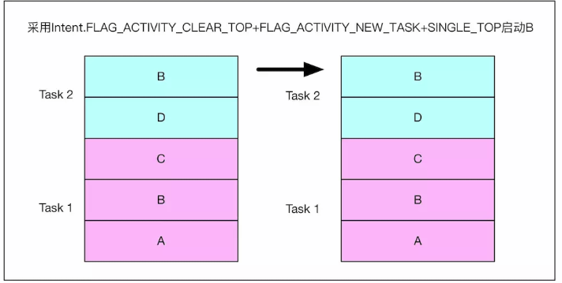
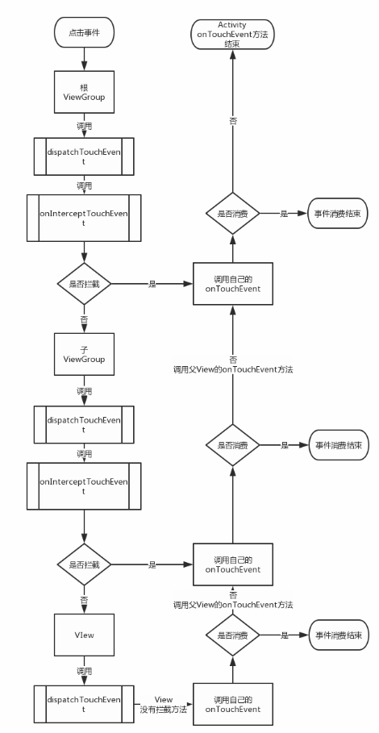

[TOC]


## Activity

### 1.Activity的启动流程


### 2.app的启动流程


### 3.启动模式相关知识

* standard：标准启动模式（默认启动模式），每次都会启动一个新的activity实例。
* singleTop：单独使用使用这种模式时，如果**Activity实例位于当前任务栈顶**，就重用栈顶实例，而不新建，并回调该实例onNewIntent()方法，否则走新建流程。
* singleTask：这种模式启动的Activity**只会存在相应的Activity的taskAffinit任务栈中**，同一时刻系统中只会存在一个实例，已存在的实例被再次启动时，会重新唤起该实例，并清理当前Task任务栈该实例之上的所有Activity，同时回调onNewIntent()方法。
* singleInstance：这种模式启动的Activity独自占用一个Task任务栈，同一时刻系统中只会存在一个实例，已存在的实例被再次启动时，只会唤起原实例，并回调onNewIntent()方法。


#### **taskAffinity**属性

* 若activity没有设置taskAffinity属性，则activity的启动task名为应用包名。
* 若activity设置了taskAffinity属性，但启动flag必须要设置为**FLAG_ACTIVITY_NEW_TASK**，才会生效。


#### Intent.FLAG_ACTIVITY_NEW_TASK

* 非Activity启动的Activity（比如Service或者通知中启动的Activity）需要显示的设置Intent.FLAG_ACTIVITY_NEW_TASK

* singleTask及singleInstance在AMS中被预处理后，隐形的设置了Intent.FLAG_ACTIVITY_NEW_TASK

* FLAG_ACTIVITY_NEW_TASK与taskAffinity各种启动情况

  * A、B、C均默认taskAffinity值，并在task1中启动，D设置了新的taskAffinity值。若在C中使用FLAG_ACTIVITY_NEW_TASK标志启动D，会新建D，放在新的task2中。

    

    

  * A、B、D均默认taskAffinity值，并在task1中启动，C设置了新的taskAffinity值，若在B中采用FLAG_ACTIVITY_NEW_TASK标志启动C，C会在新的task2中启动。

    * 在C中启动D，这时会新建D并进入task2。

    * 若在C中使用FLAG_ACTIVITY_NEW_TASK标志启动D，由于D的taskAffinity为默认值，则回去查找task1是否已经存在，则将task1栈移到最前面，并新建D放入task1中。

    

    

  * A、B为默认taskAffinity值，并在task1中启动，C、D设置了新的taskAffinity值。采用FLAG_ACTIVITY_NEW_TASK标志启动C和D，C、D会在新的task2中启动。若在D中再次启动D，则会新建D并放入到task2中。

    

    

  * A、B、C为默认taskAffinity值，并在task1中启动，D设置了新的taskAffinity值。采用FLAG_ACTIVITY_NEW_TASK标志启动D,D会在新的task2中启动。若在D中再次启动D，这个时候并不会再新建D，而是直接使用D，不会回调任何方法。

    

* **总结：** 

  * 目标栈的确定，如果未使用FLAG_ACTIVITY_NEW_TASK标志启动，目标栈为启动它的当前栈；若使用了标志启动，目标栈与taskAffinity相关。
  * 如果新启动的Activity找不到目标Task自然会启动Task，
  * 如果目标task栈的栈根Activit的intent同将要启动的Activit相同，就不启动新Activity（不做任何操作），否则启动Activity。


#### Intent.FLAG_ACTIVITY_CLEAR_TASK

* FLAG_ACTIVITY_CLEAR_TASK属性必须同FLAG_ACTIVITY_NEW_TASK属性配合使用。

* 如果设置了FLAG_ACTIVITY_NEW_TASK|FLAG_ACTIVITY_CLEAR_TASK，若目标task已存在，则清空已存在的目标task，然后新建Activity作为根Activity。

* FLAG_ACTIVITY_CLEAR_TASK的优先级最高，基本可以无视所有的配置，包括启动模式及Intent Flag，哪怕是singleInstance也会被finish，并重建。

  


#### Intent.FLAG_ACTIVITY_CLEAR_TOP

##### 只设置了FLAG_ACTIVITY_CLEAR_TOP标志

分两种情况：

* 若当前栈中存在将要新建的Activity，则将该Activity上面的所有Activity出栈，该Activity也finish掉，之后创建新的入栈。

  

  

* 若当前栈中没有要新建的Activity，则新建入栈。

  

  

##### FLAG_ACTIVITY_CLEAR_TOP与FLAG_ACTIVITY_SINGLE_TOP配合使用

* 当前栈中存在要新建的Activity，则将该Activity上面的所有Activity出栈，但不会finish该Activity，而是直接回调B的onNewIntent()。




##### FLAG_ACTIVITY_CLEAR_TOP与FLAG_ACTIVITY_NEW_TASK配合使用

* 若将要启动的Activity的目标栈存在，则将该task移到前面。

* 若目标栈中存在要新建的Activity，则将该Activity上面的所有Activity出栈，该Activity也finish掉，之后创建新的入栈。

  

  

##### FLAG_ACTIVITY_CLEAR_TOP、FLAG_ACTIVITY_NEW_TASK、FLAG_ACTIVITY_SINGLE_TOP配合使用

分两种情况：

* 如果当前栈的topActivity不是将要启动的Activity，会去目标Task中去找，并将该Activity上面的所有Activit以及自身都finish掉，之后创建新的入栈。（同FLAG_ACTIVITY_CLEAR_TOP与FLAG_ACTIVITY_NEW_TASK一样）

* 如果当前栈的topActivity是将要启动的Activity，就直接回调topActivity的onNewIntent，无论topActivity是不是在目标Task中。

  


#### Intent.FLAG_ACTIVITY_SINGLE_TOP

* FLAG_ACTIVITY_SINGLE_TOP多用来做辅助作用，和singleTop启动模式一样。


**【参考】**：

[Android面试官装逼失败之：Activity的启动模式](https://www.jianshu.com/p/b3a95747ee91)


## Service


## View

### 1.View绘制流程


### 2.View事件分发机制

* 一次事件序列包括：一次**ACTION_DOWN**、一次**ACTION_UP**、以及数量不定的**ACTION_MOVE**

  

* 事件分发过程通过**dispatchTouchEvent**、**onInterceptTouchEvent**、**onTouchEvent**三个方法共同完成

  * dispatchTouchEvent：此方法的返回结果受当前View的onTouchEvent和下级View的dispatchTouchEvent方法的影响，表示是否消耗当前时间。
  * onInterceptTouchEvent：如果当前View拦截了某个事件，那么同一个事件序列当中，此方法不会被再次调用，且交由当前View的onTouchEvent处理。
  * onTouchEvent：在dispatchTouchEvent进行调用，返回true表示事件被消费，本次事件终止，不在向下传递。返回false表示事件不消费，交给父级View的onTouchEvent处理，并且当前View无法接收到当前事件同一事件序列的后续事件。

  

* 事件发生时，最先由Activity接收，然后再一层层的向下层传递，直到找到合适的处理控件。

  * > ACTIVITY －> PHONEWINDOW －> DECORVIEW －> VIEWGROUP －> … －> VIEW

  * 如果事件传递到最后的View还是没有找到合适的View消费事件，那么事件就会向相反的方向传递，最终传递给Activity，如果最后 Activity 也没有处理，本次事件才会被抛弃.

    > ACTIVITY <－ PHONEWINDOW <－ DECORVIEW <－ VIEWGROUP <－ … <－ VIEW

    

* 事件分发流程图。

  

#### View事件分发源码

```java
class ViewGroup:
    public boolean dispatchTouchEvent(MotionEvent ev) {
        ...
        final int action = ev.getAction();
        final int actionMasked = action & MotionEvent.ACTION_MASK;

        if (actionMasked == MotionEvent.ACTION_DOWN) {
            cancelAndClearTouchTargets(ev);
            //清除FLAG_DISALLOW_INTERCEPT设置并且mFirstTouchTarget 设置为null
            resetTouchState();
        }
        // Check for interception.
        final boolean intercepted;//是否拦截事件
        if (actionMasked == MotionEvent.ACTION_DOWN
                || mFirstTouchTarget != null) {
            //FLAG_DISALLOW_INTERCEPT是子View通过
            //requestDisallowInterceptTouchEvent方法进行设置的
            final boolean disallowIntercept = (mGroupFlags & FLAG_DISALLOW_INTERCEPT) != 0;
            if (!disallowIntercept) {
                //调用onInterceptTouchEvent方法判断是否需要拦截
                intercepted = onInterceptTouchEvent(ev);
                ev.setAction(action); // restore action in case it was changed
            } else {
                intercepted = false;
            }
        } else {
            intercepted = true;
        }
        ...
    }
```

****

**结论：**

1. 当ViewGroup不拦截事件，交由子元素去处理，那么mFirstTouchTarget不为null。反之，mFirstTouchTarget=null，当MOVE、UP事件到来，不会再调用onInterceptTouchEvent方法来判断是否拦截，而且事件都交给它自身处理。

2. 如果事件由子View去处理时mFirstTouchTarget 会被赋值并指向子View

3. 子View可以通过requestDisallowInterceptTouchEvent方法干预父View的事件分发过程（**ACTION_DOWN事件除外**）。（联想：滑动冲突事件的解决，[见3](#View滑动冲突)）

   原因：ACTION_DOWN事件，拦截标志重置，mFirstTouchTarget 设置为null。DOWN事件ViewGroup都会调用自己的onInterceptTouchEvent来询问是否拦截。

   

**当ViewGroup不拦截事件，那么事件将下发给子View进行处理。**

```java
class ViewGroup:
    public boolean dispatchTouchEvent(MotionEvent ev) {
        final View[] children = mChildren;
        //对子View进行遍历
        for (int i = childrenCount - 1; i >= 0; i--) {
            final int childIndex = getAndVerifyPreorderedIndex(
                    childrenCount, i, customOrder);
            final View child = getAndVerifyPreorderedView(
                    preorderedList, children, childIndex);

            if (childWithAccessibilityFocus != null) {
                if (childWithAccessibilityFocus != child) {
                    continue;
                }
                childWithAccessibilityFocus = null;
                i = childrenCount - 1;
            }

            //判断1，View可见并且没有播放动画。2，点击事件的坐标落在View的范围内
            //如果上述两个条件有一项不满足则continue继续循环下一个View
            if (!canViewReceivePointerEvents(child)
                    || !isTransformedTouchPointInView(x, y, child, null)) {
                ev.setTargetAccessibilityFocus(false);
                continue;
            }

            newTouchTarget = getTouchTarget(child);
            //如果有子View处理即newTouchTarget 不为null则跳出循环。
            if (newTouchTarget != null) {
                newTouchTarget.pointerIdBits |= idBitsToAssign;
                break;
            }

            resetCancelNextUpFlag(child);
            //dispatchTransformedTouchEvent第三个参数child这里不为null
            //实际调用的是child的dispatchTouchEvent方法
            if (dispatchTransformedTouchEvent(ev, false, child, idBitsToAssign)) {
                mLastTouchDownTime = ev.getDownTime();
                if (preorderedList != null) {
                    for (int j = 0; j < childrenCount; j++) {
                        if (children[childIndex] == mChildren[j]) {
                            mLastTouchDownIndex = j;
                            break;
                        }
                    }
                } else {
                    mLastTouchDownIndex = childIndex;
                }
                mLastTouchDownX = ev.getX();
                mLastTouchDownY = ev.getY();
                //当child处理了点击事件，那么会设置mFirstTouchTarget 在addTouchTarget被赋值
                newTouchTarget = addTouchTarget(child, idBitsToAssign);
                alreadyDispatchedToNewTouchTarget = true;
                //子View处理了事件，然后就跳出了for循环
                break;
            }
        }
    }
```


**结论：**


**【参考】**：

[一文读懂Android View事件分发机制](https://www.jianshu.com/p/238d1b753e64)


### 3.View滑动冲突


## 进程与线程


