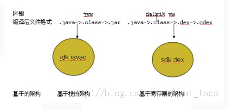
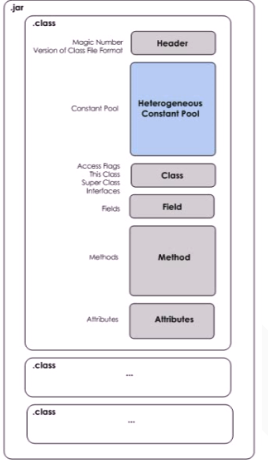
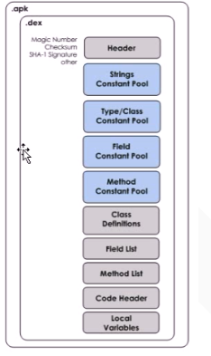

> 其实Parcel是内存中的结构的是一块连续的内存，会自动根据需要自动扩展大小(这个设计比较赞，一些对性能要求不是太高或者小数据的地方，可以不用费脑向分配多大的空间)。Parcel传递数据，可以分为3种，传递方式也不一样：
>
> - 小型数据：从用户空间(源进程)copy到kernel空间(Binder驱动中)再写回用户空间(目标进程，binder驱动负责寻找目标进程)
> - 大型数据：使用android 的匿名共享内存 (Ashmem)传递
> - binder对象：Kernel binder驱动专门处理

>整个Androdi系统架构中，虽然大量采用了Binder机制作为IPC(进程间通信)方式，但是也存在部分其他的IPC方式，比如Zygote通信就是采用socket。

#### 2、什么是Binder

从四个维度来看Binder，这样会让大家对理解Binder机制更有帮助

> - 1 从来类的角度来说，Binder就是Android的一个类，它继承了IBinder接口
> - 2 从IPC的角度来说，Binder是Android中的一个中的一种跨进程通信方式，Binder还可以理解为一种虚拟的物理设备，它的设备驱动是/dev/binder，该通信方式在Linux中没有(由于耦合性太强，而Linux没有接纳)
> - 3 从Android Framework角度来说，Binder是ServiceManager连接各种Manager(ActivityManager、WindowManager等)和相应的ManagerService的桥梁
> - 4 从Android应用层的角度来说，Binder是客户端和服务端进行通信的媒介，当你bindService的时候，服务端会返回一个包含了服务端业务调用的Binder对象，通过这个Binder对象，客户端就可以获取服务端提供的服务或者数据，这里的服务包括普通服务和基于AIDL的服务。

android采用Binder的考虑？

>* 虽然Android继承Linux内核，但是Linux与Android通信机制是不同的。Android中有大量的C/S(Client/Server)应用方式
>
>* 性能：
>  * socket支持Client/Server的通信方式，由于socket是一套通用当初网络通信方式，其效率低下，且消耗比较大(socket建立连接过程和中断连接过程都有一定的开销)，明显在手机上不适合大面积使用socket。
>  * 消息队列和管道采用"存储-转发" 方式，即数据先从发送方缓存区拷贝到内核开辟的缓存区中，再从内核缓存中拷贝到接收方缓存中，至少有两次拷贝过程。
>  * 共享内存虽然无需拷贝，但控制复杂，难以使用。
>
>* 安全性：
>  * 传统IPC没有任何安全措施，完全依赖上层协议来去报。首先传统IPC的接受方无法获取对方进程可靠的UID/PID(用户ID/进程ID)，从而无法鉴别对方身份。虽然由用户在数据包里填入UID/PID，但这样不可靠，容易被恶意程序利用。
>  * 传统IPC访问接入点是开放的，无法建立私有通道。比如命名管道、socket的ip地址或者文件名都是开放的，只要知道这些接入点的程序都可以对端建立连接，无法阻止恶意程序通过接收方地址获得连接。

#### 3、JVM与DVM

**Android采用DVM的考虑？**

> * 出于版权问题的考虑，所以谷歌在JVM上进行了一些改进
> * 相对于移动平台低内存、低电量等特性，JVM的工作性能有些低，所以谷歌优化了虚拟机的工作效率

**DVM与JVM的异同？**

* JVM:

  * JVM将.java文件编译成.class字节码文件，在执行java程序的时候，通过类加载器把需要的类全部加载到内存中去

  * 每个class文件被解析成Header、常量、类信息、属性、方法等几个部分、有多少个类。就会在内存中产生多少个类文件

    

  * JVM是基于栈的架构，所以每次访问数据cup都要到内存中取

  * JVM运行的是java字节码，其字节码保存在class文件中

* DVM：

  * davik虚拟机把.java文件编译成.class文件，又把.class文件转换成.dex文件，dalvik执行.dex文件

  * .dex文件就是把多个class文件中的常量、方法等放到一起

    

  * DVM运行的是dalvik字节码，DVM通过解释DEX文件来执行这些字节码

  * DVM是基于寄存器的架构，寄存器是在cpu上的一块存储空间，cpu如果直接从寄存器上读取数据的话就会快很多

  * 每个进程对应着一个Dalvik虚拟机实例

  * DVM可执行文件体积更小

  

**为什么DVM可执行文件体积更小?**

* class文件包含多个不同的方法签名，如果A引用B，方法也会复制到A中（在虚拟机加载类的连接阶段将会使用该签名链接到B类的对应方法），即多个不同类会同时包含相同的方法签名
* 大量的字符串常量也在多个类文件中被重复使用，这些冗余信息增加了文件的体积，也会影响虚拟机的效率
* AndroidSDK中有个dx工具负责将Java字节码文件转换为Dalvik字节码，对其重新排雷，重复的字符串常量在DEX文件中只出现一次，所有类文件共享一个常量池，从而减小了文件的体积，也减少了I/O操作，提高了类的查找速度

### Android性能优化

#### 1. 合理管理内存

* 

#### **执**

在Android中提供了两个ClassLoader的子类：PathClassLoader是通过构造函数new DexFile(path)来产生DexFile对象的；而DexClassLoader则是通过其静态方法loadDex(path,outpath,0)得到DexFile对象。DexClassLoader和PathClassLoader。这两者的区别在于DexClassLoader需要提供一个可写的outpath路径，用来释放.apk包或者.jar包中的dex文件。换个说法来说，就是PathClassLoader不能主动从zip包中释放出dex，因此只支持直接操作dex格式文件，或者已经安装的apk（因为已经安装的apk在cache中存在缓存的dex文件）。而DexClassLoader可以支持.apk、.jar和.dex文件，并且会在指定的outpath路径释放出dex文件。

对于一个Android的apk应用程序，其主要的执行代码都在其中的class.dex文件中。在程序第一次被加载的时候，为了提高以后的启动速度和执行效率，Android系统会对这个class.dex文件做一定程度的优化，并生成一个ODEX文件，存放在/data/dalvik-cache目录下。以后再运行这个程序的时候，就只要直接加载这个优化过的ODEX文件就行了，省去了每次都要优化的时间。

不过，这个优化过程会根据不同设备上Dalvik虚拟机的版本、Framework库的不同等因素而不同。在一台设备上被优化过的ODEX文件，拷贝到另一台设备上不一定能够运行。

#### SparseArray与HashMap

* SparseArray的key的类型已经确定为int类型，避免了自己主动装箱的过程