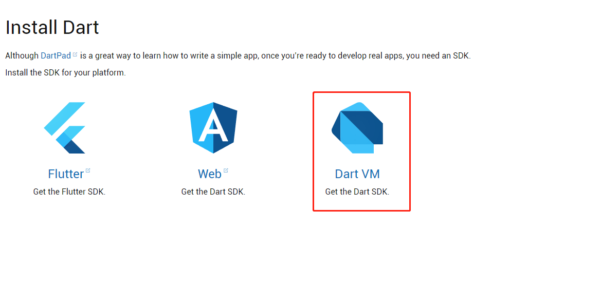
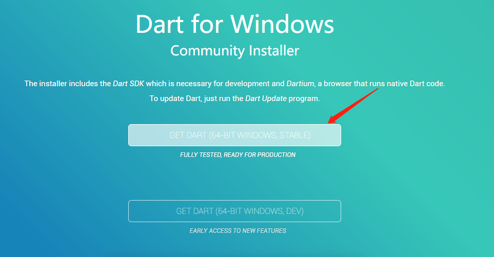

# Dart开发环境配置

##  Dart简介

Dart语言是谷歌开发的一门编程语言，可用于开发服务器，Web应用，移动应用和游戏开发。

## 环境配置（Windows）

* 下载sdk，打开链接<https://www.dartlang.org/install>

  1. Flutter SDK：移动端Dart框架，可以用于开发Android与IOS应用，目前处于实验阶段 
  2. Web SDK：用于Web页面的开发，可以取代Javascrip，使前端开发更高效，更方便 ；但目前只有Chromium浏览器支持Dart，其他浏览器都不支持，但可以通过转换成JS文件来解决 
  3. 本文所需的安装环境 

  

* 选择安装方式

* 选择版本

  版本分为稳定版和测试版，本文以稳定版为例 

  

  

* 安装

  1. 下载完成后，双击安装
  2. 一直点击下一步即可，需要注意的是目前需要翻墙才能安装成功
  3. 安装成功后添加环境变量

4. 打开cmd，输入 dart --version 可验证是否安装成功

## Dart编辑器

* 本文采用的编辑器是[webstorm](<https://www.jetbrains.com/webstorm/download/>  )，大家可以自行下载安装，关于webstorm的激活可以百度

* 安装完成后，打开webstorm，新建项目

* 编辑`bin/main.dart`，同C++u欧昂，Dart程序是从`main()`开始执行的

* 在`main.dart`文件中添加如下代码

* 点击工具栏上的运行按钮，即可看到相应的运行结果

  Dart有两种运行模式：

  * 检查模式（checked）：进行类型检查，如果发现实际类型与声明或期望的类型不匹配就报错
  * 生产模式（production）：不进行类型检查，忽略声明的类型信息，忽略 assert 语句

  检查模式运行较慢，生产模式运行快
  但检查模式可以及早地发现程序在的问题，所以建议在开发过程中使用检查模式
  而在正式环境中使用生产模式运行

  Dart VM 默认在**生产模式**下运行，而我们用 WebStorm 开发时默认在**检查模式**下运行
  通过 Run—>Edit Configurations 选项可以设置使用不同的模式 

