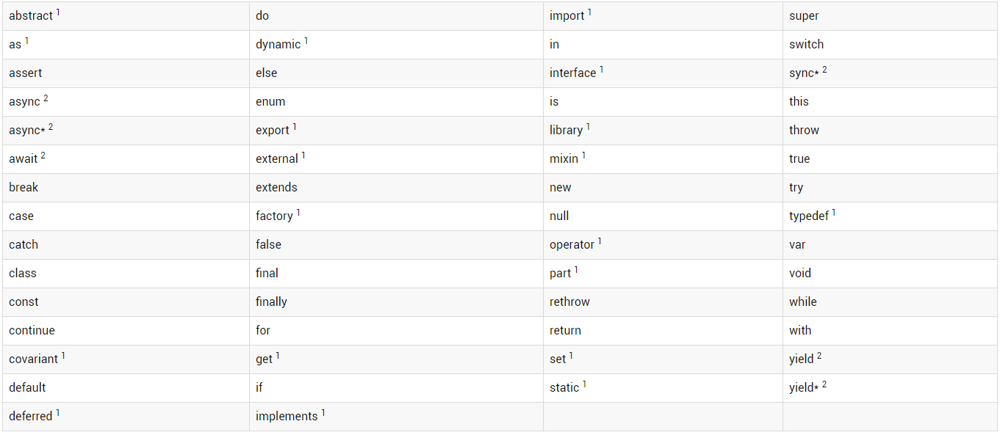

# 数据类型

[TOC]

## Dart语言基本概念

* 定义的所有变量都是一个对象，每个对象都是一个类的实例。数字，函数和null都是对象，而且所有的对象都继承至Object类
* 虽然Dart是强类型的语言，但是由于Dart可以推断 类型，所以变量定义类型时是可以选择的。当你不明确类型的时候，可以使用特殊的动态类型
* Dart支持泛型，比如`List <int>`（整数列表）或`List <dynamic>`（任何类型的对象列表）
* Dart支持顶层函数（如main()），以及与类或对象绑定的函数（静态和实例方法）,也可以在函数中创建函数（嵌套函数或局部函数）
* Dart支持顶级变量以及绑定到类或对象（静态变量和实例变量）的变量。 实例变量有时也被称为字段或属性
* 与Java不同，Dart没有关键字public，protected和private。 如果标识符以下划线（_）开头，则它是私有的
* 标识符以字母或下划线（_）开头，之后可以与任意字符和数字的组合
* Dart工具可以报告两种问题：警告和错误。 警告只是表明代码可能无法正常工作，但不会阻止您的程序执行。 错误可以是编译时错误或运行时错误。 编译时错误导致代码无法执行; 运行时错误导致代码执行时引发异常

## 关键字



* 带上标1的单词是内置标识符，禁止使用内置标识符作为自定义标识符，如果类或者类型名使用内置标识符，编译时则会报错
* 带上标2的单词是Dart1.0版本发布后添加的异步支持相关的保留字。且不能使用async，await或yield作为用async，async *或sync *标记的函数体中的标识符
* 其他关键字作为保留字，不能被定义为标识符

## 变量

* 变量定义

```dart
var name = 'Bob';
```

变量指向对象的引用。name的变量名指向值为 ‘Bob’ String对象的引用。变量可以用关键字var进行声明，Dart可以通过值推断出变量的类型。也可以使用动态`dynamic `类型和确定类型进行声明，比如：

```dart
//动态类型声明
dynamic name = 'Bob';
//显示声明
String name = 'Bob';
```

* 变量默认值

  未初始化的变量默认的初始值为null，及时是数字类型的初始值也是null，这点与java中有所区别

* final 和 const关键字

  和其他语言的用法类似，即在定义常量的时候可以使用final和const关键字。而在使用这两个关键字的时，可以省略var或其他类型

  ```dart
  var i = 10；
  const i = 10；
  final i = 10；
  ```

  const和final定义的都是常量，值不能改变 ，并且在声明的时候就必须初始化 ，但两者之间也存在差别。

  * final定义的常量可以用变量来初始化

  * const定义的是编译时常量，只能用编译时常量来初始化

    ```dart
    final time = new DateTime.now(); //Ok
    const time = new DateTime.now(); //Error，new DateTime.now()不是const常量
    ```

  还有一点值得注意：

  var、final等在左边定义变量的时候，并不关心右边是不是常量， 但是如果右边用了const，那么不管左边如何，右边都必须是常量 

  ```dart
  const list = const[1,2,3];//Ok
  const list = [1,2,3];//Error
  
  final list = [1,2,3];//Ok
  final list = const[1,2,3];//Ok
  final list = const[new DateTime.now(),2,3];//Error,const右边必须是常量
  ```

  

## 数据类型

Dart支持下面几种数据类型

- Numbers
- Strings
- Booleans
- List（也就是数组）
- Maps

### Numbers

numbers类型包含int和double两种子类型

* int：整数值不大于64位，具体取决于平台。 在Dart VM上，值可以从-2^63^到2^63^ - 1
* double：64位双精度浮点数

```dart
//int 类型
int x = 1;
int hex = 0xDEADBEEF;
//double 类型
double y = 1.1;
double exponents = 1.42e5;
```

String 与 numbers 类型想换转换

```dart
// String -> int
var one = int.parse('1');
assert(one == 1);

// String -> double
var onePointOne = double.parse('1.1');
assert(onePointOne == 1.1);

// int -> String
String oneAsString = 1.toString();
assert(oneAsString == '1');

// double -> String
String piAsString = 3.14159.toStringAsFixed(2);
assert(piAsString == '3.14');

```

int类型还可以使用位移（<<,>>），AND（＆）和OR（|）运算符

```dart
assert((3 << 1) == 6); // 0011 << 1 == 0110
assert((3 >> 1) == 1); // 0011 >> 1 == 0001
assert((3 | 4) == 7); // 0011 | 0100 == 0111
```

> 注意：断言函数assert()，**Debug**模式下，当表达式的值为false时抛出异常 


### Strings

Dart中的字符串采用的是UTF-16编码，可以使用单引号或者双引号来创建一个字符串

```dart
//如果使用的是双引号，可以内嵌单引号
  //当然，如果使用的是单引号，可以内嵌双引号，否则需要“\”转义
  //String str2 = ‘It\’s ok!’;
  String str2 = "It's ok!";
  
  //使用三个单引号或者双引号可以多行字符串赋值
  var str3 = """Dart Lang
  Hello,World!""";
  
  //在Dart中，相邻的字符串在编译的时候会自动连接
  //也可以使用+进行连接
var s1 = 'String '
    'concatenation'
    " works even over line breaks.";
assert(s1 ==
    'String concatenation works even over '
    'line breaks.');

var s2 = 'The + operator ' + 'works, as well.';
assert(s2 == 'The + operator works, as well.');
  
//可以使用“$”插入变量的值
var name = 'BoB';
print("Name：$name");
  
//声明原始字符串，直接在字符串前加字符“r”
//可以避免“\”的转义作用，在正则表达式里特别有用
print(r"换行符：\n");
  
//int是任意长度的整数，double是双精度浮点数
var hex = 0xDEADBEEF;
      
//可以使用${}插入表达式
//整型转换为16进制：3735928559 —> 0xDEADBEEF
print("整型转换为16进制：$hex —> 0x${hex.toRadixString(16).toUpperCase()}");
```


### Booleans

存在`true` and `false` 两种值


### Lists

在几乎所有的编程语言中最常见的集合可能就是数组或者有序对象组。 在Dart中，数组是List对象。

```dart
//列表的定义
var list = [1, 2, 3];
```

> 注意：上面定义的列表推断出的类型是List<int> ，因此如果向list中添加其他类型，则会报错

定义一个编译时的常量列表，可以在右边加上const

```dart
var constantList = const [1, 2, 3];
// constantList[1] = 1; // 定义之后就不能改变，重新赋值报错
```


### Maps

maps中的键和值可以是任何类型的对象，键值唯一，但值可以相同

```dart
var gifts = {
  // Key:    Value
  'first': 'partridge',
  'second': 'turtledoves',
  'fifth': 'golden rings'
};

```

> 注意：gitfs的类型是Map<String,String>，如果向里面添加其他类型，则会报错

也可以通过Map的构造器创建

```dart
var gifts = Map();
gifts['first'] = 'partridge';
gifts['second'] = 'turtledoves';
gifts['fifth'] = 'golden rings';
```

> 注意：在Dart2，new关键字可以省略


