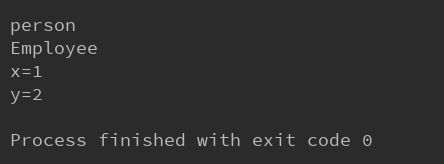
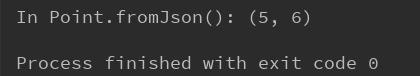
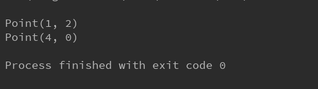

# Dart构造函数

[TOC]

## 构造函数

构造函数就是一个与类同名的函数，关键字 this 是指当前类的实例 

```dart
class Point {
    int x;
    int y;

    Point(int x, int y) {
        this.x = x;
        this.y = y;
    }
}
```

dart提供了一种更简洁的定义，上述代买可以简化为：

```dart
class Point {
    int x;
    int y;

    Point(this.x, this.y);
}
```


### 默认构造函数

如果在定义类时没有声明构造函数，则dart将提供默认的构造函数，但该默认构造函数没有参数，且调用父类的无参构造函数。在dart语言中，子类不能继承父类的构造函数 ；如果子类没有声明构造函数，就只有一个默认提供的无参构造函数。


### 命名构造函数

使用命名构造函数能够实现类的多个构造函数，也能使不同的构造函数更加清楚分明

```dart
class Point {
  num x, y;

  Point(this.x, this.y);

  // Named constructor
  Point.origin() {
    x = 0;
    y = 0;
  }
}
```

构造函数不能被继承，父类中的命名构造函数不能被子类继承。如果想要子类也拥有一个父类一样名字的构造函数，就必须在子类是实现这个构造函数。 


### 父类构造函数的调用

一般在子类的构造函数中会默认调用父类无名，无参的构造函数。父类的无名构造函数会在子类构造函数之前调用。如果定义了**初始化成员列表**，那么调用顺序如下：

1. 初始化成员列表
2. 父类构造函数
3. 该类构造函数

```
class Person {
  int x;
  int y;
  Person():x=1,y=2{
    print('person');
  }
}

class Employee extends Person {
  Employee() {
    print('Employee');
  }
}

main() {
  var p = new Employee();
  print('x='+(p.x.toString()));
  print('y='+(p.y.toString()));
}
```

执行结果：




如果父类没有提供无名无参数构造函数的构造函数，则子类中必须手动调用父类的一个构造函数。这种情况下，调用父类的构造函数的代码放在子类构造函数名后，子类构造函数体前，中间使用`:`(分号) 分割。 

```dart
class Person {
    Person.fromJson(Map data) {
        print("in Person");
    }
}

class Employee extends Person {
    Employee.fromJson(Map data) : super.fromJson(data) {
        print("in Employye");
    }
}
```


### 初始化成员列表 

除了调用父类的构造函数，也可以通过初始化成员列表 在构造函数运行前来初始化实例的变量值。 

```dart
void main(){
    var emp = new Point.fromJson({'x':5, 'y':6});
}

class Point {
    int x;
    int y;

    Point(this.x, this.y);

    Point.fromJson(Map jsonMap): x = jsonMap['x'], y = jsonMap['y'] {
        print("In Point.fromJson(): ($x, $y)");
    }
}
```




### 重定向构造函数

有时候构造函数的目的只是重定向到该类的另一个构造函数。重定向构造函数的函数体须为空

```dart
class Point {
  num x;
  num y;

  Point(this.x, this.y) {
    print("Point($x, $y)");
  }

  Point.alongXAxis(num x) : this(x, 0);
}

void main() {
  var p1 = new Point(1, 2);
  var p2 = new Point.alongXAxis(4);
}
```




### 常量构造函数


