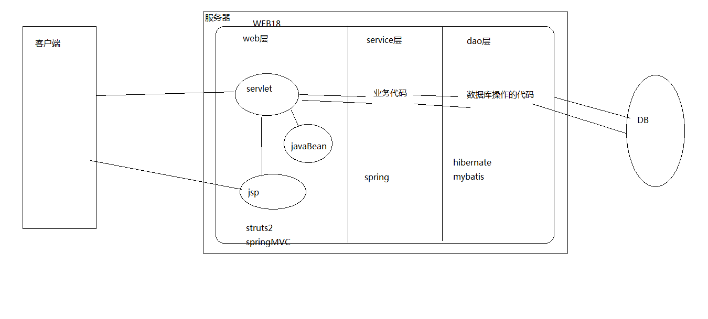

### EL的内置对象  (11个)

* pageScope   requestScope  sessionScope  applicationScope可以获取JSP中域中的数据
* param   paramValues 接收


```jsp
<!--forEach模拟
for(int i=0;i<=5;i++){
	syso(i)
}
-->
<c:forEach begin='0' end='5' var='i'>
    ${i}
</c:forEach>


<!--模拟增强for
for(User user : users){
	syso(user)
}
-->
<!-- 
items:一个集合或数组 var:代表集合中的某个元素
-->
<c:forEach items='${users}' var='user'>
    ${user.name}
</c:forEach>

<!-- 
遍历Map<String,String>
-->
<c:forEach items='${map}' var='entry'>
    ${entry.key}:${entry.value}</br>
</c:forEach>
```


### JavaEE的开发模式

1. 在开发过程中总结出的一套约定俗成的设计模式

2. javaEE经历的模式

   - model1 模式

   		技术组成:jsp+javaBean

   		弊端: 随着业务的复杂性 导致jsp页面比较混乱

   - model2 模式:
     - 技术组成:jsp+servlet+javaBean
     - 优点: 将jsp中的页面显示和java逻辑代码 分开
       - servlet: 擅长处理java业务代码
       - jsp: 擅长页面的显示
     - MVC: web层技术
       - M:Model----模型  javaBean:封装数据
       - V: View----视图 jsp : 单纯进行页面的显示
       - C: Controller----控制器 Servlet:获取数据--对数据进行封装--传递数据--指派显示的jsp页面

3. JAVAEE的三层架构

   服务器开发时,分为三层

   - web层:与客户都交互
   - service层:复杂业务处理
   - dao层:与数据库进行交互

   开发实践时 三层架构通过包结构实现

   

4. MVC与三层架构有什么关系

   

   

   

   ### 总结

   * EL表达式
     * 从域中取出数据  ${域中存储的数据的名称}
     * ${pageContext.request.contextPath}  获取web应用的名称
   * JSTL标签(核心库)
     * <%@ taglib uri=' ' prefix='c'%>
     * <c:if test=' '>
     * <c:forEach items='数组或集合 ' var='数组或集合中的每一个元素 '>
   * javaEE三层架构+MVC
     * web层:收集页面数据, 封装数据, 传递数据, 指定响应jsp页面
     * service层: 逻辑业务代码的编写
     * dao层: 数据库的访问代码的编写

   

   

   ​	


