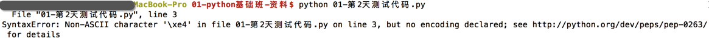
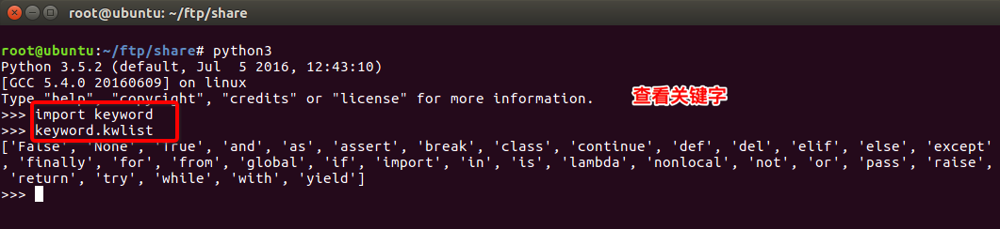
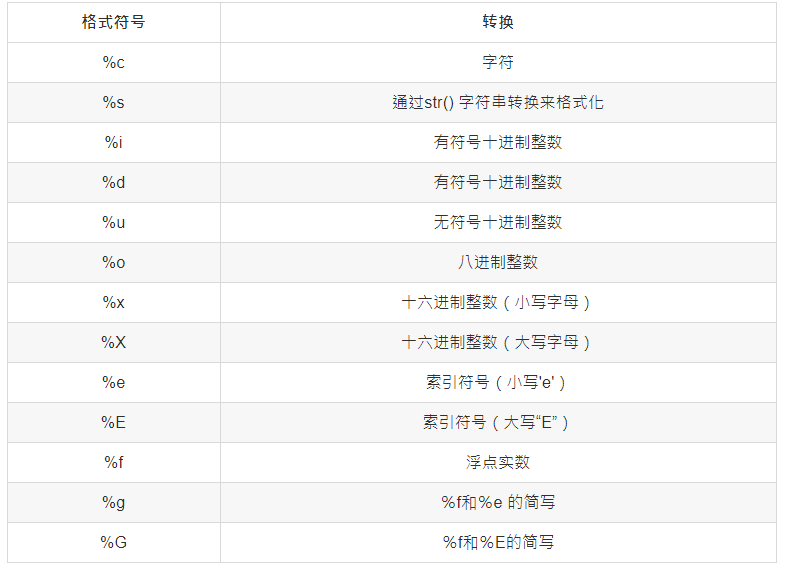
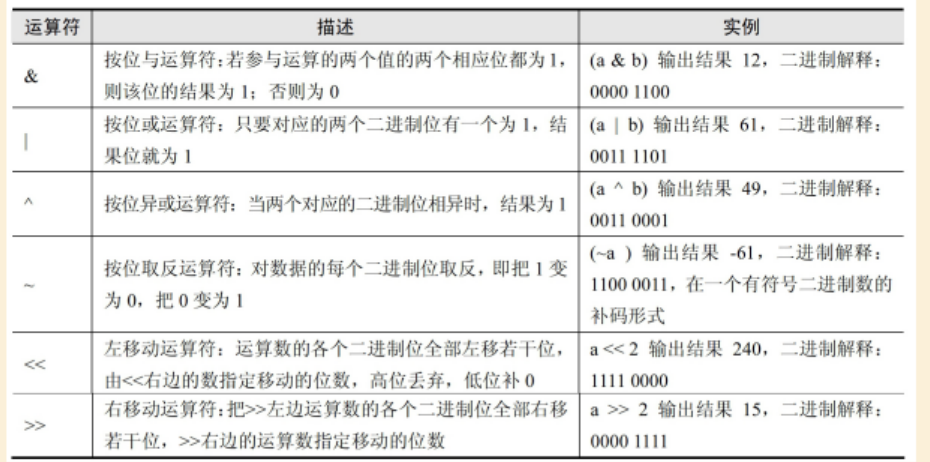
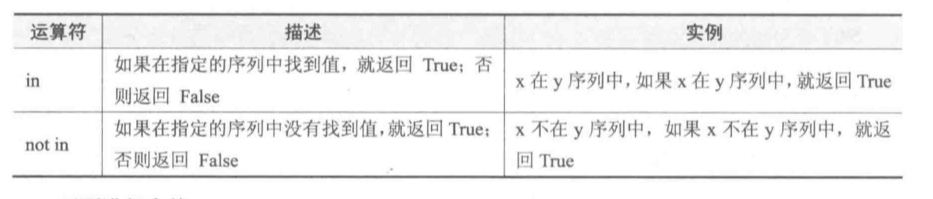
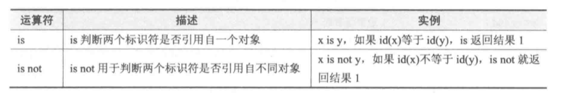
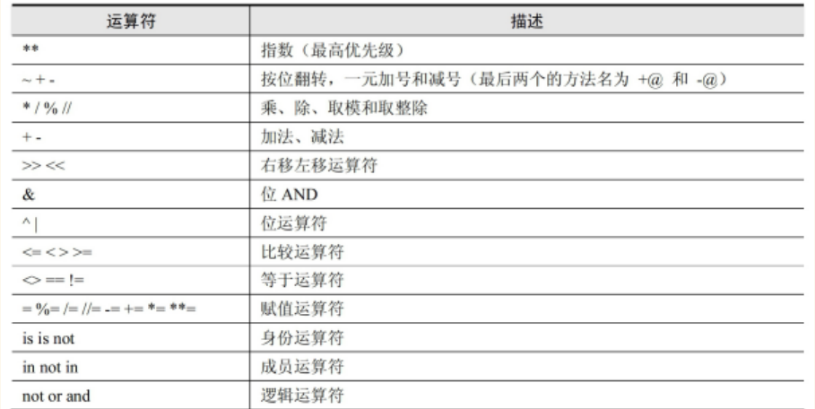

# python基础

[TOC]


## 1. 注释

### 1.单行注释

以#开头

```python
 # 我是注释，可以在里写一些功能说明之类的哦
 print('hello world')
```

### 2.多行注释

三个单引号(''')开始,三个单引号(''')结束,中间是注释语句

```python
   '''
   我是多行注释，可以写很多很多行的功能说明
   
   '''
```


## 2. python的中文支持

```python
#如果在程序中有中文,如:
print("你好")
```

如果直接运行,程序可能出错



解决办法:在程序的开头写入如下代码，即中文注释 

```python
#coding=utf-8
```

在python的语法规范中推荐使用方式 

```python
# -*- coding:utf-8 -*-
```


## 3. 标识符

标示符即自己定义的写符号和名称,如变量名 、函数名等 

### 1. 标示符命名规则

* 标示符由字母、下划线和数字组成，且数字不能开头 
* python中的标识符是区分大小写的\
* 见名知意 
* 推荐使用驼峰命名法 

### 2. 关键字

* 什么是关键字 

  python一些具有特殊功能的标示符，这就是所谓的关键字

  关键字，是python已经使用的了，所以**不允许开发者自己定义和关键字相同的名字的标示符**

* 相关关键字

```
      and     as      assert     break     class      continue    def     del
      elif    else    except     exec      finally    for         from    global
      if      in      import     is        lambda     not         or      pass
      print   raise   return     try       while      with        yield
```

可以通过以下命令进行查看当前系统中python的关键字 




### 3. 变量

```python
>>> a=123
123
>>>a='abc'
'abc'
```

​         同一个变量a可以反复赋值,且可以是不同类型的变量.  这种变量本身类型不固定的语言称为动态语言, 比如python, javascript. 而与之相对应的静态语言,静态语言必须在定义的时候指定扁蕾类型,如果赋值时类型不匹配则会报错. 

​        当不能确定变量或数据的类型时,可以用内置函数`type()`进行确认

```python
>>>type(100)
<class 'int'>
```

```python
>>>a='abc'
```

上面变量的赋值,python解释权做了两件事:

1. 在内存中创建一个'abc'字符串
2. 在内存中创建一个名为a的变量,并把它指向'abc'


#### 变量的命名

1. 变量名只能包含字母、数字和下划线。变量名可以字母或下划线打头，但不能以数字打 头
2.  变量名不能包含空格，但可使用下划线来分隔其中的单词
3. 不要将Python关键字和函数名用作变量名，即不要使用Python保留用于特殊用途的单词


## 4. 输出

* 用`print()`在括号中加上字符串，就可以向屏幕上输出指定的文字 

  ```python
  print('hello, world')
  ```

* `print()`函数也可以接受多个字符串，用逗号“,”隔开. `print()`会依次打印每个字符串，遇到逗号“,”会输出一个空格 

  ```python
  >>>print('The quick brown fox', 'jumps over', 'the lazy dog')
  The quick brown fox jumps over the lazy dog
  ```

* `print()`也可以打印整数，或者计算结果

  ```python
  >>>print(100 + 200)
  300
  ```

* 格式化输出

  * 有`%`这样的操作符，这就是Python中格式化输出 , 如:

  ```python
      age = 18
      name = "xiaohua"
      print("我的姓名是%s,年龄是%d"%(name,age))
  ```

  *  常用的格式符号

  

* 换行输出

  在输出的时候，如果有`\n`那么，此时`\n`后的内容会在另外一行显示 

* 自动换行

  在 Python 中 `print()` 默认是换行的 

  ```python
  >>>for i in range(0,3):
  ...     print (i)
  ... 
  0
  1
  2
  ```

  如果要使其输出不自动换行,可以使用`print('', end='') `,但是这个只有**Python3有用,Python2不支持 **

  ```python
  >>>for i in range(0,3):
  ...     print(i, end = '' )
  ... 
  012
  ```

  


## 5. 输入

### 1. raw_input()

在Python中，获取键盘输入的数据的方法是采用 raw_input 函数

```python
    password = raw_input("请输入密码:")
    print('您刚刚输入的密码是:', password)
```

运行结果:t


**注意**:

- raw_input()的小括号中放入的是，提示信息，用来在获取数据之前给用户的一个简单提示
- raw_input()在从键盘获取了数据以后，会存放到等号右边的变量中
- raw_input()会把用户输入的任何值都作为字符串来对待


### 2. input()

input()函数与raw_input()类似，但其接受的输入必须是表达式。 

```python
>>> a = input() 
123
>>> a
123
>>> type(a)
<type 'int'>
>>> a = input()
abc
Traceback (most recent call last):
  File "<stdin>", line 1, in <module>
  File "<string>", line 1, in <module>
NameError: name 'abc' is not defined
>>> a = input()
"abc"
>>> a
'abc'
>>> type(a)
<type 'str'>
>>> a = input()
1+3
>>> a
4
>>> a = input()
"abc"+"def"
>>> a
'abcdef'
>>> value = 100
>>> a = input()
value
>>> a
100
```

**input()接受表达式输入，并把表达式的结果赋值给等号左边的变量** 


### 3.  python3中的input()

在python3中, **没有raw_input()函数，只有input()**

并且**python3中的input** 与 **python2中的raw_input()**功能一样


如果在python3中想输入表达式,可以使用`eval()`方法,如:

```python
>>>a=input()
1+2
>>>a
'1+2'
>>>eval(a)
3
```


## 6. 运算符

### 1. 算术运算符

| 运算符 | 描述   | 实例                                                         |
| ------ | ------ | ------------------------------------------------------------ |
| +      | 加     | 两个对象相加 a + b 输出结果 30                               |
| -      | 减     | 得到负数或是一个数减去另一个数 a - b 输出结果 -10            |
| *      | 乘     | 两个数相乘或是返回一个被重复若干次的字符串 a * b 输出结果 200 |
| /      | 除     | x除以y b / a 输出结果 2                                      |
| //     | 取整除 | 返回商的整数部分 9//2 输出结果 4 , 9.0//2.0 输出结果 4.0     |
| %      | 取余   | 返回除法的余数 b % a 输出结果 0                              |
| **     | 幂     | 返回x的y次幂 a**b 为10的20次方， 输出结果 100000000000000000000 |

下面以a=10 ,b=20为例进行计算 

```python
>>> 9/2.0
4.5
>>> 9//2.0
4.0
```


### 2.赋值运算符

| 运算符 | 描述       | 实例                                                 |
| ------ | ---------- | ---------------------------------------------------- |
| =      | 赋值运算符 | 把=号右边的结果给左边的变量 num=1+2*3 结果num的值为7 |

* 序列解包

  ```python
  >>> a, b = 1, 2
  >>> a
  1
  >>> b
  2
  >>>a,b=b,a
  >>>print(a,b)
  2,1
  
  >>>c={'a':1,"b":2}
  >>>k,v=c.popitem() #将键-值作为元组返回
  >>>k
  'a'
  >>>v
  2
  ```

​	上述可以看出,序列解包就是将多个值的序列解开,然后分别赋值给变量. 


* 链式赋值

  当给变量赋相同的值时,可以使用链式赋值

  ```python
  >>>x=y=z=10
  ```

  

#### 复合赋值运算符

| 运算符 | 描述             | 实例                       |
| ------ | ---------------- | -------------------------- |
| +=     | 加法赋值运算符   | c += a 等效于 c = c + a    |
| -=     | 减法赋值运算符   | c -= a 等效于 c = c - a    |
| *=     | 乘法赋值运算符   | c *= a 等效于 c = c * a    |
| /=     | 除法赋值运算符   | c /= a 等效于 c = c / a    |
| %=     | 取模赋值运算符   | c %= a 等效于 c = c % a    |
| **=    | 幂赋值运算符     | c \**= a 等效于 c = c ** a |
| //=    | 取整除赋值运算符 | c //= a 等效于 c = c // a  |


### 3. 比较(即关系)运算符

| 运算符 | 描述                                                         | 示例                                                         |
| ------ | ------------------------------------------------------------ | ------------------------------------------------------------ |
| ==     | 检查两个操作数的值是否相等，如果是则条件变为真。             | 如a=3,b=3则（a == b) 为 true.                                |
| !=     | 检查两个操作数的值是否相等，如果值不相等，则条件变为真。     | 如a=1,b=3则(a != b) 为 true.                                 |
| <>     | 检查两个操作数的值是否相等，如果值不相等，则条件变为真。     | 如a=1,b=3则(a <> b) 为 true。这个类似于 != 运算符 (**python2符号,python3已移除**) |
| >      | 检查左操作数的值是否大于右操作数的值，如果是，则条件成立。   | 如a=7,b=3则(a > b) 为 true.                                  |
| <      | 检查左操作数的值是否小于右操作数的值，如果是，则条件成立。   | 如a=7,b=3则(a < b) 为 false.                                 |
| >=     | 检查左操作数的值是否大于或等于右操作数的值，如果是，则条件成立。 | 如a=3,b=3则(a >= b) 为 true.                                 |
| <=     | 检查左操作数的值是否小于或等于右操作数的值，如果是，则条件成立。 | 如a=3,b=3则(a <= b) 为 true.                                 |

 

### 4.逻辑运算符

| 运算符 | 逻辑表达式 | 描述                                                         | 实例                    |
| ------ | ---------- | ------------------------------------------------------------ | ----------------------- |
| and    | x and y    | 布尔"与" - 如果 x 为 False，x and y 返回 False，否则它返回 y 的计算值。 | (a and b) 返回 20。     |
| or     | x or y     | 布尔"或" - 如果 x 是 True，它返回 True，否则它返回 y 的计算值。 | (a or b) 返回 10。      |
| not    | not x      | 布尔"非" - 如果 x 为 True，返回 False 。如果 x 为 False，它返回 True。 | not(a and b) 返回 False |


### 5.位运算符




### 6.成员运算符



### 7.身份运算符




### 8.运算符优先级



**注:有括号先运算括号里面的**


