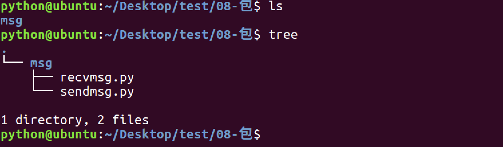
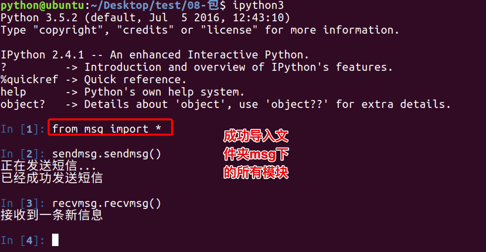
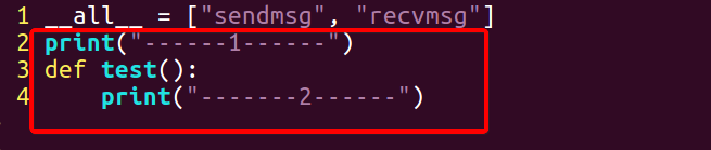

# 异常、模块

[TOC]


## 异常

### 捕获异常 try...except...

```python
try:
    语句 
except 异常:
    语句 #如果在try部分引发了异常，执行except下的语句
```

- 把可能出现问题的代码，放在try中
- 把处理异常的代码，放在except中

```python
try:
    print('try...')
    r = 10 / 0
    print('result:', r)
except Exception:
    print('except')
```


### except捕获多个异常

```python
try:
    语句 
except 异常1:
    语句 #如果在try部分引发了异常，执行except下的语句
except 异常2:
    语句 #如果在try部分引发了异常，执行except下的语句
```

一个try可以包含多个except子句，但子句中只有一个分支会被处理。

捕获多个异常，也可以使用一个元组的方式列出，如下示例：

```python
try:
    print('-----test--1---')
    open('123.txt','r') # 如果123.txt文件不存在，那么会产生 IOError 异常
    print('-----test--2---')
    print(num)# 如果num变量没有定义，那么会产生 NameError 异常

except (IOError,NameError): 
    #如果想通过一次except捕获到多个异常可以用一个元组的方式
    print('errorMsg')
```


### 获取异常的信息描述

如果希望在except字句中访问异常对象本身，可以使用 as e的形式。

```python
try:
    print('-----test--1---')
    print(num)# 如果num变量没有定义，那么会产生 NameError 异常
    print('-----test--2---')

except (IOError,NameError) as e: 
    #如果想通过一次except捕获到多个异常可以用一个元组的方式
    print(e)
    
 ####################
----test-1----
name 'num' is not defined
```


### 捕获所有异常

```python
try:
    # 如果num变量没有定义，那么会产生 NameError 异常
    print(num)
except: 
    print('error')
    
 ##或者
try:
    # 如果num变量没有定义，那么会产生 NameError 异常
    print(num)
except Exception as e: 
    print(e)
```


### 异常中的else

在if中，它的作用是当条件不满足时执行的实行；同样在try...except...中也是如此，即如果没有捕获到异常，那么就执行else中的事情 

```python
try:
    num = 100
    print(num) 
except NameError as errorMsg:
    print('产生错误了:%s'%errorMsg)
else:
    print('没有捕获到异常')
    
##################
100
'没有捕获到异常'
```


### try...finally...

try...finally...语句是无论发生异常与否，最终都会执行finally的字句代码

```python
try:
    num = 100
    print(num) 
except NameError as errorMsg:
    print('产生错误了:%s'%errorMsg)
else:
    print('没有捕获到异常')
finally:
    print('始终都要执行')
    
##############
100
'没有捕获到异常'
'始终都要执行'
```


### 抛出异常

在python代码中，可以主动用`raise`语句抛出一个异常

```python
def foo(s):
    n = int(s)
    if n==0:
        raise ValueError('invalid value: %s' % s)
    return 10 / n

def bar():
    try:
        foo('0')
    except ValueError as e:
        print('ValueError!')
        raise
```

在`bar()`函数中的except字句中，再次通过`raise`语句将错误抛出去了 。这样的好处在于，如果当前函数不知道如何处理该错误，最恰当的方式就是继续往上抛，让顶层调用者去处理 。

`raise`语句如果不带参数，就会把当前错误原样抛出 。


### 自定义异常

在python中，可以通过继承Exception类，创建一个自己的异常类。

```python
class ShortInputException(Exception):
    '''自定义的异常类'''
    pass

def main():
    try:
        s = input('请输入 --> ')
        if len(s) < 3:
            # raise引发一个你定义的异常
            raise ShortInputException(len(s), 3)
    except ShortInputException as result:#x这个变量被绑定到了错误的实例
        print('ShortInputException: 输入的长度是 %d,长度至少应是 %d'% (result.length, result.atleast))
    else:
        print('没有异常发生.')
```


## 模块

### import

在Python中用关键字`import`来引入某个模块，比如要引用模块math，就可以在文件最开始的地方用import math来引入。

形如:

```python
    import module1,mudule2...
```

当解释器遇到import语句，如果模块在当前的搜索路径就会被导入。

在调用math模块中的函数时，必须这样引用：

```python
　　模块名.函数名
```


### from…import

Python的from语句可以从模块中导入一个指定的部分（函数、全局变量、类等）到当前命名空间中

语法如下：

```python
    from modname import name1[, name2[, ... nameN]]
```


### from … import *

把一个模块的所有内容全都导入到当前的命名空间 

```python
    from modname import *
```


### as

两个模块中含有相同名称函数的时候，后面一次引入会覆盖前一次引入 。这个时候既可以通过`as`给导入的部分另外命名，可以避免覆盖。

假如模块A中有函数function( )，在模块B中也有函数function( ) ，同时引用如下：

```python
from A import function as funa
from B import function as funb
```


### 定位模块

当导入一个模块，Python解析器对模块位置的搜索顺序是：

1. 当前目录
2. 如果不在当前目录，Python则搜索在shell变量PYTHONPATH下的每个目录。
3. 如果都找不到，Python会察看默认路径。UNIX下，默认路径一般为/usr/local/lib/python/
4. 模块搜索路径存储在system模块的sys.path变量中。变量里包含当前目录，PYTHONPATH和由安装过程决定的默认目录。


如果需要添加模块的搜索路径，可以调用以下方法：

```python
os.path.append('path')
```


### ``__all__``

如果一个文件中有__all__变量，那么也就意味着这个变量中的元素，不会被from xxx import *时导入

```python
__all__=['Test','test1']
class Test(object):
    def test1():
        print('test1')
        
    def test2():
        print('test2')
        
```

当通过from Test import *引入时，test2并没有被导入到当前的命名空间，只有`__all__`中的元素被导入。


### 包的制作

* 将模块功能放到同一个文件夹下





* 使用import 文件.模块 的方式导入


* 使用from 文件夹 import 模块 的方式导入


* 在msg文件夹下创建`__init__.py`文件


*  在`__init__.py`文件中写入


* 重新使用from 文件夹 import 模块 的方式导入

 


总结：

- 包将有联系的模块组织在一起，即放到同一个文件夹下，并且在这个文件夹创建一个名字为`__init__.py` 文件，那么这个文件夹就称之为`包`
- 有效避免模块名称冲突问题，让应用组织结构更加清晰


### `__init__.py`

`__init__.py` 控制着包的导入行为 

#### `__init__.py`为空

仅仅是把这个包导入，不会导入包中的模块

#### `__all__`

在`__init__.py`文件中，定义一个`__all__`变量，它控制着 from 包名 import *时导入的模块

#### 可以在`__init__.py`文件中编写内容

可以在这个文件中编写语句，当导入时，这些语句就会被执行

`__init__.py文件` 




### 模块发布

1.mymodule目录结构体如下：

```
.
├── setup.py
├── suba
│   ├── aa.py
│   ├── bb.py
│   └── __init__.py
└── subb
    ├── cc.py
    ├── dd.py
    └── __init__.py
```

2.编辑setup.py文件

py_modules需指明所需包含的py文件

```
from distutils.core import setup

setup(name="xxx", version="1.0", description="xxx's module", author="xxx", py_modules=['suba.aa', 'suba.bb', 'subb.cc', 'subb.dd'])
```

3.构建模块

python setup.py build

构建后目录结构

```
.
├── build
│   └── lib.linux-i686-2.7
│       ├── suba
│       │   ├── aa.py
│       │   ├── bb.py
│       │   └── __init__.py
│       └── subb
│           ├── cc.py
│           ├── dd.py
│           └── __init__.py
├── setup.py
├── suba
│   ├── aa.py
│   ├── bb.py
│   └── __init__.py
└── subb
    ├── cc.py
    ├── dd.py
    └── __init__.py
```

4.生成发布压缩包

python setup.py sdist

打包后,生成最终发布压缩包xxx-1.0.tar.gz , 目录结构

```
.
├── build
│   └── lib.linux-i686-2.7
│       ├── suba
│       │   ├── aa.py
│       │   ├── bb.py
│       │   └── __init__.py
│       └── subb
│           ├── cc.py
│           ├── dd.py
│           └── __init__.py
├── dist
│   └── xxx-1.0.tar.gz
├── MANIFEST
├── setup.py
├── suba
│   ├── aa.py
│   ├── bb.py
│   └── __init__.py
└── subb
    ├── cc.py
    ├── dd.py
    └── __init__.py
```


### 模块安装、使用

#### 安装的方式

1. 找到模块的压缩包
2. 解压
3. 进入文件夹
4. 执行命令`python setup.py install`

注意：

- 如果在install的时候，执行目录安装，可以使用`python setup.py install --prefix=安装路径`


#### 模块的引入

在程序中，使用from import 即可完成对安装的模块使用

`from 模块名 import 模块名或者*`


