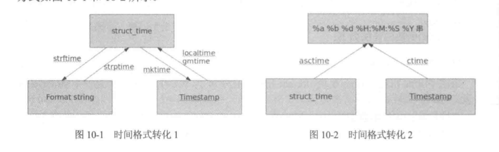

# 常用模块

[TOC]


## 内建模块

### time

* time.time()

  返回当前时间的时间戳（从1970.01.01.08:00:00）

  ```python
  In [3]: time.time()
  Out[3]: 1533868512.4080687
  ```

  

* time.localtime([secs])

  将时间戳方式向时间元组转换，默认为当前时间的转换

  ```python
  In [4]: time.localtime()
  Out[4]: time.struct_time(tm_year=2018, tm_mon=8, tm_mday=10, tm_hour=10, tm_min=38, tm_sec=23, tm_wday=4, tm_yday=222, tm_isdst=0)
      
  In [5]: time.localtime(time.time())
  Out[5]: time.struct_time(tm_year=2018, tm_mon=8, tm_mday=10, tm_hour=10, tm_min=39, tm_sec=16, tm_wday=4, tm_yday=222, tm_isdst=0)
  ```


* time.gmtime([secs])

  接收时间戳（1970纪元后经过的浮点秒数）并返回UTC时区（0时区）下的时间元组t。注：t.tm_isdst始终为0 

  ```python
  In [6]: time.gmtime()
  Out[6]: time.struct_time(tm_year=2018, tm_mon=8, tm_mday=10, tm_hour=2, tm_min=42, tm_sec=6, tm_wday=4, tm_yday=222, tm_isdst=0)
  ```

  

* time.mktime(t)

  接受时间元组并返回时间戳（1970纪元后经过的浮点秒数）。 t指结构化的时间或完整的9位元组元素（年、月、日、时、分、秒、一年中的第几周、一年中第几天、是否为夏令时）

  ```python
  In [9]: t=(2018,8,10,10,44,35,0,0,0)
  
  In [10]: time.mktime(t)
  Out[10]: 1533869075.0
  ```


* time.asctime([t])

  接受时间元组并返回一个可读的形式为"Tue Dec 11 18:07:14 2008"（2008年12月11日 周二18时07分14秒）的24个字符的字符串。 

  ```python
  In [11]: time.asctime(time.localtime())
  Out[11]: 'Fri Aug 10 11:26:41 2018'
  ```


* time.ctime([secs])

  把一个时间戳转换成"Tue Dec 11 18:07:14 2008"的形式。默认当前时间

  ```python
  In [12]: time.ctime(time.time())
  Out[12]: 'Fri Aug 10 11:28:41 2018'
      
  In [13]: time.ctime()
  Out[13]: 'Fri Aug 10 11:28:57 2018'
  ```

  

* time.sleep(secs)

  推迟调用线程的运行，secs指秒数。 

  ```python
  In [20]: print('start:%s'%time.ctime())
      ...: time.sleep(5)
      ...: print('end:%s'%time.ctime())
  start:Fri Aug 10 11:34:40 2018
  end:Fri Aug 10 11:34:45 2018
  ```


* time.clock()

  用于以浮点数计算的秒数返回当前CPU时间，用来衡量不同程序的耗时

  1. 在第一次调用时，返回程序运行的实际时间
  2. 在第二次之后的调用，返回自第一次调用后到这次调用的时间间隔

  ```python
  In [22]: def func():
      ...:     time.sleep(2)
      ...:
  
  In [23]: t1 = time.clock()
      ...: func()
      ...: print('func process time:',time.clock()-t1)
  func process time: 1.9997381215414627
  ```


* time.strftime(format[,t])

  接收时间元祖，并返回以可读字符串表示的当地时间，格式由format决定。 

  ```python
  In [28]: # 格式化成2016-03-20 11:45:39形式
      ...: print(time.strftime("%Y-%m-%d %H:%M:%S", time.localtime()))
      ...:
      ...: # 格式化成Sat Mar 28 22:24:24 2016形式
      ...: print(time.strftime("%a %b %d %H:%M:%S %Y", time.localtime()))
      ...:
      ...:
  2018-08-10 11:45:04
  Fri Aug 10 11:45:04 2018
  ```

  

* time.strptime(str[,formate])

  根据formate的格式把一个时间字符串解析为时间元组。 

  ```python
  In [29]: a = "Sat Mar 28 22:24:24 2016"
  In [30]: time.strptime(a,"%a %b %d %H:%M:%S %Y")
  Out[30]: time.struct_time(tm_year=2016, tm_mon=3, tm_mday=28, tm_hour=22, tm_min=24, tm_sec=24, tm_wday=5, tm_yday=88, tm_isdst=-1)
  ```


* 三种时间格式转换

  


### datetime

datetime是Python处理日期和时间的标准库。 

* datetime.today()

  返回一个表示当前本地时间的datetime对象

  ```python
  In [33]: from datetime import datetime
  
  In [34]: print('today is:',datetime.today())
  today is: 2018-08-10 13:33:53.236600
  ```

  

* datetime.now([tz])

  tz:时区，获取tz所指时区的本地时间的datetime对象

  ```python
  In [37]: print('now is:',datetime.now())
  now is: 2018-08-10 13:38:08.991654
  ```


* datetime.utcnow()

  返回0时区的当前时间的datetime对象

  ```python
  In [38]: print('now is:',datetime.utcnow())
  now is: 2018-08-10 05:39:13.344079
  ```


* 获取指定日期和时间

  要指定某个日期和时间，直接用参数构造一个`datetime`：

  ```python
  >>> from datetime import datetime
  >>> dt = datetime(2018, 8, 19, 12, 20) # 用指定日期时间创建datetime
  >>> print(dt)
  2018-08-19 12:20:00
  ```


* datetime.timestamp()

  把一个`datetime`类型转换为时间戳调用`timestamp()`方法：

  ```python
  >>> from datetime import datetime
  >>> dt = datetime(2015, 4, 19, 12, 20) # 用指定日期时间创建datetime
  >>> dt.timestamp() # 把datetime转换为timestamp
  1429417200.0
  ```

  注意Python的timestamp是一个浮点数。如果有小数位，小数位表示毫秒数。

  某些编程语言（如Java和JavaScript）的timestamp使用整数表示毫秒数，这种情况下需要把timestamp除以1000就得到Python的浮点表示方法。

  

* timestamp.fromtimestamp()

  把timestamp转换为`datetime`，使用`fromtimestamp()`方法：

  ```python
  >>> from datetime import datetime
  >>> t = 1429417200.0
  >>> print(datetime.fromtimestamp(t))
  2015-04-19 12:20:00
  ```

  注意到timestamp是一个浮点数，它没有时区的概念，而datetime是有时区的。上述转换是在timestamp和本地时间做转换。

  本地时间是指当前操作系统设定的时区。例如北京时区是东8区，则本地时间：

  ```
  2015-04-19 12:20:00
  ```

  实际上就是UTC+8:00时区的时间：

  ```
  2015-04-19 12:20:00 UTC+8:00
  ```

  而此刻的格林威治标准时间与北京时间差了8小时，也就是UTC+0:00时区的时间应该是：

  ```
  2015-04-19 04:20:00 UTC+0:00
  ```

  timestamp也可以直接被转换到UTC标准时区的时间：

  ```python
  >>> from datetime import datetime
  >>> t = 1429417200.0
  >>> print(datetime.fromtimestamp(t)) # 本地时间
  2015-04-19 12:20:00
  >>> print(datetime.utcfromtimestamp(t)) # UTC时间
  2015-04-19 04:20:00
  ```

  

* datetime.strptime(date_str,formate)

  将事件字符串按格式转换datetime对象

  ```python
  >>> from datetime import datetime
  >>> cday = datetime.strptime('2015-6-1 18:19:59', '%Y-%m-%d %H:%M:%S')
  >>> print(cday)
  2015-06-01 18:19:59
  ```

  字符串`'%Y-%m-%d %H:%M:%S'`规定了日期和时间部分的格式。

  

* datetime.strftime(format)

    将datetime对象按格式转换成字符串

    ```python
      >>> from datetime import datetime
      >>> now = datetime.now()
      >>> print(now.strftime('%a, %b %d %H:%M'))
      Mon, May 05 16:28
    ```


* datetime加减

  对日期和时间进行加减实际上就是把datetime往后或往前计算，得到新的datetime。加减可以直接用`+`和`-`运算符，不过需要导入`timedelta`这个类：

  ```python
  >>> from datetime import datetime, timedelta
  >>> now = datetime.now()
  >>> now
  datetime.datetime(2015, 5, 18, 16, 57, 3, 540997)
  >>> now + timedelta(hours=10)
  datetime.datetime(2015, 5, 19, 2, 57, 3, 540997)
  >>> now - timedelta(days=1)
  datetime.datetime(2015, 5, 17, 16, 57, 3, 540997)
  >>> now + timedelta(days=2, hours=12)
  datetime.datetime(2015, 5, 21, 4, 57, 3, 540997)
  ```

  使用`timedelta`你可以很容易地算出前几天和后几天的时刻。

  

* 本地时间转换为UTC时间

  本地时间是指系统设定时区的时间，例如北京时间是UTC+8:00时区的时间，而UTC时间指UTC+0:00时区的时间。

  一个`datetime`类型有一个时区属性`tzinfo`，但是默认为`None`，所以无法区分这个`datetime`到底是哪个时区，除非强行给`datetime`设置一个时区：

  ```python
  >>> from datetime import datetime, timedelta, timezone
  >>> tz_utc_8 = timezone(timedelta(hours=8)) # 创建时区UTC+8:00
  >>> now = datetime.now()
  >>> now
  datetime.datetime(2015, 5, 18, 17, 2, 10, 871012)
  >>> dt = now.replace(tzinfo=tz_utc_8) # 强制设置为UTC+8:00
  >>> dt
  datetime.datetime(2015, 5, 18, 17, 2, 10, 871012, tzinfo=datetime.timezone(datetime.timedelta(0, 28800)))
  ```

  如果系统时区恰好是UTC+8:00，那么上述代码就是正确的，否则，不能强制设置为UTC+8:00时区。

  

* 时区转换

  先通过`utcnow()`拿到当前的UTC时间，再转换为任意时区的时间：

  ```python
  # 拿到UTC时间，并强制设置时区为UTC+0:00:
  >>> utc_dt = datetime.utcnow().replace(tzinfo=timezone.utc)
  >>> print(utc_dt)
  2015-05-18 09:05:12.377316+00:00
  # astimezone()将转换时区为北京时间:
  >>> bj_dt = utc_dt.astimezone(timezone(timedelta(hours=8)))
  >>> print(bj_dt)
  2015-05-18 17:05:12.377316+08:00
  # astimezone()将转换时区为东京时间:
  >>> tokyo_dt = utc_dt.astimezone(timezone(timedelta(hours=9)))
  >>> print(tokyo_dt)
  2015-05-18 18:05:12.377316+09:00
  # astimezone()将bj_dt转换时区为东京时间:
  >>> tokyo_dt2 = bj_dt.astimezone(timezone(timedelta(hours=9)))
  >>> print(tokyo_dt2)
  2015-05-18 18:05:12.377316+09:00
  ```

  时区转换的关键在于，拿到一个`datetime`时，要获知其正确的时区，然后强制设置时区，作为基准时间。

  利用带时区的`datetime`，通过`astimezone()`方法，可以转换到任意时区。

  注：不是必须从UTC+0:00时区转换到其他时区，任何带时区的`datetime`都可以正确转换，例如上述`bj_dt`到`tokyo_dt`的转换。

  


**小结**

  `datetime`表示的时间需要时区信息才能确定一个特定的时间，否则只能视为本地时间。

  如果要存储`datetime`，最佳方法是将其转换为timestamp再存储，因为timestamp的值与时区完全无关。


### collections


## 第三方模块

