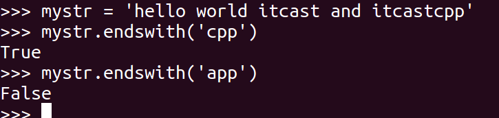

# 字符串

[TOC]

## 字符串介绍

字符串是python中常用的数据类型，可以使用单引号或双引号创建。

上面所述的关于序列的操作，对字符串同样适用。但字符串是不可变，所以不能切片赋值

```python
>>>str='hello'
>>>str[1]
'e'

# 以下赋值是不合法的
# str[1] = 'a'
```

【问题】给定一个字符串aStr, 请反转字符串？

```python
>>>str='hello world'
>>>str[::-1]
'dlrow olleh'
```


### 转移字符

在需要在字符中使用特殊字符时，python用反斜杠(\)转义字符。如下表： 

| 转义字符     | 描述                                         |
| ------------ | -------------------------------------------- |
| \\(在行尾时) | 续行符                                       |
| \\\\         | 反斜杠符号                                   |
| \'           | 单引号                                       |
| \"           | 双引号                                       |
| \a           | 响铃                                         |
| \b           | 退格(Backspace)                              |
| \e           | 转义                                         |
| \000         | 空                                           |
| \n           | 换行                                         |
| \v           | 纵向制表符                                   |
| \t           | 横向制表符                                   |
| \r           | 回车                                         |
| \f           | 换页                                         |
| \oyy         | 八进制数，yy代表的字符，例如：\o12代表换行   |
| \xyy         | 十六进制数，yy代表的字符，例如：\x0a代表换行 |
| \other       | 其它的字符以普通格式输出                     |


### 字符串格式化

```python
>>>'hello %s,%d'%('world',2018)
'hello world,2018'
```

其实%s、%d相当于标记了需要放置转换值的位置，即占位符。

**python中的格式化符号**：

| 符   号 | 描述                                 |
| ------- | ------------------------------------ |
| %c      | 格式化字符及其ASCII码                |
| %s      | 格式化字符串                         |
| %d      | 格式化整数                           |
| %u      | 格式化无符号整型                     |
| %o      | 格式化无符号八进制数                 |
| %x      | 格式化无符号十六进制数               |
| %X      | 格式化无符号十六进制数（大写）       |
| %f      | 格式化浮点数字，可指定小数点后的精度 |
| %e      | 用科学计数法格式化浮点数             |
| %E      | 作用同%e，用科学计数法格式化浮点数   |
| %g      | %f和%e的简写                         |
| %G      | %f 和 %E 的简写                      |
| %p      | 用十六进制数格式化变量的地址         |

**注意：%f可指定精度值，若不指定精度，默认输出6位小数。**

#### 字段宽度和精度

字段宽度是转换后的值保留的最小字符个数，精度是数字转换结果中应该包含的小数位数或字符串转换后的值所能包含的最大字符个数。

```python
>>>'圆周率PI: %10f'%3.141593
#字符串宽度为10，不足10位时剩余的用空格补齐
'圆周率PI:   3.141593'

>>>'圆周率PI: %10.2f'%3.141593
#字符串宽度为10，小数部分保留2位，总共占据4位，剩余6位用空格补齐
'圆周率PI:       3.14'

>>>'圆周率PI: %.2f'%3.141593
#没有宽度，保留两位小数
'圆周率PI: 3.14'

>>>'字符串精度：%.5s'%'hello world'
#打印字符串前5个字符
'字符串精度：hello'
```


可以使用*（星号）作为字段宽度或进度，数值会从元组中读出

```python
>>>'元组中获得宽度精度：%*.*s'%(8,3,'hello,world')
#宽度为8，精度为3，剩余用空格补齐
'元组中获得宽度精度：     hel'

>>>'元组中获得宽度精度：%.*s'%(3,'hello,world')
#精度输出为3
'元组中获得宽度精度：hel'
```


#### 符号、对齐和0填充

```python
>>>'圆周率PI: %10.2f'%3.141593
'圆周率PI:       3.14'

>>>'圆周率PI: %-10.2f'%3.141593
# 减号（-）用来左对齐数值
'圆周率PI: 3.14      '

>>>'圆周率PI: %010.2f'%3.141593
#0 表示多余的用0补充
'圆周率PI: 0000003.14'

#加号（+）表示无论正负数都显示出符号
>>>'圆周率PI: %+10.2f'%-3.141593
'圆周率PI:      -3.14'
>>>'圆周率PI: %+10.2f'%3.141593
'圆周率PI:      +3.14'
```


#### str.format()

Python2.6 开始，新增了一种格式化字符串的函数 str.format()，它增强了字符串格式化的功能。

 ```python
>>>"{} {}".format("hello", "world")    # 不设置指定位置，按默认顺序
'hello world'
 
>>> "{0} {1}".format("hello", "world")  # 设置指定位置
'hello world'
 
>>> "{1} {0} {1}".format("hello", "world")  # 设置指定位置
'world hello world'

#也可以设置参数
>>>"网站名：{name}, 地址 {url}".format(name="菜鸟教程", url="www.runoob.com")
网站名：菜鸟教程, 地址 www.runoob.com
 
# 通过字典设置参数
>>>site = {"name": "菜鸟教程", "url": "www.runoob.com"}
>>>"网站名：{name}, 地址 {url}".format(**site)
网站名：菜鸟教程, 地址 www.runoob.com
 
# 通过列表索引设置参数
>>>my_list = ['菜鸟教程', 'www.runoob.com']
>>>"网站名：{0[0]}, 地址 {0[1]}".format(my_list)  # "0" 是必须的
网站名：菜鸟教程, 地址 www.runoob.com
 ```

 

数字格式化

```python
>>> print("{:.2f}".format(3.1415926));
3.14
```


| 数字       | 格式                                                         | 输出                                  | 描述                         |
| ---------- | ------------------------------------------------------------ | ------------------------------------- | ---------------------------- |
| 3.1415926  | {:.2f}                                                       | 3.14                                  | 保留小数点后两位             |
| 3.1415926  | {:+.2f}                                                      | +3.14                                 | 带符号保留小数点后两位       |
| -1         | {:+.2f}                                                      | -1.00                                 | 带符号保留小数点后两位       |
| 2.71828    | {:.0f}                                                       | 3                                     | 不带小数                     |
| 5          | {:0>2d}                                                      | 05                                    | 数字补零 (填充左边, 宽度为2) |
| 5          | {:x<4d}                                                      | 5xxx                                  | 数字补x (填充右边, 宽度为4)  |
| 10         | {:x<4d}                                                      | 10xx                                  | 数字补x (填充右边, 宽度为4)  |
| 1000000    | {:,}                                                         | 1,000,000                             | 以逗号分隔的数字格式         |
| 0.25       | {:.2%}                                                       | 25.00%                                | 百分比格式                   |
| 1000000000 | {:.2e}                                                       | 1.00e+09                              | 指数记法                     |
| 13         | {:10d}                                                       | 13                                    | 右对齐 (默认, 宽度为10)      |
| 13         | {:<10d}                                                      | 13                                    | 左对齐 (宽度为10)            |
| 13         | {:^10d}                                                      | 13                                    | 中间对齐 (宽度为10)          |
| 11         | `'{:b}'.format(11)` `'{:d}'.format(11)`  `'{:o}'.format(11)` `'{:x}'.format(11)` `'{:#x}'.format(11)` `'{:#X}'.format(11)` | `1011`  `11`  `13` `b`  `0xb`  `0XB ` | 进制                         |

`^`, `<`, `>` 分别是居中、左对齐、右对齐，后面带宽度， `: `号后面带填充的字符，只能是一个字符，不指定则默认是用空格填充。

`+`表示在正数前显示 `+`，负数前显示`-` ；  （空格）表示在正数前加空格

`b`、`d`、`o`、`x` 分别是二进制、十进制、八进制、十六进制。

此外我们可以使用大括号 `{}` 来转义大括号，如下实例：

```python
>>>print ("{} 对应的位置是 {{0}}".format("runoob"))
runoob 对应的位置是 {0}
```


### Unicode 字符串

在Python2中，普通字符串是以8位ASCII码进行存储的，而Unicode字符串则存储为16位unicode字符串，这样能够表示更多的字符集。使用的语法是在字符串前面加上前缀 **u**。

在Python3中，所有的字符串都是Unicode字符串。


### 三引号

python三引号允许一个字符串跨多行，字符串中可以包含换行符、制表符以及其他特殊字符。

```python
>>>para_str = """这是一个多行字符串的实例
多行字符串可以使用制表符
TAB ( \t )。
也可以使用换行符 [ \n ]。
"""
>>>print (para_str)
这是一个多行字符串的实例
多行字符串可以使用制表符
TAB (    )。
也可以使用换行符 [ 
 ]。
```


### 字符串方法

#### find()

```
mystr.find(str, start=0, end=len(mystr))
```

检测 str 是否包含在 mystr中，在[start,end)的范围，如果找到就返回开始的索引值，否则返回-1 

```python
>>>mystr='do it now'
>>>mystr.find('now')
6

>>>mystr.find('it',5)#提供起点
-1
>>>mystr.find('it',0,5)#提供起点终点
3
```


#### index()

```
mystr.index(str, start=0, end=len(mystr)) 
```

跟find()方法一样，只不过如果str不在 mystr中会报一个异常.

```python
>>>mystr='do it now'
>>>mystr.index('it',5)#提供起点
Traceback (most recent call last):
  File "<stdin>", line 1, in <module>
ValueError: substring not found
```


#### join()

```
mystr.join(sequence)
```

sequence的每个元素之间用mystr连接起来,构造出一个新的字符串 

```python
>>>mystr=' '
>>>li=['i','am','boy']
>>>mystr.join(li)
'i am boy'
```


#### lower()

```
mystr.lower()    
```

转换 mystr 中所有大写字符为小写 

```python
>>>str='Abc'
>>>str.lower()
'abc'
```


#### upper()

```
mystr.upper()  
```

转换 mystr 中的小写字母为大写 

```python
>>>str='Abc'
>>>str.upper()
'ABC'
```


#### swapcase()

```python
mystr.swapcase()  
```

将mystr中的大写转小写，小写转大写


#### replace()

```
mystr.replace(str1, str2, count)
```

把 mystr 中的 str1 替换成 str2,如果 count 指定，则替换不超过 count 次。默认全部替换

```python
>>>str='ha ha ha hehe'
>>>str.replace('ha','HA')
'HA HA HA hehe'
>>>str.replace('ha','HA',2)
'HA HA ha hehe'
```


#### split()

```
mystr.split(str=" ", num) 
```

以 str 为分隔符切片 mystr，如果 num有指定值，则仅分隔 num个子字符串。默认按空格分割

```python
>>>str.split(" ")
['ha', 'ha', 'ha', 'hehe']
```


#### translate()

```
str.translate(table[,deletechars])
```

根据table给出的翻译表转换字符串的支付，deletechars代表字符串中要过滤的字符列表。其中table翻译表通过maketrans方法转换而来

```python
>>>intab='adefs'
>>>outab='12345'
>>>transtab=str.maketrans(intab,outab)
>>>st='just do it'
>>>st.translate(transtab)
'ju5t 2o it'
```


#### capitalize()

```
mystr.capitalize()
```

把字符串的第一个字符大写 


#### title()

把字符串的每个单词首字母大写 

```python
>>> a = "hello itcast"
>>> a.title()
'Hello Itcast'
```


#### startswith()

```
mystr.startswith(obj)
```

检查字符串是否是以 obj 开头, 是则返回 True，否则返回 False 


#### endswith()

```
mystr.endswith(obj)
```

检查字符串是否以obj结束，如果是返回True,否则返回 False. 




#### ljust()

```
mystr.ljust(width)
```

返回一个原字符串左对齐,并使用空格填充至长度 width 的新字符串 


#### rjust()

```
mystr.rjust(width)    
```

返回一个原字符串右对齐,并使用空格填充至长度 width 的新字符串 


#### center()

```
mystr.center(width)   
```

返回一个原字符串居中,并使用空格填充至长度 width 的新字符串 


#### strip()

```
mystr.strip([chars])
```

用于移除字符串头尾指定的字符（默认为空白字符）

```python
>>> a="\n\t itcast \t\n"
>>> a.strip()
'itcast'

>>>a='---abc--'
>>>a.strip('-')
'abc'
```


#### lstrip()

```
mystr.lstrip()
```

删除 mystr 左边的空白字符 


#### rstrip()

```
mystr.rstrip()    
```

删除 mystr 字符串末尾的空白字符 


#### rfind()

```
mystr.rfind(str, start=0,end=len(mystr) )
```

类似于 find()函数，不过是从右边开始查找. 


#### rindex()

```
mystr.rindex( str, start=0,end=len(mystr))
```

类似于 index()，不过是从右边开始. 


#### partition()

```
mystr.partition(str)
```

把mystr以str分割成三部分,str前，str和str后 


#### rpartition()

```
mystr.rpartition(str)
```

类似于 partition()函数,不过是从右边开始. 


#### splitlines()

```
mystr.splitlines()  
```

按照行分隔，返回一个包含各行作为元素的列表 


#### isalpha()

```
mystr.isalpha()  
```

如果 mystr 所有字符都是字母 则返回 True,否则返回 False

 


#### isdigit()

```
mystr.isdigit() 
```

如果 mystr 只包含数字则返回 True 否则返回 False. 


#### isalnum()

```
mystr.isalnum()  
```

如果 mystr 所有字符都是字母或数字则返回 True,否则返回 False 


#### isspace()

```
mystr.isspace()   
```

如果 mystr 中只包含空格，则返回 True，否则返回 False. 


