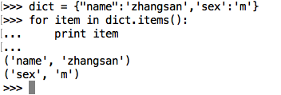
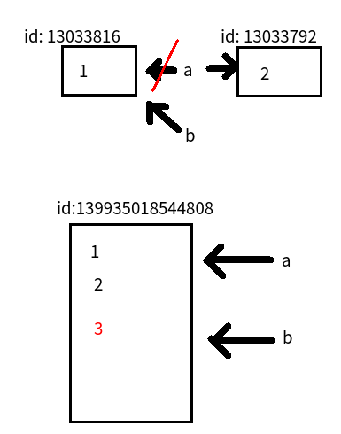

# 遍历、公共方法、引用
[TOC]

## 遍历

通过for ... in ...:的语法结构，可以遍历字符串、列表、元组、字典，集合等数据结构。

### 字符串遍历

```python
>>> a_str = "hello"
>>> for char in a_str:
...     print(char,end=' ')
...
h e l l o
```


### 列表遍历

```python
>>> a_list = [1, 2, 3, 4, 5]
>>> for num in a_list:
...     print(num,end=' ')
...
1 2 3 4 5
```


### 元组遍历

```python
>>> a_turple = (1, 2, 3, 4, 5)
>>> for num in a_turple:
...     print(num,end=" ")
1 2 3 4 5
```


### 集合遍历

```python
>>> a_set = {1, 2, 3, 4, 5}
>>> for num in a_set:
...     print(num,end=" ")
1 2 3 4 5
```


### 字典遍历

#### 遍历字典的key（键）


#### 遍历字典的value（值）


#### 遍历字典的项（元素）




#### 遍历字典的key-value（键值对）


#### 带下标索引的遍历： enumerate()

```python
>>> chars = ['a', 'b', 'c', 'd']
>>> for i, chr in enumerate(chars):
...     print(i,chr)
...
0 a
1 b
2 c
3 d
```


## 公共方法

### 运算符

| 运算符 | Python 表达式      | 结果                         | 描述           | 支持的数据类型           |
| ------ | ------------------ | ---------------------------- | -------------- | ------------------------ |
| +      | [1, 2] + [3, 4]    | [1, 2, 3, 4]                 | 合并           | 字符串、列表、元组       |
| *      | 'Hi!' * 4          | ['Hi!', 'Hi!', 'Hi!', 'Hi!'] | 复制           | 字符串、列表、元组       |
| in     | 3 in (1, 2, 3)     | True                         | 元素是否存在   | 字符串、列表、元组、字典 |
| not in | 4 not in (1, 2, 3) | True                         | 元素是否不存在 | 字符串、列表、元组、字典 |


#### +

```python
>>> "hello " + "itcast"
'hello itcast'
>>> [1, 2] + [3, 4]
[1, 2, 3, 4]
>>> ('a', 'b') + ('c', 'd')
('a', 'b', 'c', 'd')
```

#### *

```python
>>> 'ab'*4
'ababab'
>>> [1, 2]*4
[1, 2, 1, 2, 1, 2, 1, 2]
>>> ('a', 'b')*4
('a', 'b', 'a', 'b', 'a', 'b', 'a', 'b')
```

#### in

```python
>>> 'itc' in 'hello itcast'
True
>>> 3 in [1, 2]
False
>>> 4 in (1, 2, 3, 4)
True
>>> "name" in {"name":"Delron", "age":24}
True
```

**注意，in在对字典操作时，判断的是字典的键**


### python内置函数

Python包含了以下内置函数

| 序号 | 方法              | 描述                 |
| ---- | ----------------- | -------------------- |
| 1    | cmp(item1, item2) | 比较两个值           |
| 2    | len(item)         | 计算容器中元素个数   |
| 3    | max(item)         | 返回容器中元素最大值 |
| 4    | min(item)         | 返回容器中元素最小值 |
| 5    | del(item)         | 删除变量             |

#### cmp

```python
>>> cmp("hello", "itcast")
-1
>>> cmp("itcast", "hello")
1
>>> cmp("itcast", "itcast")
0
>>> cmp([1, 2], [3, 4])
-1
>>> cmp([1, 2], [1, 1])
1
>>> cmp([1, 2], [1, 2, 3])
-1
>>> cmp({"a":1}, {"b":1})
-1
>>> cmp({"a":2}, {"a":1})
1
>>> cmp({"a":2}, {"a":2, "b":1})
-1
```

**注意：cmp在比较字典数据时，先比较键，再比较值。**

#### len

```python
>>> len("hello itcast")
12
>>> len([1, 2, 3, 4])
4
>>> len((3,4))
2
>>> len({"a":1, "b":2})
2
```

**注意：len在操作字典数据时，返回的是键值对个数。**

#### max

```python
>>> max("hello itcast")
't'
>>> max([1,4,522,3,4])
522
>>> max({"a":1, "b":2})
'b'
>>> max({"a":10, "b":2})
'b'
>>> max({"c":10, "b":2})
'c'
```

#### del

del有两种用法，一种是del加空格，另一种是del()

```python
>>> a = 1
>>> a
1
>>> del a
>>> a
Traceback (most recent call last):
  File "<stdin>", line 1, in <module>
NameError: name 'a' is not defined
>>> a = ['a', 'b']
>>> del a[0]
>>> a
['b']
>>> del(a)
>>> a
Traceback (most recent call last):
  File "<stdin>", line 1, in <module>
NameError: name 'a' is not defined
```


### 多维列表/元祖访问的示例

```python
>>> tuple1 = [(2,3),(4,5)]
>>> tuple1[0]
(2, 3)
>>> tuple1[0][0]
2
>>> tuple1[0][2]
Traceback (most recent call last):
  File "<stdin>", line 1, in <module>
IndexError: tuple index out of range
>>> tuple1[0][1]
3
>>> tuple1[2][2]
Traceback (most recent call last):
  File "<stdin>", line 1, in <module>
IndexError: list index out of range
>>> tuple2 = tuple1+[(3)]
>>> tuple2
[(2, 3), (4, 5), 3]
>>> tuple2[2]
3
>>> tuple2[2][0]
Traceback (most recent call last):
  File "<stdin>", line 1, in <module>
TypeError: 'int' object is not subscriptable 
```


## 引用

在python中，值是靠引用来传递来的。

**我们可以用id()来判断两个变量是否为同一个值的引用。** 我们可以将id值理解为那块内存的地址标示。

```python
>>> a = 1
>>> b = a
>>> id(a) 
13033816
>>> id(b)   # 注意两个变量的id值相同
13033816
>>> a = 2
>>> id(a)   # 注意a的id值已经变了
13033792
>>> id(b)   # b的id值依旧
13033816
```


```python
>>> a = [1, 2]
>>> b = a
>>> id(a)
139935018544808
>>> id(b)
139935018544808
>>> a.append(3)
>>> a
[1, 2, 3]
>>> id(a)
139935018544808
>>> id(b)       # 注意a与b始终指向同一个地址
139935018544808
```



### 可变类型与不可变类型

可变类型，值可以改变：

- 列表 list
- 字典 dict

不可变类型，值不可以改变：

- 数值类型 int, long, bool, float
- 字符串 str
- 元组 tuple


## 常用的数据类型转换

| 函数                   | 说明                                                |
| ---------------------- | --------------------------------------------------- |
| int(x [,base ])        | 将x转换为一个整数                                   |
| long(x [,base ])       | 将x转换为一个长整数                                 |
| float(x )              | 将x转换到一个浮点数                                 |
| complex(real [,imag ]) | 创建一个复数                                        |
| str(x )                | 将对象 x 转换为字符串                               |
| repr(x )               | 将对象 x 转换为表达式字符串                         |
| eval(str )             | 用来计算在字符串中的有效Python表达式,并返回一个对象 |
| tuple(s )              | 将序列 s 转换为一个元组                             |
| list(s )               | 将序列 s 转换为一个列表                             |
| chr(x )                | 将一个整数转换为一个字符                            |
| unichr(x )             | 将一个整数转换为Unicode字符                         |
| ord(x )                | 将一个字符转换为它的整数值                          |
| hex(x )                | 将一个整数转换为一个十六进制字符串                  |
| oct(x )                | 将一个整数转换为一个八进制字符串                    |


