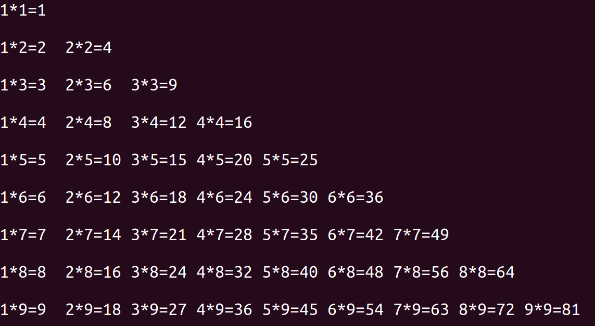

# 条件,循环语句

[TOC]

程序代码结构

* 顺序结构   

  按照从上到下的顺序，一条语句一条语句的执行，是最基本的结构 

* 分支结构

  条件分支(if-else)语句

* 循环结构 

  写循环程序时需要注意循环变量的初值,循环条件和循环变量的增量，三者共称为循环三要素 


## 1.条件判断

在条件判断的布尔表达式中,以下的值会被解释器看做假

* False
* None
* 0(所有类型的数字, 包括浮点型,长整型和其他类型)
* ""(空字符串)
* ()  空元祖
* []  空列表
* {}  空字典

### 1. if-else

使用格式:

```python
if 条件:
    #满足条件代码
else:
    #不满足条件代码
```


### 2.elif

当有多个子条件需要判定时,可以使用elif, 使用格式

```python
    if xxx1:
        #满足条件代码
    elif xxx2:
        #满足条件代码
    elif xxx3:
        #满足条件代码
    else:
        #不满足条件代码
```

**注意: elif必须和if一起使用 ,不能单独使用**


### 3.if嵌套

使用格式:

```python
  if 条件1:
        #满足条件1代码
        if 条件2:
           #满足条件1并且满足条件2代码
   
```


### 4.其他条件判断

* #### is: 同一性运算符

```python
>>>x=y=[1,2]
>>>z=[1,2]
>>>x==y
True
>>>x==z
True
>>>x is y
True
>>>x is z
False
```

​	is运算符是用于判断同一性而不是相等性, x,y因为指向同一个列表所以结果为True, 但是变量z指向的是另一个		列表,即使列表中的值相等,确不是同一个对象,所以结果为False.

* #### 字符串和序列的比较

  字符串可以按照字母排列顺序进行比较,  序列同样按照相同的顺序进行比较,但是两者比较的的类型要相等

  ```python
  >>>[1,2]<[2,1]
  True
  >>>[1,2]==[1,2]
  False
  ```

* #### 断言

  * assert断言用来声明某个条件是真的
  * assert语句失败时, 会引发一个AssertionError

  ```python
  >>>x = 2
  >>>assert x%2>0
  Traceback (most recent call last):
    File "<input>", line 1, in <module>
  AssertionError
  >>>assert x > 0
  ```

  当assert后面的条件为真时,程序正常运行,当条件为假时,程序引发异常,输出错误信息


## 2.循环

### 1.while循环

使用格式:

```python
while 判断条件:
    #执行语句
```

判断条件可以是任何表达式,当判断条件为真时,反复执行语句块, 直到条件为假时, 结束循环.

#### while嵌套

```python
    while 判断条件1:
      	#执行语句
        while 判断条件2:
           #执行语句
```


嵌套应用:九九乘法表



```python
    i = 1
    while i<=9:
        j=1
        while j<=i:
            print("%d*%d=%-2d "%(j,i,i*j),end='')
            j+=1
        print('\n')
        i+=1
```


### 2. for循环

在python中for循环可以遍历任何序列,如一个列表或字符串

使用格式:

```python
    for 临时变量 in 序列:
        #循环满足条件时执行的代码
    else:
        #循环不满足条件时执行的代码
```

```python
>>> for i in 'abc':
...    print(i)
... else:
...    print('遍历结束了')
    
a
b
c
遍历结束了
```


### 3.break和Continue

* break的作用: 用来结束整个循环 
* continue的作用: 用来结束本次循环，紧接着执行下一次的循环 
* break/continue只能用在循环中，除此以外不能单独使用 
* break/continue在嵌套循环中，只对最近的一层循环起作用 


### 4.遍历字典

```python
>>>tups = {'a':1,"b":2}
>>>for k,v in tups.items():
...    print('{0}:{1}'.format(k,v))
    
a:1
b:2
>>>
```

单独迭代字典的key或者value可以使用字典的keys()或values()函数 


### 5.迭代

* 并行迭代:同时迭代多个序列

  python中可以使用`zip()`函数进行并行迭代

  ```python
  >>>numbers = [1, 2, 3, 4]
  >>>words = ["one", "two", "three", "four"]
  >>>days = ["Mon.", "Tues.", "Wed.", "Thur."]
  >>>for number, word, day in zip(numbers, words, days):
  ...		print(number, word, day)
  
  1 one Mon.
  2 two Tues.
  3 three Wed.
  4 four Thur.
  ```

  - `zip()`函数在长度最小的参数中的元素用完后自动停止，其他参数未使用的元素将被略去

  - `zip()`函数的返回值不是列表或元组，而是一个整合在一起的可迭代变量 

    ```python
    >>>zip(words,days)
    <zip object at 0x104faee88>
    
    
    >>>list(zip(words, days))
    [('one', 'Mon.'), ('two', 'Tues.'), ('three', 'Wed.'), ('four', 'Thur.')]
    ```

* 翻转和排序迭代

  * 翻转函数:`reversed()`
  * 排序函数:`sorted()`

  这两个函数可作用于任何序列或可迭代对象. 但不是修改原对象, 而是返回翻转或排序后的新对象,

  `reversed()`返回的是一个可迭代对象,可以使用list类将其转换成列表

  ```python
  >>>a= [1,21,5,3]
  >>>sorted(a)
  [1, 3, 5, 21]
  
  >>>a
  [1, 21, 5, 3]
  
  >>>sorted('hello, world')
  [' ', ',', 'd', 'e', 'h', 'l', 'l', 'l', 'o', 'o', 'r', 'w']
  
  >>>reversed('hello,world')
  <reversed object at 0x105532f98>
  
  >>>list(reversed('hello,world'))
  ['d', 'l', 'r', 'o', 'w', ',', 'o', 'l', 'l', 'e', 'h']
  
  >>>reversed(a)
  <list_reverseiterator object at 0x105532780>
  
  >>>list(reversed(a))
  [3, 5, 21, 1]
  
  >>>''.join(reversed('hello'))
  'olleh'
  ```

  


