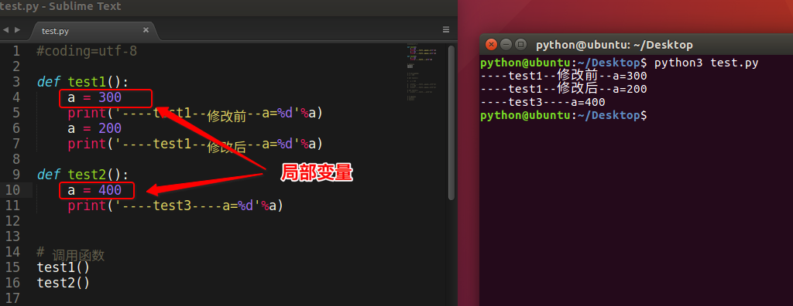
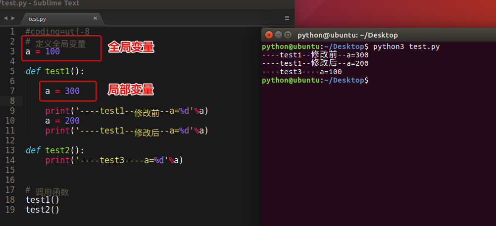

# 函数

[TOC]


## 函数定义

定义函数格式：

```python
def 函数名():
    函数体
```

* 函数名称必须以字母或下划线‘__'开头，和定义变量的规则一样。
* 不能用关键字定义函数名称
* 函数体中函数语句需要缩进，以表示该语句属于这个函数，同一层级的代码缩进一致

```python
    # 定义一个函数，能够完成打印信息的功能
    def printInfo():
        print '------------------------------------'
        print '         人生苦短，我用Python'
        print '------------------------------------'
```


定义一个空函数可以用pass语句，pass相当于占位符

```python
def printinfo():
    pass
```


## 调用函数

通过 **函数名()** 即可完成调用 

```python
# 定义完函数后，函数是不会自动执行的，需要调用它才可以
printInfo()
```


## 函数的文档说明

```python
>>> def test(a,b):
...     "用来完成对2个数求和"
...     print("%d"%(a+b))
... 
>>> help(test)

#可以看到该函数的相关说明
Help on function test in module __main__:

test(a, b)
    用来完成对2个数求和
(END)

```


## 函数的参数

函数参数的类型：

* 必须参数
* 关键字参数
* 默认参数
* 可变参数


### 必须参数

必须参数必须以正确的顺序传入函数。调用时传参数量必须和声明时的一样

```python
def param_1(str):
    print(str)
    
#函数调用
param_1('hahah')

#如果没有传参或者参数超过一个都会报错
param_1()
Traceback (most recent call last):
  File "<input>", line 1, in <module>
TypeError: param_1() missing 1 required positional argument: 'str'#
        

param_1('hah','haha')
Traceback (most recent call last):
  File "<input>", line 1, in <module>
TypeError: param_1() takes 1 positional argument but 2 were given
```


### 默认参数

调用函数时，如果没有传递参数，就会使用默认的参数

```python
def printinfo(name, age = 35 ):
   # 打印任何传入的字符串
   print("Name: ", name)
   print("Age ", age)

# 调用printinfo函数
printinfo(name="miki" )
printinfo(age=9,name="miki" )

#结果
Name:  miki
Age  35
Name:  miki
Age  9
```

**注意：默认参数一定要放在非默认参数的后面 。** 

```python
>>> def printinfo(name, age=35, sex):
...     print name
...
  File "<stdin>", line 1
SyntaxError: non-default argument follows default argument
```


#### 多个默认参数

```python
def enroll(name, gender, age=6, city='Beijing'):
    print('name:', name)
    print('gender:', gender)
    print('age:', age)
    print('city:', city)
```

当存在多个默认参数的时候，调用的时候，既可以按顺序提供默认参数，比如调用`enroll('Bob', 'M', 7)`，意思是，除了`name`，`gender`这两个参数外，最后1个参数应用在参数`age`上，`city`参数由于没有提供，仍然使用默认值。

也可以不按顺序提供部分默认参数。当不按顺序提供部分默认参数时，需要把参数名写上。比如调用`enroll('Adam', 'M', city='Tianjin')`，意思是，`city`参数用传进去的值，其他默认参数继续使用默认值。


#### 默认参数不能为可变对象

```python
def add_end(L=[]):
    L.append('END')
    return L

>>> add_end()
['END', 'END']
>>> add_end()
['END', 'END', 'END']
```

**原因**：Python函数在定义的时候，默认参数`L`的值就被计算出来了，即`[]`，因为默认参数`L`也是一个变量，它指向对象`[]`，每次调用该函数，如果改变了`L`的内容，则下次调用时，默认参数的内容就变了，不再是函数定义时的`[]`了。 

**定义默认参数要牢记一点：默认参数必须指向不变对象！ **

上述例子，可以用None这个不可变对象来实现：

```python
def add_end(L=None):
    if L is None:
        L = []
    L.append('END')
    return L
```


### 可变参数

可变参数就是传入的参数个数是可变的，不定的

```python
def calc(*numbers):
    sum = 0
    for n in numbers:
        sum = sum + n * n
    return sum
```

可变参数的定义即在参数前面加一个`*`。在函数内部，参数`numbers`接收到的是一个元组，将传参都放在同一个元组中

如果传参是list或者tuple，要调用一个可变参数函数时，可以在list或tuple前面加一个`*`号，把list或tuple的元素变成可变参数传进去： 

```python
>>> nums = [1, 2, 3]
>>> calc(*nums)
14
```

`*nums`表示把`nums`这个list的所有元素作为可变参数传进去。 


### 关键字参数

可变参数允许你传入0个或任意个参数，这些可变参数在函数调用时自动组装为一个tuple。而关键字参数允许你传入0个或任意个含参数名的参数，这些关键字参数在函数内部自动组装为一个dict。 

```python
def person(name, age, **kw):
    print('name:', name, 'age:', age, 'other:', kw)
```

函数`person`除了必选参数`name`和`age`外，还接受关键字参数`kw`。

```python
>>> person('Michael', 30)
name: Michael age: 30 other: {}
            
>>> person('Bob', 35, city='Beijing')
name: Bob age: 35 other: {'city': 'Beijing'}
>>> person('Adam', 45, gender='M', job='Engineer')
name: Adam age: 45 other: {'gender': 'M', 'job': 'Engineer'}  
```

如果传参就是字典的话，可以这样传递：

```python
>>> extra = {'city': 'Beijing', 'job': 'Engineer'}
>>> person('Jack', 24, **extra)
name: Jack age: 24 other: {'city': 'Beijing', 'job': 'Engineer'}
```

**注意：**`**extra`表示把`extra`这个dict的所有key-value用关键字参数传入到函数的`**kw`参数，`kw`将获得一个dict，**而kw获得的dict是`extra`的一份拷贝，对`kw`的改动不会影响到函数外的`extra`。 **


#### 命名关键字参数

如果要限制关键字参数的名字，就可以用命名关键字参数，例如，只接收`city`和`job`作为关键字参数。这种方式定义的函数如下： 

```python
def person(name, age, *, city, job):
    print(name, age, city, job)
```

和关键字参数`**kw`不同，命名关键字参数需要一个特殊分隔符`*`，`*`后面的参数被视为命名关键字参数。 

* 命名关键字参数必须传入参数名，这和位置参数不同。如果没有传入参数名，调用将报错： 

```python
>>> person('Jack', 24, city='Beijing', job='Engineer')
Jack 24 Beijing Engineer

>>> person('Jack', 24, 'Beijing', 'Engineer')
Traceback (most recent call last):
  File "<stdin>", line 1, in <module>
TypeError: person() takes 2 positional arguments but 4 were given
```


* 如果函数定义中已经有了一个可变参数，后面跟着的命名关键字参数就不再需要一个特殊分隔符`*`了 

```python
def person(name, age, *args, city, job):
    print(name, age, args, city, job)
```


* 命名关键字参数可以有缺省值 

```python
def person(name, age, *, city='Beijing', job):
    print(name, age, city, job)
    
#由于命名关键字参数city具有默认值，调用时，可不传入city参数：
>>> person('Jack', 24, job='Engineer')
Jack 24 Beijing Engineer
```


### 参数的组合

在Python中定义函数，可以用必选参数、默认参数、可变参数、关键字参数和命名关键字参数，这5种参数都可以组合使用。但是请注意，参数定义的顺序必须是：必选参数、默认参数、可变参数、命名关键字参数和关键字参数。 

```python
def f1(a, b, c=0, *args, **kw):
    print('a =', a, 'b =', b, 'c =', c, 'args =', args, 'kw =', kw)

def f2(a, b, c=0, *, d, **kw):
    print('a =', a, 'b =', b, 'c =', c, 'd =', d, 'kw =', kw)
```

在函数调用的时候，Python解释器自动按照参数位置和参数名把对应的参数传进去。 

```python
>>> f1(1, 2)
a = 1 b = 2 c = 0 args = () kw = {}
>>> f1(1, 2, c=3)
a = 1 b = 2 c = 3 args = () kw = {}
>>> f1(1, 2, 3, 'a', 'b')
a = 1 b = 2 c = 3 args = ('a', 'b') kw = {}
>>> f1(1, 2, 3, 'a', 'b', x=99)
a = 1 b = 2 c = 3 args = ('a', 'b') kw = {'x': 99}
>>> f2(1, 2, d=99, ext=None)
a = 1 b = 2 c = 0 d = 99 kw = {'ext': None}
```

也可以通过元组和列表传递

```python
>>> args = (1, 2, 3, 4)
>>> kw = {'d': 99, 'x': '#'}
>>> f1(*args, **kw)
a = 1 b = 2 c = 3 args = (4,) kw = {'d': 99, 'x': '#'}
>>> args = (1, 2, 3)
>>> kw = {'d': 88, 'x': '#'}
>>> f2(*args, **kw)
a = 1 b = 2 c = 3 d = 88 kw = {'x': '#'}
```

所以，对于任意函数，都可以通过类似`func(*args, **kw)`的形式调用它，无论它的参数是如何定义的。 


### 引用传参

**Python中函数参数是引用传递（注意不是值传递）。对于不可变类型，因变量不能修改，所以运算不会影响到变量自身；而对于可变类型来说，函数体中的运算有可能会更改传入的参数变量。** 

```python
>>> def selfAdd(a):
...     """自增"""
...     a += a
...
>>> a_int = 1
>>> a_int
1
>>> selfAdd(a_int)
>>> a_int
1
>>> a_list = [1, 2]
>>> a_list
[1, 2]
>>> selfAdd(a_list)
>>> a_list
[1, 2, 1, 2]
```


## 变量作用域

变量的作用域决定了在哪一部分程序可以访问哪个特定的变量名称。Python的作用域一共有4种，分别是：

- L （Local） 局部作用域
- E （Enclosing） 闭包函数外的函数中
- G （Global） 全局作用域
- B （Built-in） 内建作用域

以 L –> E –> G –>B 的规则查找，即：在局部找不到，便会去局部外的局部找（例如闭包），再找不到就会去全局找，再者去内建中找。 

```python
x = int(2.9)  # 内建作用域
 
g_count = 0  # 全局作用域
def outer():
    o_count = 1  # 闭包函数外的函数中
    def inner():
        i_count = 2  # 局部作用域
```

Python 中只有模块（module），类（class）以及函数（def、lambda）才会引入新的作用域，其它的代码块（如 if/elif/else/、try/except、for/while等）是不会引入新的作用域的，也就是说这些语句内定义的变量，外部也可以访问，如下代码： 

```python
>>> if True:
...  msg = 'I am from Runoob'
... 
>>> msg
'I am from Runoob'
>>> 
```


## 局部变量和全局变量

### 局部变量

- 局部变量，就是在函数内部定义的变量，只能在函数内部引用，不能再函数外引用
- 不同的函数，可以定义相同的名字的局部变量，但是各用个的不会产生影响
- 局部变量的作用，为了临时保存数据需要在函数中定义变量来进行存储，这就是它的作用




### 全局变量

- 在函数外边定义的变量叫做`全局变量`
- 全局变量能够在所有的函数中进行访问
- 如果在函数中修改全局变量，那么就需要使用`global`进行声明，否则出错
- 如果全局变量的名字和局部变量的名字相同，那么使用的是局部变量的


#### 全局变量和局部变量名字相同




#### 修改全局变量

当内部作用域想修改外部作用域的变量时，就要用到global和nonlocal关键字了 


如果要修改嵌套作用域（enclosing 作用域，外层非全局作用域）中的变量则需要 nonlocal 关键字了，如下实例： 

```python
def outer():
    num = 10
    def inner():
        nonlocal num   # nonlocal关键字声明
        num = 100
        print(num)
    inner()
    print(num)
outer()

#100
#100
```

另外有一种特殊情况 :

```python
a = 10
def test():
    a = a + 1
    print(a)
test()

#报错，因为 test 函数中的 a 使用的是局部，未定义，无法修改。
Traceback (most recent call last):
  File "test.py", line 7, in <module>
    test()
  File "test.py", line 5, in test
    a = a + 1
UnboundLocalError: local variable 'a' referenced before assignment
```


#### 可变类型的全局变量

```python
>>> li = [1,]
>>> def f2():
...     li.append(1)
...     print li
...
>>> f2()
[1, 1]
>>> li
[1, 1]
```

- 在函数中不使用global声明全局变量时不能修改全局变量的本质是不能修改全局变量的指向，即不能将全局变量指向新的数据。
- 对于不可变类型的全局变量来说，因其指向的数据不能修改，所以不使用global时无法修改全局变量。
- 对于可变类型的全局变量来说，因其指向的数据可以修改，所以不使用global时也可修改全局变量。


## 返回值

- 所谓“返回值”，就是程序中函数完成一件事情后，最后给调用者的结果
- 若函数没有使用return语句，则默认返回一个None
- 想要在函数中把结果返回给调用者，需要在函数中使用return 

```python
def add2num(a, b):
        c = a+b
        return c
```

* 返回多个值  (**本质是利用了元组** )

```python
>>> def divid(a, b):
...     shang = a//b
...     yushu = a%b 
...     return shang, yushu
...
>>> sh, yu = divid(5, 2)
>>> sh
5
>>> yu
1
```


## 递归函数

如果一个函数在内部调用自身本身，这个函数就是递归函数。 

计算阶乘`n! = 1 x 2 x 3 x ... x n` ,可以用递归的方式：

```python
def fact(n):
    if n==1:
        return 1
    return n * fact(n - 1)
```

计算`fact(5)`，可以根据函数定义看到计算过程如下： 

```
===> fact(5)
===> 5 * fact(4)
===> 5 * (4 * fact(3))
===> 5 * (4 * (3 * fact(2)))
===> 5 * (4 * (3 * (2 * fact(1))))
===> 5 * (4 * (3 * (2 * 1)))
===> 5 * (4 * (3 * 2))
===> 5 * (4 * 6)
===> 5 * 24
===> 120
```

使用递归函数需要注意防止栈溢出。在计算机中，函数调用是通过栈（stack）这种数据结构实现的，每当进入一个函数调用，栈就会加一层栈帧，每当函数返回，栈就会减一层栈帧。由于栈的大小不是无限的，所以，递归调用的次数过多，会导致栈溢出。

```python
>>> fact(1000)
Traceback (most recent call last):
  File "<stdin>", line 1, in <module>
  File "<stdin>", line 4, in fact
  ...
  File "<stdin>", line 4, in fact
RuntimeError: maximum recursion depth exceeded in comparison
```

解决递归调用栈溢出的方法是通过**尾递归**优化，事实上尾递归和循环的效果是一样的，所以，把循环看成是一种特殊的尾递归函数也是可以的。

尾递归是指，在函数返回的时候，调用自身本身，并且，return语句不能包含表达式。这样，编译器或者解释器就可以把尾递归做优化，使递归本身无论调用多少次，都只占用一个栈帧，不会出现栈溢出的情况。

上面的`fact(n)`函数由于`return n * fact(n - 1)`引入了乘法表达式，所以就不是尾递归了。要改成尾递归方式，主要是要把每一步的乘积传入到递归函数中：

```python
def fact(n):
    return fact_iter(n, 1)

def fact_iter(num, product):
    if num == 1:
        return product
    return fact_iter(num - 1, num * product)
```

`return fact_iter(num - 1, num * product)`仅返回递归函数本身，`num - 1`和`num * product`在函数调用前就会被计算，不影响函数调用。

`fact(5)`对应的`fact_iter(5, 1)`的调用如下：

```
===> fact_iter(5, 1)
===> fact_iter(4, 5)
===> fact_iter(3, 20)
===> fact_iter(2, 60)
===> fact_iter(1, 120)
===> 120
```

尾递归调用时，如果做了优化，栈不会增长，因此，无论多少次调用也不会导致栈溢出。

遗憾的是，大多数编程语言没有针对尾递归做优化，Python解释器也没有做优化，所以，即使把上面的`fact(n)`函数改成尾递归方式，也会导致栈溢出。


### 递归练习

【练习题】[汉诺塔](http://baike.baidu.com/view/191666.htm)的移动

1. 将b柱子作为辅助，把a上的63个圆盘移动到b上
2. 将a上最后一个圆盘移动到c
3. 将a作为辅助，把b上的62个圆盘移动到a上
4. 将b上的最后一个圆盘移动到c

```python
def hanoi(n,a,b,c):
    if n == 1:
        print(a,'--->',c)
    else:
        hanoi(n-1,a,c,b)#将n-1个盘子由a移动到b，以c为辅助柱子
        print(a,'--->',c)#将a上的最后一个盘子移动到c
        hanoi(n-1,b,a,c)#将n-1个盘子由b移动到c，以a为辅助柱子
        
hanoi(3,'A','B','C')

#结果
A ---> C
A ---> B
C ---> B
A ---> C
B ---> A
B ---> C
A ---> C
```


## 匿名函数

匿名函数就是不在使用def语句这样的标准形式定义一个函数。

在python中通过使用 lambda 创建。

lambda函数的语法只包含了一个语句 ：

```
 lambda [arg1 [,arg2,.....argn]]:expression
```

匿名函数有个限制，就是只能有一个表达式，不用写`return`，返回值就是该表达式的结果。 例如：

```python
    sum = lambda arg1, arg2: arg1 + arg2

    #调用sum函数
    print("Value of total : ", sum( 10, 20 ))
	
    #结果
    Value of total :  30
```


### 应用场合

函数作为参数传递

```python
>>> def fun(a, b, opt):
...     print("a =", a)
...     print("b =", b) 
...     print("result =", opt(a, b)) 
...
>>> fun(1, 2, lambda x,y:x+y)
a = 1
b = 2
result = 3
```


当排序时，作为参数，如下例：

```python
>>>stus = [
    {"name":"zhangsan", "age":18}, 
    {"name":"lisi", "age":19}, 
    {"name":"wangwu", "age":17}
]
#按name排序：
>>> stus.sort(key = lambda x:x['name'])
>>> stus
[{'age': 19, 'name': 'lisi'}, {'age': 17, 'name': 'wangwu'}, {'age': 18, 'name': 'zhangsan'}]

#按age排序：
>>> stus.sort(key = lambda x:x['age'])
>>> stus
[{'age': 17, 'name': 'wangwu'}, {'age': 18, 'name': 'zhangsan'}, {'age': 19, 'name': 'lisi'}]
```


## 偏函数

通过以下的例子，理解偏函数：

```python
#int()函数可以把字符串转换为整数，当仅传入字符串时，int()函数默认按十进制转换
#但是如果要转换大量的二进制字符，每次都传入int(x, base=2)非常麻烦
#所以这个时候，就可以借助functools.partial创建一个偏函数，固定参数base=2
>>> import functools
>>> int2 = functools.partial(int, base=2)
>>> int2('1000000')
64
>>> int2('1010101')
85
```

其实，`functools.partial`的作用就是，把一个函数的某些参数给固定住（也就是设置默认值），返回一个新的函数，调用这个新函数会更简单。 

当然上面的新的`int2`函数，仅仅是把`base`参数重新设定默认值为`2`，但也可以在函数调用时传入其他值： 

```python
>>> int2('1000000', base=10)
1000000
```

`functools.partial`创建偏函数时，实际上可以接收函数对象、`*args`和`**kw`这3个参数，当传入：

```python
int2 = functools.partial(int, base=2)
```

实际上固定了int()函数的关键字参数base，也就是：

```python
int2('10010')
```

相当于：

```python
kw = { 'base': 2 }
int('10010', **kw)
```

当传入：

```python
max2 = functools.partial(max, 10)
```

实际上会把`10`作为`*args`的一部分自动加到左边，也就是：

```python
max2(5, 6, 7)
```

相当于：

```python
args = (10, 5, 6, 7)
max(*args)
#结果为10
```


