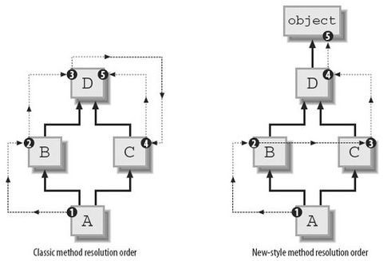

# 面向对象1

[TOC]


面向对象编程——Object Oriented Programming，简称OOP，是一种程序设计思想。OOP把对象作为程序的基本单元，一个对象包含了数据和操作数据的函数。 

面向过程的程序设计把计算机程序视为一系列的命令集合，即一组函数的顺序执行。为了简化程序设计，面向过程把函数继续切分为子函数，即把大块函数通过切割成小块函数来降低系统的复杂度。

而面向对象的程序设计把计算机程序视为一组对象的集合，而每个对象都可以接收其他对象发过来的消息，并处理这些消息，计算机程序的执行就是一系列消息在各个对象之间传递。


## 类和对象

类是一种抽象的概念，是具有相同属性和行为事物的统称。

对象就是一个具体存在的事物，是根据类这个抽象的模板创建出来的一个实例

面向对象的设计思想就是抽象出类（Class），根据类（Class）创建实例（Instance ）


## 类

类(Class) 由3个部分构成

- 类的名称:类名
- 类的属性:一组数据
- 类的方法:允许对进行操作的方法 (行为)


### 类的定义

定义一个类，格式如下 ：

```python
class 类名(object):
    <语句--1>
    .
    .
    <语句--n>
```

* 定义类使用class关键字
* 类名开通通常大写,采用驼峰的方式命名
* (object)表示该类从哪个类继承下来。所有类最终都会继承object类。
* 类中包含了属性和方法


### 类的使用

创建对象的格式为: 

```
对象名 = 类名()
```

类使用例子：

```python
class MyClass(object):
    #定义方法
    def fuc(self):
        print('hello')
        
        
#类的使用，创建对象实例
my_class = MyClass()
#调用对象的方法
my_class.fuc()
#给对象添加属性
my_class.name='bbb'
print(my_class.name)

#结果
'hello'
'bbb'
```


### 类的构造函数`__init__`

```python
def 类名:
    #初始化函数，用来完成一些默认的设定
    def __init__(self):
        pass
```

如果我们在创建对象的时候，需要绑定一些默认的属性，则可以在可以通过`__init__`方法，进行设置。

```python
class Student(object):

    def __init__(self, name, score):
        self.name = name
        self.score = score
```

`__init__`方法的第一个参数永远是`self`，表示创建的实例本身，因此，在`__init__`方法内部，就可以把各种属性绑定到`self`，因为`self`就指向创建的实例本身。 

当`__init__`有其他参数时，在创建实例的时候，就不能传入空的参数了，必须传入与`__init__`方法匹配的参数，但`self`不需要传，Python解释器自己会把实例变量传进去： 

```python
>>> bart = Student('Bart Simpson', 59)
>>> bart.name
'Bart Simpson'
>>> bart.score
59
```

总结：

* 即使没有显示定义`__init__()`方法，在实例化是系统会调用默认的构造方法

* `__init__()`方法，在创建一个对象时默认被调用，不需要手动调用
* `__init__(self)`中，默认第一个参数永远是`self`，如果`__init__(self)`中除了self外还有其他参数，则在创建对象实例的时候，就需要传入相应的参数，`self`除外
* `__init__(self)`中的self参数，不需要开发者传递，python解释器会自动把当前的对象引用传递进去
* 一个类中可以定义多个`__init__()`方法，但最后的方法会覆盖前面的方法，所以必须要以最后一个`__init__()`的形式进行实例化


### 访问限制

在类内部，可以有属性和方法，而外部代码可以通过直接调用实例变量的方法来操作数据，这样，就隐藏了内部的复杂逻辑。 

```python
>>> bart = Student('Bart Simpson', 59)
>>> bart.score
59
>>> bart.score = 99
>>> bart.score
99
```

但是，通过上面可以看出，外部代码还是可以自由地修改一个实例的`name`、`score`属性。

如果要让内部属性不被外部访问，可以把属性的名称前加上两个下划线`__`，在Python中，实例的变量名如果以`__`开头，就变成了一个私有变量（private），只有内部可以访问，外部不能访问 。如下：

```python
class Student(object):

    def __init__(self, name, score):
        self.__name = name
        self.__score = score

    def print_score(self):
        print('%s: %s' % (self.__name, self.__score))
```

```python
>>> bart = Student('Bart Simpson', 59)
>>> bart.__name
Traceback (most recent call last):
  File "<stdin>", line 1, in <module>
AttributeError: 'Student' object has no attribute '__name'
```

通过添加了`__`，外部便不能通过`实例变量.__name`和`实例变量.__score` 访问对象属性了，这样就通过访问限制的保护 ，确保了外部代码不能熟悉修改对象内部的属性，使代码更加健壮。


虽然不能通过对象名.属性名 进行直接访问了，但是可以通过给类添加方法，来访问相应的属性。

```python
class Student(object):
    ...
    
    #设置__score的值
    def set_score(self, score):
        self.__score = score
        
    #获取__score的值
    def get_score(self):
        return self.__score
        
    #获取__name的值
    def get_name(self):
        return self.__name
   
```

通过方法来访问设置相应的属性的好处在于，可以在方法中对传入参数进行检查，避免无效的参数


需要注意的是，在Python中，变量名类似`__xxx__`的，以双下划线开头，并且以双下划线结尾的，是特殊变量，特殊变量是可以直接访问的，不是private变量，所以，不能用`__name__`、`__score__`这样的变量名。

以一个下划线开头的实例变量名，比如`_name`，这样的实例变量外部是可以访问的，但是，按照约定俗成的规定，当你看到这样的变量时，意思就是，“虽然我可以被访问，但是，请把我视为私有变量，不要随意访问”。

其实，私有属性并非不能直接访问，只是Python解释器将私有属性修改了而已。比如：`__name`变量改成了`_Student__name` ，所以仍然可以通过`_Student__name`来访问`__name`变量 。**但强烈建议不要这么做**

```python
>>> bart._Student__name
'Bart Simpson'
```


最后注意下面的这种**错误写法**： 

```python
>>> bart = Student('Bart Simpson', 59)
>>> bart.get_name()
'Bart Simpson'
>>> bart.__name = 'New Name' # 设置__name变量！
>>> bart.__name
'New Name'
```

表面上看，外部代码“成功”地设置了`__name`变量，但实际上这个`__name`变量和class内部的`__name`变量**不是**一个变量！内部的`__name`变量已经被Python解释器自动改成了`_Student__name`，而外部代码给`bart`新增了一个`__name`变量。

```python
>>> bart.get_name() # get_name()内部返回self.__name
'Bart Simpson'
```


总结：

- Python中没有像C++中public和private这些关键字来区别公有属性和私有属性
- 它是以属性命名方式来区分，如果在属性名前面加了2个下划线'__'，则表明该属性是私有属性，否则为公有属性
- 方法也是一样，方法名前面加了2个下划线的话表示该方法是私有的，外部无法直接访问。


### 继承

在OOP程序设计中，当定义一个class的时候，可以从某个现有的class继承，新的class称为子类（Subclass），而被继承的class称为基类、父类或超类（Base class、Super class）。 

```python
# 定义一个父类，如下:
class Cat(object):

    def __init__(self, name):
        self.name = name

    def run(self):
        print("%s--在跑"%self.name)


# 定义一个子类，继承Cat类如下:
class Bosi(Cat):

    def __init__(self,name,color='白色'):
        #调用父类的构函数
        super(Bosi,self).__init__(name)
        self.color = color
    
    def setNewName(self, newName):
        self.name = newName

    def eat(self):
        print("%s--在吃"%self.name)
        
        
bs = Bosi("印度猫")
print('bs的名字为:%s'%bs.name)
print('bs的颜色为:%s'%bs.color)
bs.eat()
bs.setNewName('波斯')
bs.run()

#运行结果
bs的名字为:印度猫
bs的颜色为:白色
印度猫--在吃
波斯--在跑
```

* 如果子类没有定义`__init__`方法，就会继承父类的`__init__`的方法，在创建子类实例的时候，会默认执行那个继承过来的`__init__`方法 
* 如果子类定义了`__init__`方法，就需要在子类的构造方法中直接调用父类的构造函数
* 继承最大的好处是子类继承了父类全部非私有的功能


**注意：**

```python
class Animal(object):

    def __init__(self, name='动物', color='白色'):
        self.__name = name
        self.color = color

    def __test(self):
        print(self.__name)
        print(self.color)

    def test(self):
        print(self.__name)
        print(self.color)


class Dog(Animal):
    def dogTest1(self):
        #print(self.__name) #不能访问到父类的私有属性
        print(self.color)


    def dogTest2(self):
        #self.__test() #不能访问父类中的私有方法
        self.test()


A = Animal()
#print(A.__name) #程序出现异常，不能访问私有属性
print(A.color)
#A.__test() #程序出现异常，不能访问私有方法
A.test()

print("------分割线-----")

D = Dog(name = "小花狗", color = "黄色")
D.dogTest1()
D.dogTest2()
```

- 私有的属性，不能通过对象直接访问，但是可以通过方法访问
- 私有的方法，不能通过对象直接访问
- 私有的属性、方法，不会被子类继承，也不能被访问
- 一般情况下，私有的属性、方法都是不对外公布的，往往用来做内部的事情，起到安全的作用


继承还可以一级一级地继承下来，就好比从爷爷到爸爸、再到儿子这样的关系。而任何类，最终都可以追溯到根类object，这些继承关系看上去就像一颗倒着的树。

```
                ┌───────────────┐
                │    object     │
                └───────────────┘
                        │
           ┌────────────┴────────────┐
           │                         │
           ▼                         ▼
    ┌─────────────┐           ┌─────────────┐
    │   Animal    │           │    Plant    │
    └─────────────┘           └─────────────┘
           │                         │
     ┌─────┴──────┐            ┌─────┴──────┐
     │            │            │            │
     ▼            ▼            ▼            ▼
┌─────────┐  ┌─────────┐  ┌─────────┐  ┌─────────┐
│   Dog   │  │   Cat   │  │  Tree   │  │ Flower  │
└─────────┘  └─────────┘  └─────────┘  └─────────┘
```


### 多态

所谓多态，就是定义时的类型和运行时的类型不一样，此时就成为多态 。先看如下示例：

```python
class Animal(object):
    def run(self):
        print('Animal is running...')
        
        
class Dog(Animal):

    def run(self):
        print('Dog is running...')

class Cat(Animal):

    def run(self):
        print('Cat is running...')
        
        
dog = Dog()
dog.run()

cat = Cat()
cat.run()

#运行结果
Dog is running...
Cat is running...
```

从运行结果可以看到，当子类和父类存在相同的方法时，子类的方法会覆盖父类的方法，在代码运行时总是会调用子类的方法，这个称为多态。

那么，多态有什么好处呢？

```python
#先定义一个函数
def run_twice(animal):
    animal.run()
    animal.run()
    
class Tortoise(Animal):
    def run(self):
        print('Tortoise is running slowly...')
        
#然后分别传入Dog Cat Tortoise类型
>>> run_twice(Dog())
Dog is running...
Dog is running...

>>> run_twice(Cat())
Cat is running...
Cat is running...

>>> run_twice(Tortoise())
Tortoise is running slowly...
Tortoise is running slowly.
```

从上面可以看出，不管传入`Dog`、`Cat`、`Tortoise` ，只要是`Animal`类或者子类，就可以放心的调用`run()`方法，不必对`run_twice()`做任何修改 。至于具体调用的`run()`方法是作用在`Dog`、`Cat`还是`Tortoise`对象上，由运行时该对象的确切类型决定，这就是多态的好处：

调用方只管调用，不管细节，而当我们新增一种`Animal`的子类时，只要确保`run()`方法编写正确，不用管原来的代码是如何调用的。这就是著名的“开闭”原则：

对扩展开放：允许新增`Animal`子类；

对修改封闭：不需要修改依赖`Animal`类型的`run_twice()`等函数。


**注意**

python中的多态其实是一种‘“鸭子类型”。

对于静态语言（例如Java）来说，如果需要传入`Animal`类型，则传入的对象必须是`Animal`类型或者它的子类，否则，将无法调用`run()`方法。

对于Python这样的动态语言来说，则不一定需要传入`Animal`类型。我们只需要保证传入的对象有一个`run()`方法就可以了：

```python
class Timer(object):
    def run(self):
        print('Start...')
```

这就是动态语言的“鸭子类型”，它并不要求严格的继承体系，一个对象只要“看起来像鸭子，走起路来像鸭子”，那它就可以被看做是鸭子。

Python的“file-like object“就是一种鸭子类型。对真正的文件对象，它有一个`read()`方法，返回其内容。但是，许多对象，只要有`read()`方法，都被视为“file-like object“。许多函数接收的参数就是“file-like object“，你不一定要传入真正的文件对象，完全可以传入任何实现了`read()`方法的对象。


### 多继承

通过继承，子类可以继承父类非私有的功能。前面介绍的都是单继承，而python还支持多重继承，即可以继承多个基类，同时获得多个父类所有非私有功能。如下示例：

```python
# 定义一个父类
class A:
    def printA(self):
        print('----A----')

# 定义一个父类
class B:
    def printB(self):
        print('----B----')

# 定义一个子类，继承自A、B
class C(A,B):
    def printC(self):
        print('----C----')

obj_C = C()
obj_C.printA()
obj_C.printB()

#结果
----A----
----B----
```


**注意：**

如果父类中存在同名的函数时，那么通过子类去调用的时候，调用哪个？ 

```python
#coding=utf-8
class base(object):
    def test(self):
        print('----base test----')
class A(base):
    def test(self):
        print('----A test----')

# 定义一个父类
class B(base):
    def test(self):
        print('----B test----')

# 定义一个子类，继承自A、B
class C(A,B):
    pass


obj_C = C()
obj_C.test()

print(C.__mro__) #可以查看C类的对象搜索方法时的先后顺序
```

多继承的调用父类的顺序，可以通过类的`__mro__`属性进行查看。

MRO即method resolution order，用于判断子类调用的属性来自于哪个父类。在Python2.3之前，MRO是基于深度优先算法的，自2.3开始使用C3算法，定义类时需要继承object，这样的类称为新式类，否则为旧式类

从图中可以看出，旧式类查找属性时是深度优先搜索，新式类则是广度优先搜索

 


C3算法最早被提出是用于Lisp的，应用在Python中是为了解决原来基于深度优先搜索算法不满足本地优先级，和单调性的问题。

- 本地优先级：指声明时父类的顺序，比如C(A,B)，如果访问C类对象属性时，应该根据声明顺序，优先查找A类，然后再查找B类。
- 单调性：如果在C的解析顺序中，A排在B的前面，那么在C的所有子类里，也必须满足这个顺序


### 类属性、实例属性

#### 实例属性

实例属性就是通过实例绑定的变量，或者通过`self`变量

```python
class Student(object):
    def __init__(self, name):
        self.name = name

s = Student('Bob')
s.score = 90
```


#### 类属性

类属性就是`类对象`所拥有的属性，它被所有`类对象`的`实例对象`所共有，在内存中只存在一个副本 。

对于公有的类属性，在类外可以通过`类对象`和`实例对象`访问 。

``` python
class People(object):
    name = 'Tom'  #公有的类属性
    __age = 12     #私有的类属性

p = People()

print(p.name)           #正确
print(People.name)      #正确
print(p.__age)            #错误，不能在类外通过实例对象访问私有的类属性
print(People.__age)        #错误，不能在类外通过类对象访问私有的类属性
```


类属性的修改

```python
class People(object):
    country = 'china' #类属性


>>>print(People.country)
'china'
>>>p = People()
>>>print(p.country)
'china'
>>>p.country = 'japan' 
>>>print(p.country)      #实例属性会屏蔽掉同名的类属性
'japan'
>>>print(People.country)
'china'
>>>del p.country    #删除实例属性
>>>print(p.country)
'china'
```

- 如果需要在类外修改`类属性`，必须通过`类对象`去引用然后进行修改。
- 如果通过实例对象去引用，会产生一个同名的`实例属性`，这种方式修改的是`实例属性`，不会影响到`类属性`
- 如果通过实例对象去引用该名称的属性，实例属性会强制屏蔽掉类属性，即引用的是`实例属性`，除非删除了该`实例属性`。


### 静态方法、类方法、实例方法

#### 类方法

是类对象所拥有的方法，需要用修饰器`@classmethod`来标识其为类方法，对于类方法，第一个参数必须是类对象，一般以`cls`作为第一个参数 ，能够通过实例对象和类对象去访问。 

```python
class People(object):
    country = 'china'

    #类方法，用classmethod来进行修饰
    @classmethod
    def getCountry(cls):
        return cls.country

p = People()
print p.getCountry()    #可以用过实例对象引用
print People.getCountry()    #可以通过类对象引用
```

类方法还有一个用途就是可以对类属性进行修改： 

```python
class People(object):
    country = 'china'

    #类方法，用classmethod来进行修饰
    @classmethod
    def getCountry(cls):
        return cls.country

    @classmethod
    def setCountry(cls,country):
        cls.country = country


>>>p = People()
>>>print p.getCountry()    #可以用过实例对象引用
'china'
>>>print People.getCountry()    #可以通过类对象引用
'china'

>>>p.setCountry('japan')   

>>>print p.getCountry()  
'japan'
>>>print People.getCountry()
'japan'
```


#### 静态方法

指类中无需实例参与即可调用的方法(不需要self参数)，在调用过程中，无需将类实例化，直接在类之后使用.号运算符调用方法。 需要通过修饰器`@staticmethod`来进行修饰。

```python
class People(object):
    country = 'china'

    @staticmethod
    #静态方法
    def getCountry():
        return People.country


>>>print(People.getCountry())
'china'
```


#### 实例方法 

除静态方法与类方法外，类的其他方法都属于实例方法。

实例方法需要将类实例化后调用，如果使用类直接调用实例方法,需要显式地将实例作为参数传入。

最左侧传入的参数self，是实例本身。

```python
class People(object):
    country = 'china'

    def getCountry(self):
        print(self.country)
        print(People.country)

>>>p=People()
>>>p.country='japan'
>>>print(p.getCountry())
'japan'
'china'
```


#### 总结

* 类方法的第一个参数是类对象cls，那么通过cls引用的必定是类对象的属性和方法；
* 而实例方法的第一个参数是实例对象self，那么通过self引用的可能是类属性、也有可能是实例属性（这个需要具体分析），不过在存在相同名称的类属性和实例属性的情况下，实例属性优先级更高。
* 静态方法中不需要额外定义参数，因此在静态方法中引用类属性的话，必须通过类对象来引用 


