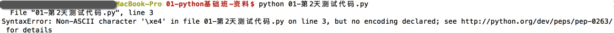
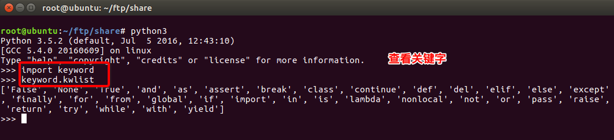
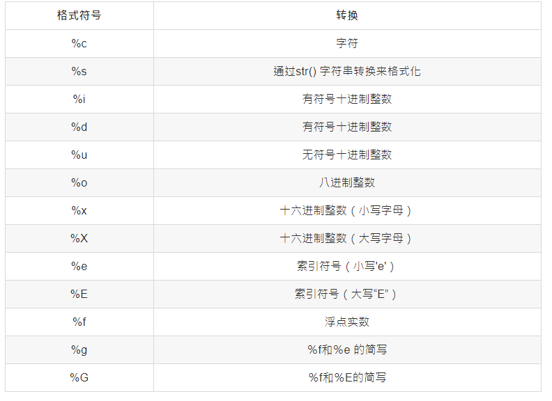

# python基础

[TOC]


## 1. 注释

### 1.单行注释

以#开头

```py
 # 我是注释，可以在里写一些功能说明之类的哦
 print('hello world')
```

### 2.多行注释

三个单引号(''')开始,三个单引号(''')结束,中间是注释语句

```pyt
   '''
   我是多行注释，可以写很多很多行的功能说明
   
   '''
```


## 2. python的中文支持

```py
#如果在程序中有中文,如:
print("你好")
```

如果直接运行,程序可能出错



解决办法:在程序的开头写入如下代码，即中文注释 

```py
#coding=utf-8
```

在python的语法规范中推荐使用方式 

```pyt
# -*- coding:utf-8 -*-
```


## 3. 标识符

标示符即自己定义的写符号和名称,如变量名 、函数名等 

### 1. 标示符命名规则

* 标示符由字母、下划线和数字组成，且数字不能开头 
* python中的标识符是区分大小写的\
* 见名知意 
* 推荐使用驼峰命名法 

### 2. 关键字

* 什么是关键字 

  python一些具有特殊功能的标示符，这就是所谓的关键字

  关键字，是python已经使用的了，所以**不允许开发者自己定义和关键字相同的名字的标示符**

* 相关关键字

```
      and     as      assert     break     class      continue    def     del
      elif    else    except     exec      finally    for         from    global
      if      in      import     is        lambda     not         or      pass
      print   raise   return     try       while      with        yield
```

可以通过以下命令进行查看当前系统中python的关键字 




## 4. 输出

* 用`print()`在括号中加上字符串，就可以向屏幕上输出指定的文字 

  ```py
  print('hello, world')
  ```

* `print()`函数也可以接受多个字符串，用逗号“,”隔开. `print()`会依次打印每个字符串，遇到逗号“,”会输出一个空格 

  ```py
  print('The quick brown fox', 'jumps over', 'the lazy dog')
  
  # The quick brown fox jumps over the lazy dog
  ```

* `print()`也可以打印整数，或者计算结果

  ```py
  print(100 + 200)
  
  #300
  ```

* 格式化输出

  * 有`%`这样的操作符，这就是Python中格式化输出 , 如:

  ```py
      age = 18
      name = "xiaohua"
      print("我的姓名是%s,年龄是%d"%(name,age))
  ```

  *  常用的格式符号

  

* 换行输出

  在输出的时候，如果有`\n`那么，此时`\n`后的内容会在另外一行显示 


## 5. 输入

### 1. raw_input()

在Python中，获取键盘输入的数据的方法是采用 raw_input 函数

```py
    password = raw_input("请输入密码:")
    print('您刚刚输入的密码是:', password)
```

运行结果:


**注意**:

- raw_input()的小括号中放入的是，提示信息，用来在获取数据之前给用户的一个简单提示
- raw_input()在从键盘获取了数据以后，会存放到等号右边的变量中
- raw_input()会把用户输入的任何值都作为字符串来对待


### 2. input()

input()函数与raw_input()类似，但其接受的输入必须是表达式。 

```py
>>> a = input() 
123
>>> a
123
>>> type(a)
<type 'int'>
>>> a = input()
abc
Traceback (most recent call last):
  File "<stdin>", line 1, in <module>
  File "<string>", line 1, in <module>
NameError: name 'abc' is not defined
>>> a = input()
"abc"
>>> a
'abc'
>>> type(a)
<type 'str'>
>>> a = input()
1+3
>>> a
4
>>> a = input()
"abc"+"def"
>>> a
'abcdef'
>>> value = 100
>>> a = input()
value
>>> a
100
```

**input()接受表达式输入，并把表达式的结果赋值给等号左边的变量** 


### 3.  python3中的input()

在python3中, **没有raw_input()函数，只有input()**

并且**python3中的input** 与 **python2中的raw_input()**功能一样


如果在python3中想输入表达式,可以使用`eval()`方法,如:

```py
>>>a=input()
1+2
>>>a
'1+2'
>>>eval(a)
3
```


## 6. 运算符


## 7. 条件判断


## 8. 


