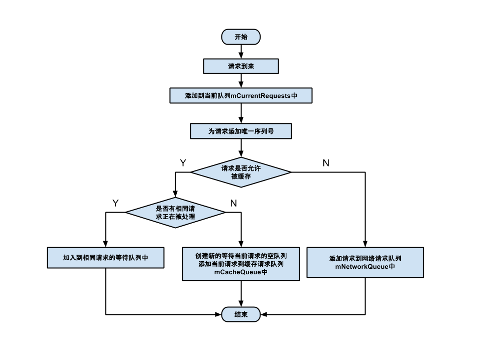
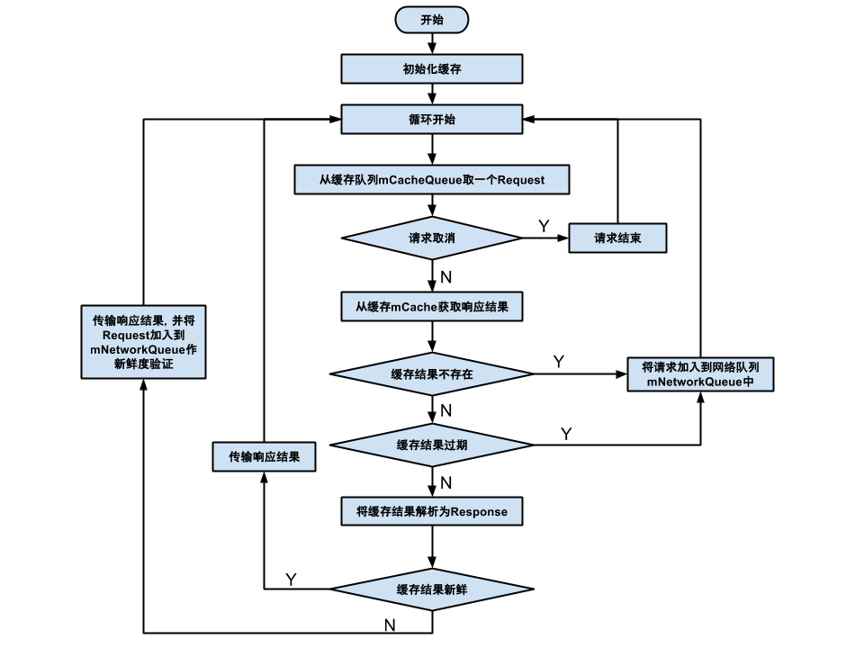
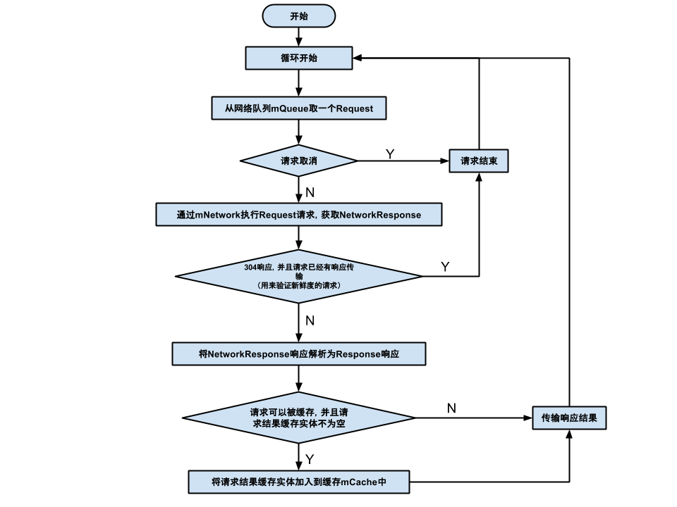

# Volley

[TOC]


## Volley，Okhttp，Rerofit的三者区别

1. Voller底层封装的是HttpUrlConnection，支持图片加载，网络请求排序，优先级处理，缓存，与Activity生命周期联动。扩展性好，支持httpclient，HttpUrlConnection，OkHttp，在频繁请求和加载数据量少的时候优势，不适合大数据加载，Request和Response都是使用byte数组存储数据，大数据=大数组，消耗内存。

2. Okhttp底层基于原生http，支持异步同步，缓存相应数据，减少重复请求，自动重连，支持GZIP减少数据流量。请求，处理速度快，基于NIO和Okio。NIO是非阻塞式的，Okio是Square基于IO,NIO的一个高效处理数据流的开源库。API使用更加方便，简单，适用于数据大的重量级网络请求。

3. Retrofit基于Okhttp，通过注解的方式配置请求，序列化方式丰富，提供Rxjava支持。请求处理速度最快，扩展性太差，封装太好。使用最简单，代码最少，解耦更加彻底，易与其他框架联用。任何场景开发优先使用，如序列化方式多，项目中使用Rxjava


## Volley的简单使用

```java
 		RequestQueue mqueue = Volley.newRequestQueue(context);
        //创建请求
        StringRequest request = new StringRequest(GET, "http://www.baidu.com", new Response.Listener<String>() {
            @Override
            public void onResponse(String response) {

            }
        }, new Response.ErrorListener() {
            @Override
            public void onErrorResponse(VolleyError error) {

            }
        });
        //添加请求到队列中
        mqueue.add(request);
```

以上就是volley最简单的使用，更多具体的应用可以参考[Volley使用](http://blog.csdn.net/guolin_blog/article/details/17482095/)


## Volley流程分析

通过上面volley的简单使用，逐步跟踪分析Volley网络访问的流程。

### 请求队列的创建

volley的使用首先通过Volley类创建一个请求队列RequestQueue

``` 
   RequestQueue queue = Volley.newRequestQueue(getApplicationContext());
```


#### Volley类

volley类中有4个静态重载方法：

```java
public static RequestQueue newRequestQueue(Context context, HttpStack stack, int maxDiskCacheBytes) 
public static RequestQueue newRequestQueue(Context context, int maxDiskCacheBytes)
public static RequestQueue newRequestQueue(Context context, HttpStack stack)
public static RequestQueue newRequestQueue(Context context)
```


最终调用都是第一个方法，具体实现如下：

```java
public static RequestQueue newRequestQueue(Context context, HttpStack stack, int maxDiskCacheBytes) {
    	//创建缓存文件
        File cacheDir = new File(context.getCacheDir(), DEFAULT_CACHE_DIR);

    	//创建useragent,useragent网络请求时的一个请求头
        String userAgent = "volley/0";
        try {
            String packageName = context.getPackageName();
            PackageInfo info = context.getPackageManager().getPackageInfo(packageName, 0);
            userAgent = packageName + "/" + info.versionCode;
        } catch (NameNotFoundException e) {
        }
		
    	//stack是真正去跟网络打交道的类，他们都继承HttpStack接口，文章后续会介绍
    	//如果使用者自定义请求类，则通过sdk的版本创建相应的stack
        if (stack == null) {
            //SDK版本大于等于9（>=2.3），使用HurlStack，基于HttpUrlConnection的实现
            if (Build.VERSION.SDK_INT >= 9) {
                stack = new HurlStack();
            } else {
                //如果小于9,则是用HttpClient来实现，基于HttpClient的实现
                stack = new HttpClientStack(AndroidHttpClient.newInstance(userAgent));
            }
        }
		//创建BasicNetwork对象，并将HttpStack封装在Network中
    	//通过Network去管理HttpStack方法的调用
        Network network = new BasicNetwork(stack);
        
        RequestQueue queue;
  		//创建请求队列，
        if (maxDiskCacheBytes <= -1)
        {
        	// 创建基于Disk的缓存对象，默认缓存为5M
        	queue = new RequestQueue(new DiskBasedCache(cacheDir), network);
        }
        else
        {
        	// Disk cache size specified
        	queue = new RequestQueue(new DiskBasedCache(cacheDir, maxDiskCacheBytes), network);
        }
		//请求队列启动
        queue.start();

        return queue;
    }
```

通过上述的分析，创建请求队列的过程中，主要做了以下几件事：

1）创建缓存文件和UserAgenp字符串

2）根据SDK版本来创建HttpStack的实现，如果是2.3以上的，则使用基于HttpUrlConnection实现的HurlStack，反之，则利用HttpClient实现的HttpClientStack。

3）创建一个BasicNetwork对象，并将HttpStack封装在Network中

4）创建一个DiskBasedCache对象，和Network一起，传给RequestQueue作为参数，创建RequestQueue对象。

5）调用 RequestQueue的 start 方法，然后返回创建的queue对象。


**【扩展】HttpURLConnection 和 AndroidHttpClient(HttpClient 的封装)如何选择及原因：**

* 在 2.2之前，HttpURLConnection 有个重大 Bug，调用 close() 函数会影响连接池，导致连接复用失效，所以在  2.2之前使用 HttpURLConnection 需要关闭 keepAlive。 

* 在 2.3 HttpURLConnection 默认开启了 gzip 压缩，提高了 HTTPS 的性能。

* 在4.0 HttpURLConnection 支持了请求结果缓存。 再加上 HttpURLConnection 本身 API 相对简单，所以对 Android 来说，在 2.3 之后建议使用 HttpURLConnection，之前建议使用 AndroidHttpClient。

**【扩展】关于 User Agent**

* 通过代码我们发现如果是使用 AndroidHttpClient，Volley 还会将请求头中的 User-Agent 字段设置为 App 的 packageName/versionCode，如果异常则使用 "volley/0"

* 对于 HttpURLConnection， 通过数据抓包会发现，HttpURLConnection 默认是有 User-Agent 的，类似：

```xml
Dalvik/1.6.0 (Linux; U; Android 4.1.1; Google Nexus 4 - 4.1.1 - API 16 - 768x1280_1 Build/JRO03S)
```

实际在请求发出之前，会检测 User-Agent 是否为空，如果不为空，则加上系统默认 User-Agent。在 	Android 2.1 之后，可以通过

```java
String userAgent = System.getProperty("http.agent");
```

得到系统默认的 User-Agent，Volley 如果希望自定义 User-Agent，可在自定义 Request 中重写 getHeaders() 函数

```java
@Override
public Map<String, String> getHeaders() throws AuthFailureError {
    // self-defined user agent
    Map<String, String> headerMap = new HashMap<String, String>();
    headerMap.put("User-Agent", "android-open-project-analysis/1.0");
    return headerMap;
}
```


#### RequestQueue类

##### RequestQueue的创建

首先是RequestQueue的创建。RequestQueue类有三个构造函数，

```java
//最终调用的构造函数 
public RequestQueue(Cache cache, Network network, int threadPoolSize,
            ResponseDelivery delivery) {
    	//缓存
        mCache = cache;
        mNetwork = network;
        //实例化网络请求线程数组，数组大小默认是4
        mDispatchers = new NetworkDispatcher[threadPoolSize];
        mDelivery = delivery;
    }

    public RequestQueue(Cache cache, Network network, int threadPoolSize) {
        this(cache, network, threadPoolSize,
                //请求结果分发器
                new ExecutorDelivery(new Handler(Looper.getMainLooper())));
    }

    public RequestQueue(Cache cache, Network network) {
        this(cache, network, DEFAULT_NETWORK_THREAD_POOL_SIZE);
    }
```

RequestQueue在构造函数中初始化了4个成员变量：

* mCache(文件缓存)
* mNetwork(BasicNetwork实例)
* mDispatchers(网络请求线程数组)
* mDelivery(请求结果分发器)

同时，在RequestQueue中还维护了4个集合：

* **基于优先级**的 Request 队列，缓存请求队列和网络请求队列

  通过take方法会取走BlockingQueue里排在首位的对象,若BlockingQueue为空,阻断进入等待状态直到BlockingQueue有新的对象被加入为止 。

  * ```java
    private final PriorityBlockingQueue<Request<?>> mCacheQueue = new PriorityBlockingQueue<Request<?>>();
    ```

  * ```java
    private final PriorityBlockingQueue<Request<?>> mNetworkQueue = new PriorityBlockingQueue<Request<?>>();
    ```

* 一个正在进行中，尚未完成的请求集合

  ```java
  private final Set<Request<?>> mCurrentRequests = new HashSet<Request<?>>();
  ```

* 一个等待请求的集合，如果一个请求正在被处理并且可以被缓存，后续的相同 url 的请求，将进入此等待队列。

  ```java
  private final Map<String, Queue<Request<?>>> mWaitingRequests = new HashMap<String, Queue<Request<?>>>();
  ```


##### RequestQueue.start()

RequestQueue实例化完成后，最后调用了它的start()方法

```java
    public void start() {
         // 保证所有正在运行的Dispatcher（也就是线程）都停止
        stop();  
        // 创建缓存调度线程，并启动线程。
        mCacheDispatcher = new CacheDispatcher(mCacheQueue, mNetworkQueue, mCache, mDelivery);
        mCacheDispatcher.start();

        // 根据网络请求线程数组的大小，创建相对应的网络请求线程，并启动所有的线程
        for (int i = 0; i < mDispatchers.length; i++) {
            NetworkDispatcher networkDispatcher = new NetworkDispatcher(mNetworkQueue, mNetwork,
                    mCache, mDelivery);
            mDispatchers[i] = networkDispatcher;
            networkDispatcher.start();
        }
    }

	//停止缓存线程跟所有的网络线程
	public void stop() {
        if (mCacheDispatcher != null) {
            mCacheDispatcher.quit();
        }
        for (int i = 0; i < mDispatchers.length; i++) {
            if (mDispatchers[i] != null) {
                mDispatchers[i].quit();
            }
        }
    }
```

start()方法中做了以下几件事：

* 先见缓存线程和所有网络线程停止
* 然后重新创建缓存线程并开启，并将 mCacheQueue，mNetworkQueue, mCache 和 mDelivery传入
* 默认创建4个网络请求线程并开启，并将 mCacheQueue，mNetwrok, mCache 和 mDelivery传入
* 最后线程都开启后，就静静的等待请求的到来


### 网络请求的创建

Volley为我们提供了多种的网络请求，比如StringRequest、JsonObjectRequest、ImageRequest等等。它们都继承抽象类Request，所以如果需要自定义一个网路请求，继承Request类，并实现其相应的抽象的方法即可。

在抽象类Request中定义一些基本的参数变量，如：

* 请求方式

  ```java
   public interface Method {
          int DEPRECATED_GET_OR_POST = -1;
          int GET = 0;
          int POST = 1;
          int PUT = 2;
          int DELETE = 3;
          int HEAD = 4;
          int OPTIONS = 5;
          int TRACE = 6;
          int PATCH = 7;
    }
   private final int mMethod;
  ```

* 请求url

  ```java
  private final String mUrl;
  ```

* 网络请求错误监听

  ```java
  private Response.ErrorListener mErrorListener;
  ```

* 是否需要缓存 默认可以缓存

  ```java
  private boolean mShouldCache = true;
  ```

* 分类标签

  ```java
  private Object mTag;
  ```


还有两个抽象方法，子类必须实现

```java
//处理响应的数据
abstract protected Response<T> parseNetworkResponse(NetworkResponse response);
//处理响应成功的回调
abstract protected void deliverResponse(T response)
```


我们以最简单的StringRequest为例，看看其具体的实现，而其他的Request类，大体的实现都差不多。

```java
public class StringRequest extends Request<String> {
    //请求成功监听回调
    private Listener<String> mListener;

    public StringRequest(int method, String url, Listener<String> listener,
            ErrorListener errorListener) {
        super(method, url, errorListener);
        mListener = listener;
    }

    public StringRequest(String url, Listener<String> listener, ErrorListener errorListener) {
        this(Method.GET, url, listener, errorListener);
    }

    @Override
    protected void onFinish() {
        super.onFinish();
        mListener = null;
    }

    @Override
    protected void deliverResponse(String response) {
        if (mListener != null) {
            //请求成功后，将处理结果String回调给成功监听器
            mListener.onResponse(response);
        }
    }

    @Override
    protected Response<String> parseNetworkResponse(NetworkResponse response) {
        String parsed;
        try {
            //将响应包装成String类型
            parsed = new String(response.data, HttpHeaderParser.parseCharset(response.headers));
        } catch (UnsupportedEncodingException e) {
            parsed = new String(response.data);
        }
        return Response.success(parsed, HttpHeaderParser.parseCacheHeaders(response));
    }
}
```

网络请求的创建，就是初始化一些基本参数，病假请求类型，url，成功错误回调监听封装起来，然后通过parseNetworkResponse()方法对响应的数据进行相应的处理，最后在deliverResponse()方法中回调给成功监听器。

最后生成返回的Response对象的时候需要传入一个Cache.Entry的缓存对象，它通过HttpHeaderParser.parseCacheHeaders()方法得到，这个方法中计算得到各种缓存头标识，用于请求的缓存判断。

```java
 public static Cache.Entry parseCacheHeaders(NetworkResponse response) {
        long now = System.currentTimeMillis();

        Map<String, String> headers = response.headers;
		//服务器响应时间
        long serverDate = 0;
     	//最后一次修改的时间
        long lastModified = 0;
     	//服务器过期时间（http1.0版本）
        long serverExpires = 0;
     	//缓存新鲜度时间
        long softExpire = 0;
     	//最终过期时间
        long finalExpire = 0;
        long maxAge = 0;
        long staleWhileRevalidate = 0;
        boolean hasCacheControl = false;
        boolean mustRevalidate = false;

        String serverEtag = null;
        String headerValue;
		
     	//服务器响应时间
        headerValue = headers.get("Date");
        if (headerValue != null) {
            serverDate = parseDateAsEpoch(headerValue);
        }

     	 //获取响应头中是否有缓存响应头cache-control
        headerValue = headers.get("Cache-Control");
        if (headerValue != null) {
            hasCacheControl = true;
            String[] tokens = headerValue.split(",");
            for (int i = 0; i < tokens.length; i++) {
                String token = tokens[i].trim();
                //如果Cache-Control里为no-cache和no-store则表示不需要缓存，返回null
                if (token.equals("no-cache") || token.equals("no-store")) {
                    return null;
                } else if (token.startsWith("max-age=")) {
                    //缓存的内容将在 xxx 秒后失效, 这个选项只在HTTP 1.1可用
                    try {
                        maxAge = Long.parseLong(token.substring(8));
                    } catch (Exception e) {
                    }
                } else if (token.startsWith("stale-while-revalidate=")) {
                    //为过了缓存时间后还可以继续使用缓存的时间，即真正的缓存时间是“max-age=” + “stale-while-revalidate=”的总时间
                    try {
                        staleWhileRevalidate = Long.parseLong(token.substring(23));
                    } catch (Exception e) {
                    }
                } else if (token.equals("must-revalidate") || token.equals("proxy-revalidate")) {
                    //有“must-revalidate”或者“proxy-revalidate”字段则过了缓存时间缓存就立即请求服务器
                    mustRevalidate = true;
                }
            }
        }
     
		//响应过期的日期和时间，是一个绝对时间 。Expires 的一个缺点就是，返回的到期时间是服务器端的时间，
        // 这样存在一个问题，如果客户端的时间与服务器的时间相差很大，那么误差就很大，
        // 所以在HTTP 1.1版开始，使用Cache-Control: max-age=秒替代。
        headerValue = headers.get("Expires");
        if (headerValue != null) {
            serverExpires = parseDateAsEpoch(headerValue);
        }

        headerValue = headers.get("Last-Modified");
        if (headerValue != null) {
            lastModified = parseDateAsEpoch(headerValue);
        }
		//etag类似资源指纹，用于标识请求资源是否改变
        serverEtag = headers.get("ETag");

       //是否有Cache-Control头，且非no-cache和no-store方式
        if (hasCacheControl) {
            //缓存新鲜度时间为当前的时间+cachecontrol中maxage的时间*1000(毫秒)
            softExpire = now + maxAge * 1000;
            //最终过期的时间先要判断是否有“must-revalidate”或者“proxy-revalidate”字段，如果有的话
            //最终过期的时间跟软过期一致，否则为软过期时间+stale-while-revalidate字段的时间*1000
            finalExpire = mustRevalidate
                    ? softExpire
                    : softExpire + staleWhileRevalidate * 1000;
        } else if (serverDate > 0 && serverExpires >= serverDate) {
           //如果响应头中没有cache-control头，且响应头中返回了过期时间
            //存新鲜度时间等于当前时间加上（过期时间-返回的服务器时间）
            softExpire = now + (serverExpires - serverDate);
             //最终过期时间等于软过期时间
            finalExpire = softExpire;
        }

        Cache.Entry entry = new Cache.Entry();
        entry.data = response.data;
        entry.etag = serverEtag;
        entry.softTtl = softExpire;
        entry.ttl = finalExpire;
        entry.serverDate = serverDate;
        entry.lastModified = lastModified;
        entry.responseHeaders = headers;

        return entry;
    }

```

从这个方法中，我们得知了缓存的过期时间以及缓存新鲜度时间是怎么来的。缓存相关字段：

* Date：返回服务器时间，如果想得到服务器的时候，我们可以从这里获取

* Cache-Control:为no-cache和no-store:不缓存响应数据，如果需要缓存响应数据，当需要设置缓存时，通过maxAge的值来设置缓存过期的时间。

* Must-revalidate和proxy-revalidate：该值为一个boolean值，服务器告诉客户端，缓存数据过期前，可以使用缓存；缓存一旦过期，必须去源服务器进行有效性校验。

* Expires:设置缓存过期的时间，如果 Cache-Control设置为需要缓存，那么优先以 Cache-Control的maxAge的值来设置缓存过期时间。

* Last-Modified：在浏览器第一次请求某一个URL时，服务器端的返回状态会是200，内容是客户端请求的资源，同时有一个Last-Modified的属性标记此文件在服务器端最后被修改的时间。
   客户端第二次请求此URL时，根据HTTP协议的规定，浏览器会向服务器传送If-Modified-Since报头，询问该时间之后文件是否有被修改过，如果服务器端的资源没有变化，则自动返回 HTTP 304（Not Changed.）状态码，内容为空，这样就节省了传输数据量。它和请求头的if-modified-since字段去判断资源有没有被修改的。

* ETags:它和if-None-Match(HTTP协议规格说明定义ETag为“被请求变量的实体值”，或者是一个可以与Web资源关联的记号)常用来判断当前请求资源是否改变。类似于Last-Modified和HTTP-IF-MODIFIED-SINCE。但是有所不同的是Last-Modified和HTTP-IF-MODIFIED-SINCE只判断资源的最后修改时间，而ETags和If-None-Match可以是资源任何的任何属性，不如资源的MD5等


### 添加请求

请求队列，网络请求都创建完成后，最后将网络添加进入请求队列即可。现在就开始分析，RequestQueue的add()方法。

```java
    public <T> Request<T> add(Request<T> request) {
        //标记该请求由当前的RequestQueue处理
        request.setRequestQueue(this);
        synchronized (mCurrentRequests) {
            //将请求放入尚未完成的请求集合中保存起来
            mCurrentRequests.add(request);
        }

        //获得当前请求的序号
        request.setSequence(getSequenceNumber());
        //添加log日志tag
        request.addMarker("add-to-queue");

        //判断当前请求是否支持缓存，如果请求不能缓存，直接添加到网络请求队列
        //默认是可以缓存
        if (!request.shouldCache()) {
            mNetworkQueue.add(request);
            return request;
        }

        //如果支持缓存，锁定当前代码块，只能有一个线程执行
        synchronized (mWaitingRequests) {
            //获取缓存key：mMethod + ":" + mUrl
            String cacheKey = request.getCacheKey();
            //等待请求集合中是否有相同的请求
            if (mWaitingRequests.containsKey(cacheKey)) {
                // 如果有相同请求，那么把这个请求放进mWaitingRequest中，等待.
                Queue<Request<?>> stagedRequests = mWaitingRequests.get(cacheKey);
                //相同的请求，放入同一个LinkedList中
                if (stagedRequests == null) {
                    stagedRequests = new LinkedList<Request<?>>();
                }
                stagedRequests.add(request);
                mWaitingRequests.put(cacheKey, stagedRequests);
                if (VolleyLog.DEBUG) {
                    VolleyLog.v("Request for cacheKey=%s is in flight, putting on hold.", cacheKey);
                }
            } else {
               //没有相同的请求，那么把请求放进mWaitingRequests中，同时也放进mCacheQueue缓存队列中
            	//这代表这个请求已经开始在缓存线程中运行了
                mWaitingRequests.put(cacheKey, null);
                mCacheQueue.add(request);
            }
            return request;
        }
    }
```

通过上面代码的分析，add()方法主要做了以下几件事：

* 将当前的请求放入到当前的请求队列mCurrentRequests中去
* 如果当前请求不缓存，直接将请求添加到网络请求队列mNetworkQueue中去
* 如果支持缓存并且存在相同请求，则将该请求放入等待请求集合mWaitingRequests中去，排队等待
* 如果没有相同请求，则直接放入缓存队列mCacheQueue中去

后台运行的缓存调度线程和网络调度线程会一直不断的轮询各自的请求队列，所以每当将请求放入到缓存队列和网络请求队列中，各自线程就会发现请求任务并开始处理。



#### RequestQueue.finish()

每当Request请求结束后，会调用自身的finish()方法，最终都会调用到RequestQueue.finish()

```java
<T> void finish(Request<T> request) {
        // 将请求从当前请求结合中移除.
        synchronized (mCurrentRequests) {
            mCurrentRequests.remove(request);
        }
        synchronized (mFinishedListeners) {
           //如果有请求结束监听，则遍历回调
          for (RequestFinishedListener<T> listener : mFinishedListeners) {
            listener.onRequestFinished(request);
          }
        }
		
    	//如果该请求有缓存，将前面mWaitingQueue中相同CacheKey的一大批请求取出
    	//再扔到mCacheQueue中，去获取缓存的结果
        if (request.shouldCache()) {
            synchronized (mWaitingRequests) {
                String cacheKey = request.getCacheKey();
                Queue<Request<?>> waitingRequests = mWaitingRequests.remove(cacheKey);
                if (waitingRequests != null) {
                    if (VolleyLog.DEBUG) {
                        VolleyLog.v("Releasing %d waiting requests for cacheKey=%s.",
                                waitingRequests.size(), cacheKey);
                    }
                    mCacheQueue.addAll(waitingRequests);
                }
            }
        }
    }
```

【扩展】为什么现在才将等待请求集合中的相同请求放入缓存队列呢？

因为前面我们不知道相同CacheKey的那个请求到底在缓存中有没有，如果没有，它需要去网络中获取，那就等到它从网络中获取之后，放到缓存中后，它结束了，并且已经缓存了，这个时候，我们就可以保证后面那堆相同CacheKey的请求可以在缓存中去取到数据了，而不需要再去网络中获取了。


### 缓存调度线程

在RequestQueue的start()方法中，创建了缓存调度线程并开始运行。并将 mCacheQueue，mNetworkQueue, mCache 和 mDelivery传入了其中。

```java
public class CacheDispatcher extends Thread {

    private static final boolean DEBUG = VolleyLog.DEBUG;
   //缓存队列
    private final BlockingQueue<Request<?>> mCacheQueue;
	//请求队列
    private final BlockingQueue<Request<?>> mNetworkQueue;
	//缓存，即DiskBasedCache对象
    private final Cache mCache;
	//响应调度器
    private final ResponseDelivery mDelivery;
    //该线程是否退出标志
    private volatile boolean mQuit = false;

    public CacheDispatcher(
            BlockingQueue<Request<?>> cacheQueue, BlockingQueue<Request<?>> networkQueue,
            Cache cache, ResponseDelivery delivery) {
        mCacheQueue = cacheQueue;
        mNetworkQueue = networkQueue;
        mCache = cache;
        mDelivery = delivery;
    }

   	//强制停止该线程，如果队列中仍然存在请求，它们并不会被保证执行
    public void quit() {
        mQuit = true;
        interrupt();
    }

    @Override
    public void run() {
        if (DEBUG) VolleyLog.v("start new dispatcher");
        //设置为后台线程
        Process.setThreadPriority(Process.THREAD_PRIORITY_BACKGROUND);

        //缓存初始化，会遍历整个缓存文件夹
        mCache.initialize();

        Request<?> request;
        while (true) {
            request = null;
            try {
                // 从缓存队列中取出请求
                request = mCacheQueue.take();
            } catch (InterruptedException e) {
                // 当通过interrupt()终止阻塞线程时，产生改异常中断
                //然后通过手动退出循环
                if (mQuit) {
                    return;
                }
                continue;
            }
            try {
                //log日志标签
                request.addMarker("cache-queue-take");

                // 如果请求被取消掉，最终会调用RequestQueue的finish方法，并不会被分发
                if (request.isCanceled()) {
                    request.finish("cache-discard-canceled");
                    continue;
                }

                //从文件缓存中取出这个请求的结果
                //如果缓存为空，直接放入到网络请求队列中去重新请求
                Cache.Entry entry = mCache.get(request.getCacheKey());
                if (entry == null) {
                    request.addMarker("cache-miss");
                    // Cache miss; send off to the network dispatcher.
                    mNetworkQueue.put(request);
                    continue;
                }

                 //判断缓存是否过期
                //如果过期，同样放到网络请求队列中去重新请求
                if (entry.isExpired()) {
                    request.addMarker("cache-hit-expired");
                    request.setCacheEntry(entry);
                    mNetworkQueue.put(request);
                    continue;
                }

                //如果上述条件都不成立，从缓存中取出数据包装成NetworkResponse
                //并调用Request的parseNetworkResponse去解析处理数据
                request.addMarker("cache-hit");
                Response<?> response = request.parseNetworkResponse(
                        new NetworkResponse(entry.data, entry.responseHeaders));
                request.addMarker("cache-hit-parsed");

                 //验证缓存的新鲜度
                if (!entry.refreshNeeded()) {
                   //新鲜的，直接通过调度器分发结果
                    mDelivery.postResponse(request, response);
                } else {
                    // 不新鲜，虽然把缓存数据分发出去，但还是需要到网络上验证缓存是否需要更新
                    request.addMarker("cache-hit-refresh-needed");
                    //请求带上缓存属性
                    request.setCacheEntry(entry);

                    // intermediate用作结果的新鲜度的标志，表示第二个请求结果可能即将到来
                    response.intermediate = true;

                    // 分发完缓存数据后，将请求加入网络请求队列，判断是否需要更新缓存数据
                    final Request<?> finalRequest = request;
                    mDelivery.postResponse(request, response, new Runnable() {
                        @Override
                        public void run() {
                            try {
                                mNetworkQueue.put(finalRequest);
                            } catch (InterruptedException e) {
                                // Not much we can do about this.
                            }
                        }
                    });
                }
            } catch (Exception e) {
                VolleyLog.e(e, "Unhandled exception %s", e.toString());
            }
        }
    }
}
```

缓存调度线程做了以下几件事：

* 线程第一次执行的时候，初始化缓存
* 进入死循环，不断轮询从mCacheQueue队列中取得request进行网络数据的请求操作。
* 判断若请求已经取消，则直接finish请求，进行下一次轮询
* 判断从缓存中获得的数据若是空的，则把请求添加到mNetworkQueue队列中，进行下一次轮询。
* 判断取得的数据是否已经过期了，若已经过期，则把请求添加到mNetworkQueue中重新请求数据。
* 把得到的数据解析解析，然后判断缓存的新鲜度，若新鲜则直接交给响应调度器分发结果
* 如果不新鲜，则缓存数据分发出去，同时再把请求添加到mNetworkQueue，获取最新的数据





### 网络调度线程

在RequestQueue的start()方法中，创建了网络调度线程数组并开始运行。并将 mCacheQueue，mNetwrok, mCache 和 mDelivery传入了其中。网络调度线程和缓存调度线程的区别在于run()。

```java
@Override
    public void run() {
        Process.setThreadPriority(Process.THREAD_PRIORITY_BACKGROUND);
        Request<?> request;
        while (true) {
            //得到从开机到现在的时间，单位是毫秒
            long startTimeMs = SystemClock.elapsedRealtime();
 
            request = null;
            try {
                // 从请求队列中取出请求
                request = mQueue.take();
            } catch (InterruptedException e) {
                if (mQuit) {
                    return;
                }
                continue;
            }

            try {
                request.addMarker("network-queue-take");

                // 如果请求被取消掉，最终会调用RequestQueue的finish方法，并不会被分发
                if (request.isCanceled()) {
                    request.finish("network-discard-cancelled");
                    continue;
                }
				//统计线程内部发生的数据传输情况
                addTrafficStatsTag(request);

               //调用BasicNetwork实现类进行网络请求，并获得响应
                NetworkResponse networkResponse = mNetwork.performRequest(request);
                request.addMarker("network-http-complete");

                //在缓存调度线程中，如果缓存不新鲜重新去请求网络
                //在这里就是对重新请求的判断
                //如果返回304，即网络数据没有改变，并且结果已经分发，则直接finish请求
                if (networkResponse.notModified && request.hasHadResponseDelivered()) {
                    request.finish("not-modified");
                    continue;
                }

                // 调用Request的parseNetworkResponse去解析处理数据
                //数据解析在工作线程
                Response<?> response = request.parseNetworkResponse(networkResponse);
                request.addMarker("network-parse-complete");

                //如果需要缓存，则写入缓存
                if (request.shouldCache() && response.cacheEntry != null) {
                    mCache.put(request.getCacheKey(), response.cacheEntry);
                    request.addMarker("network-cache-written");
                }

                // 将该请求的结果分发标志置为true
                request.markDelivered();
                //分发请求结果
                mDelivery.postResponse(request, response);
            } catch (VolleyError volleyError) {
                volleyError.setNetworkTimeMs(SystemClock.elapsedRealtime() - startTimeMs);
                parseAndDeliverNetworkError(request, volleyError);
            } catch (Exception e) {
                VolleyLog.e(e, "Unhandled exception %s", e.toString());
                VolleyError volleyError = new VolleyError(e);
                volleyError.setNetworkTimeMs(SystemClock.elapsedRealtime() - startTimeMs);
                mDelivery.postError(request, volleyError);
            }
        }
    }
```

网络调度线程做了以下几件事：

* 进入死循环，不断轮询从mNetworkQueue队列中取得request进行网络数据的请求操作
* 从mQueue请求队列中获取一个请求。
* 判断如果请求已经取消了，则finish这次请求。
* 调用BasicNetwork实现类执行访问网络操作，获取网络返回的数据。
* 判断如果获取的网络数据没有被修改并且请求结果已经分发过，则结束这次请求，进行下一次的轮询。
* 解析从网络取得的数据，如果请求的数据需要缓存，则写到缓存中。
* 响应调度器分发结果





### 网络请求

网络调度线程间网络请求的相关操作都交给了BasicNetwork.perfromRequest()方法进行处理。

```java
 public NetworkResponse performRequest(Request<?> request) throws VolleyError {
      	//从开机到现在的毫秒数
        long requestStart = SystemClock.elapsedRealtime();
        while (true) {
            HttpResponse httpResponse = null;
            //响应内容
            byte[] responseContents = null;
            //响应头
            Map<String, String> responseHeaders = Collections.emptyMap();
            try {
               // 添加头部信息
                Map<String, String> headers = new HashMap<String, String>();
                //如果存在缓存信息，那么添加额外的请求头If-None-Match和If-Modified-Since
                addCacheHeaders(headers, request.getCacheEntry());
                //调用HttpStack对象去网络中获取数据。
                //>=2.3，使用HurlStack
                //<2.3, HttpClientStack
                //所以volley的最终请求其实还是交给HttpClient或者HttpUrlConnnection来执行
                httpResponse = mHttpStack.performRequest(request, headers);
                 //得到响应的状态
                StatusLine statusLine = httpResponse.getStatusLine();
                //得到状态码
                int statusCode = statusLine.getStatusCode();

                //把HttpResonse中的响应头全部放入一个Map对象中
                responseHeaders = convertHeaders(httpResponse.getAllHeaders());
                //  处理缓存验证
                //如果是304（未修改），说明之前已经取过数据了，那么就直接利用缓存中的数据，构造一个NetworkResonse对象
                if (statusCode == HttpStatus.SC_NOT_MODIFIED) {
					//从request中获取缓存实体
                    //此缓存实体的设置是在缓存调度线程池中，如果请求是缓存，就从缓存中得到相应的缓存设置进去
                    Entry entry = request.getCacheEntry();
                    if (entry == null) {
                        return new NetworkResponse(HttpStatus.SC_NOT_MODIFIED, null,
                                responseHeaders, true,
                                SystemClock.elapsedRealtime() - requestStart);
                    }

					//将新的响应头更新至缓存中
                    entry.responseHeaders.putAll(responseHeaders);
                    return new NetworkResponse(HttpStatus.SC_NOT_MODIFIED, entry.data,
                            entry.responseHeaders, true,
                            SystemClock.elapsedRealtime() - requestStart);
                }
                
                // 处理重定向的情况
                if (statusCode == HttpStatus.SC_MOVED_PERMANENTLY || statusCode == HttpStatus.SC_MOVED_TEMPORARILY) {
                	String newUrl = responseHeaders.get("Location");
                	request.setRedirectUrl(newUrl);
                }

                // 有些响应是不带内容的，比如响应状态编码是204的话，
                //添加一个空的byte作为内容，后面好统一处理
                if (httpResponse.getEntity() != null) {
                    //把一个HttpEntity对象转化为一个byte数组
                  responseContents = entityToBytes(httpResponse.getEntity());
                } else {
           
                  responseContents = new byte[0];
                }

                // 得到个请求时间
                long requestLifetime = SystemClock.elapsedRealtime() - requestStart;
                //如果是debug模式，或者requestLifetime大于3000ms，就用Log打印请求
                logSlowRequests(requestLifetime, request, responseContents, statusLine);

                //如果状态码小于200，大于299抛出IO异常
                if (statusCode < 200 || statusCode > 299) {
                    throw new IOException();
                }
                //最后返回一个NetworkResponse，响应实体类
                return new NetworkResponse(statusCode, responseContents, responseHeaders, false,
                        SystemClock.elapsedRealtime() - requestStart);
            } catch (SocketTimeoutException e) {
                //连接超时重连策略
                attemptRetryOnException("socket", request, new TimeoutError());
            } catch (ConnectTimeoutException e) {
                 //连接超时重连策略
                attemptRetryOnException("connection", request, new TimeoutError());
            } catch (MalformedURLException e) {
                throw new RuntimeException("Bad URL " + request.getUrl(), e);
            } catch (IOException e) {
                int statusCode = 0;
                NetworkResponse networkResponse = null;
                if (httpResponse != null) {
                    statusCode = httpResponse.getStatusLine().getStatusCode();
                } else {
                    throw new NoConnectionError(e);
                }
                if (statusCode == HttpStatus.SC_MOVED_PERMANENTLY || 
                		statusCode == HttpStatus.SC_MOVED_TEMPORARILY) {
                	VolleyLog.e("Request at %s has been redirected to %s", request.getOriginUrl(), request.getUrl());
                } else {
                	VolleyLog.e("Unexpected response code %d for %s", statusCode, request.getUrl());
                }
                if (responseContents != null) {
                    networkResponse = new NetworkResponse(statusCode, responseContents,
                            responseHeaders, false, SystemClock.elapsedRealtime() - requestStart);
                    if (statusCode == HttpStatus.SC_UNAUTHORIZED ||
                            statusCode == HttpStatus.SC_FORBIDDEN) {
                        attemptRetryOnException("auth",
                                request, new AuthFailureError(networkResponse));
                    } else if (statusCode == HttpStatus.SC_MOVED_PERMANENTLY || 
                    			statusCode == HttpStatus.SC_MOVED_TEMPORARILY) {
                        attemptRetryOnException("redirect",
                                request, new RedirectError(networkResponse));
                    } else {
                        // TODO: Only throw ServerError for 5xx status codes.
                        throw new ServerError(networkResponse);
                    }
                } else {
                    throw new NetworkError(e);
                }
            }
        }
    }
```

BasicNetwork做了以下几件事：

* 如果对于已经有缓存的请求，添加其头部信息

  ```java
     private void addCacheHeaders(Map<String, String> headers, Cache.Entry entry) {
          if (entry == null) {
              return;
          }
   		//按照HTTP标准，Last-Modified只能精确到秒级。ETag的出现可以很好的解决这个问题。在用途上，ETag常与If-None-Match或者If-Match一起，由客户端通过HTTP头信息(包括ETag值)发送给服务端处理。
          if (entry.etag != null) {
              headers.put("If-None-Match", entry.etag);
          }
   
          if (entry.serverDate > 0) {
              Date refTime = new Date(entry.serverDate);
              headers.put("If-Modified-Since", DateUtils.formatDate(refTime));
          }
      }
  ```

* 调用 HttpStack 对象去网络中获取数据，返回httpResonse 对象。

* 根据状态编码来返回不同的Response对象，如304（未修改）就返回缓存中的数据，如果不是，则根据响应中的数据，重新构造一个NetworkResponse对象。

* BasicNetwork实现了重试的机制，如果第一次从网络获取失败，默认会重新再尝试一次，如果失败，则会将Error返回，默认的实现类是DefaultRetryPolicy类。

* 在Network中返回的NetworkResponse对象，会在NetworkDispatcher中由具体的Request（比如ImageRequest，JsonRequest）类来进行解析，再最后返回给UI线程。


#### 【扩展】关于添加缓存的理解？

* 首先缓存时间过期并不意味着这个资源就真的过期了，这个资源在服务器上可能一直就没有发生变化，所以当缓存时间到了之后，需要发送一个验证请求来判断资源是否发生变化，
* 如果没有发生变化就返回304代码，这时候服务器返回一个新的响应头这里面包括新的过期时间。
* 如果资源发生变化服务器就直接返回200代码，这时候服务器返回的就是发生变化后的全新资源。


#### 【扩展】Expires和max-age的理解？

* 服务器在第一次返回资源的时候，响应头中会有Expires头部，Expires的值是一个绝对的时间值，当前客户端的时间超过这个值资源就过期了。
* 或者响应头中Cache-Control头部的值是max-age，max-age的值是毫秒数，是一个相对的时间，指的是资源在客户端过了多少毫秒就过期。如果max-age和Expires同时存在，则max-age覆盖Expires.
* Expires返回的是服务器的时间，如果客户端的时间和服务器的时间相差较大的话，那么就会有误差，所以在Http 1.1版本开始，使用Cache-control：max-age来替代


#### 【扩展】如何判断服务器资源是否修改过？

* 服务器在第一次返回资源的时候，在头部还添加了Last-Modified和Etag头部。Last-Modified标记了资源文件在服务器的最后修改时间，类似于Last-Modified:Tue, 24 Feb 2016 08:01:04 GMT。
* 当客户端由于缓存过期发起请求时，请求头要使用If-Modified-Since头部，它的值就是第一次服务器返回的Last-Modified。
* 服务器收到这个时间后，跟当前的资源文件最后修改时间进行对比，如果服务器中资源文件的最后修改时间新与Last-Modified的值，那么说明资源文件进行修改过。
* Etag头部是资源实体标记，格式类似于Etag:“5d83a2aeedda8d6a:3119″，它是资源的唯一标识。
* 在服务器第一次返回数据的时候，响应头中会包含这个头部。当客户端由于缓存过期发起请求时会使用If-None-Match头部，它的值就是Etag返回的值。
* 服务器收到这个值后，跟当前资源的Etag值进行对比，如果是相同的，说明是同一个资源，就会返回304状态码。否则返回200状态码。
* If-Modified-Since和Etag一个保证资源是否修改，一个保证是否是同一个资源。
* 需要注意的是在分布式系统里，需要保证多台服务器之间资源的Last-Modified都一致。Etag头部尽量不要使用，因为每台机器生产的Etag都不一样。


#### 【扩展】缓存流程图


从上面的分析中知道，真正去跟网络打交道是交给HurlStack或者HttpClientStack的performRequest去处理的。由于HurlStack和HttpClientStack的实现机制是一样的，只是使用的类不一样，所以只介绍HurlStack的实现。

```java
public HttpResponse performRequest(Request<?> request, Map<String, String> additionalHeaders)
            throws IOException, AuthFailureError {
        String url = request.getUrl();
        HashMap<String, String> map = new HashMap<String, String>();
    	//添加请求头
        map.putAll(request.getHeaders());
    	//添加缓存相关的请求头信息
        map.putAll(additionalHeaders);
    	//url重写，一般用不到
        if (mUrlRewriter != null) {
            String rewritten = mUrlRewriter.rewriteUrl(url);
            if (rewritten == null) {
                throw new IOException("URL blocked by rewriter: " + url);
            }
            url = rewritten;
        }
        URL parsedUrl = new URL(url);
    	//打开Connection
        HttpURLConnection connection = openConnection(parsedUrl, request);
    	//添加请求参数
        for (String headerName : map.keySet()) {
            connection.addRequestProperty(headerName, map.get(headerName));
        }
    	//设置请求方式 如果是post请求，设置请求参数
        setConnectionParametersForRequest(connection, request);
        //设置Http 1.1 协议
        ProtocolVersion protocolVersion = new ProtocolVersion("HTTP", 1, 1);
    	//获取响应状态
        int responseCode = connection.getResponseCode();
    	//-1说明没有响应，抛出异常
        if (responseCode == -1) {
            throw new IOException("Could not retrieve response code from HttpUrlConnection.");
        }
    	//将响应头信息包装成StatusLine对象，再包装成BasicHttpResponse对象
        StatusLine responseStatus = new BasicStatusLine(protocolVersion,
                connection.getResponseCode(), connection.getResponseMessage());
        BasicHttpResponse response = new BasicHttpResponse(responseStatus);
    	//获得Response的流，并将其解析成对应的HttpEntity对象，设置给Response.entity字段
        if (hasResponseBody(request.getMethod(), responseStatus.getStatusCode())) {
            response.setEntity(entityFromConnection(connection));
        }
    	//添加响应头
        for (Entry<String, List<String>> header : connection.getHeaderFields().entrySet()) {
            if (header.getKey() != null) {
                Header h = new BasicHeader(header.getKey(), header.getValue().get(0));
                response.addHeader(h);
            }
        }
        return response;
    }


//开启网络连接
 private HttpURLConnection openConnection(URL url, Request<?> request) throws IOException {
        HttpURLConnection connection = createConnection(url);

        int timeoutMs = request.getTimeoutMs();
     	//超时时间
        connection.setConnectTimeout(timeoutMs);
        connection.setReadTimeout(timeoutMs);
        connection.setUseCaches(false);
        connection.setDoInput(true);

        // HTTPS认证
        if ("https".equals(url.getProtocol()) && mSslSocketFactory != null) {
            ((HttpsURLConnection)connection).setSSLSocketFactory(mSslSocketFactory);
        }

        return connection;
    }

//内容解析
private static HttpEntity entityFromConnection(HttpURLConnection connection) {
        BasicHttpEntity entity = new BasicHttpEntity();
        InputStream inputStream;
        try {
            inputStream = connection.getInputStream();
        } catch (IOException ioe) {
            inputStream = connection.getErrorStream();
        }
        entity.setContent(inputStream);
        entity.setContentLength(connection.getContentLength());
        entity.setContentEncoding(connection.getContentEncoding());
        entity.setContentType(connection.getContentType());
        return entity;
    }
```

HurlStack做了以下几件事：

* 从Request中获得url参数，根据url参数构造URL对象。
* 调用openConnection()方法打开Connection，并设置connection的超时，缓存，让网络资源写入等属性。
* 调用方法 setConnectionParametersForRequest 来设置 Method属性，如果是Post或者Put的话，还要设置Content内容。
* 设置Http1.1 协议。
* 获得Response的流，并将其解析成对应的HttpEntity对象，设置给Response.entity字段，返回给BasicNetwork。
* BasicNetwork获得返回来的Response对象，就会由Request去解析这个Response对象，因为不同的请求返回来的对象是不一样的，所以这个解析的过程必须由各个请求的实现类自己去实现，也即如ImageRequest，JsonObjectRequest对象等，都要实现自己的parseNetworkResponse方法。


### ExecutorDelivery 通知主线程

网络调度线程和缓存调度线程得到相应的响应结果后，最后都通过ExecutorDelivery .postResponse()方法进行最后的分发。

```java
public class ExecutorDelivery implements ResponseDelivery {
    /** Used for posting responses, typically to the main thread. */
    private final Executor mResponsePoster;

    public ExecutorDelivery(final Handler handler) {
        //ExecutorDelivery在RequestQueue的构造器中被创建,handler绑定了UI线程的Looper
        //创建自定义的Executor，它仅仅只是对handler的封装，所有待分发的结果最终会通过handler.post方法交给UI线程。
        mResponsePoster = new Executor() {
            @Override
            public void execute(Runnable command) {
                handler.post(command);
            }
        };
    }

    /**
     * Creates a new response delivery interface, mockable version
     * for testing.
     * @param executor For running delivery tasks
     */
    public ExecutorDelivery(Executor executor) {
        mResponsePoster = executor;
    }

    @Override
    public void postResponse(Request<?> request, Response<?> response) {
        postResponse(request, response, null);
    }

    @Override
    public void postResponse(Request<?> request, Response<?> response, Runnable runnable) {
        //设置请求的响应的分发标志
        request.markDelivered();
        request.addMarker("post-response");
        //将ResponseDeliveryRunnable通过handler分发到UI线程去执行
        //所有最终分发的执行过程在RUnnable的run方法中
        mResponsePoster.execute(new ResponseDeliveryRunnable(request, response, runnable));
    }

    @Override
    public void postError(Request<?> request, VolleyError error) {
        request.addMarker("post-error");
        Response<?> response = Response.error(error);
        mResponsePoster.execute(new ResponseDeliveryRunnable(request, response, null));
    }

    
    @SuppressWarnings("rawtypes")
    private class ResponseDeliveryRunnable implements Runnable {
        private final Request mRequest;
        private final Response mResponse;
        private final Runnable mRunnable;

        public ResponseDeliveryRunnable(Request request, Response response, Runnable runnable) {
            mRequest = request;
            mResponse = response;
            mRunnable = runnable;
        }

        @SuppressWarnings("unchecked")
        @Override
        public void run() {
            // 如果请求取消，响应不做分发
            //最后会执行到RequestQueue的finish方法
            if (mRequest.isCanceled()) {
                mRequest.finish("canceled-at-delivery");
                return;
            }

            // 如果响应成功，则调用请求的deliverResponse方法
            if (mResponse.isSuccess()) {
                mRequest.deliverResponse(mResponse.result);
            } else {
                mRequest.deliverError(mResponse.error);
            }

            // intermediate在缓存调度线程中设置
            if (mResponse.intermediate) {
                mRequest.addMarker("intermediate-response");
            } else {
                mRequest.finish("done");
            }

            // If we have been provided a post-delivery runnable, run it.
            if (mRunnable != null) {
                mRunnable.run();
            }
       }
    }
}
```

在ExecutorDelivery 中主要做了以下几件事：

* 将结果分发到UI线程中去执行

* 在UI线程中，先判断请求是否被取消。如果这时候被取消，就直接结束分发

* 接着判断响应结果是否成功（即判断Response中的VolleyError属性是否为空），如果成功，就调用Request中的deliverResponse方法，把Response中的result传入（以StringRequest为例）

  ```java
  protected void deliverResponse(String response) {
          if (mListener != null) {
              //回到响应成功监听
              mListener.onResponse(response);
          }
      }
  ```

* 如果不成功就调用Requet.deliverError这个方法（以StringRequest为例）。

  ```java
  public void deliverError(VolleyError error){    
      if (mErrorListener != null) {      
          //回调响应失败的监听
          mErrorListener.onErrorResponse(error); 
     }
  }
  
  ```

* 判断Response.intermediate这个变量是否为true,如果不为true那么就执行Request.finish方法，请求结束。

  其中intermediate是在CacheDispatcher的run方法中设置的

  ```java
   public void run() {
    			..........
  
                  if (!entry.refreshNeeded()) {
                      // Completely unexpired cache hit. Just deliver the response.
                      mDelivery.postResponse(request, response);
                  } else {
                      .......
                      //如果缓存不新鲜，需要更新
                      response.intermediate = true;
  
                      
                      final Request<?> finalRequest = request;
                      //调用的postResponse方法传递了一个Runnable对象的原因是，最后将finalRequest加入到网络队列中去
                      //即如果缓存软过期，返回当前缓存中的数据，但是还需要把这次请求加入到网络队列中去获取新的数据。
                      mDelivery.postResponse(request, response, new Runnable() {
                          @Override
                          public void run() {
                              try {
                                  mNetworkQueue.put(finalRequest);
                              } catch (InterruptedException e) {
                                  // Not much we can do about this.
                              }
                          }
                      });
                  }
              } catch (Exception e) {
                  VolleyLog.e(e, "Unhandled exception %s", e.toString());
              }
          }
      }
  ```
