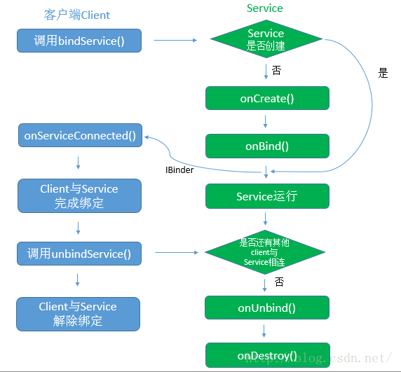
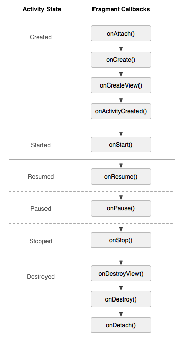

### Service知识点

#### 1. startServoce的生命周期

> startservice--->onCreate--->onStartCommand---->service运行中
>
> --->外部调用stopService（或自身调用stopSelf）--->onDestory--->service停止

* 一个service可以通过startservice启动多次，但是oncreate只会调用一次
* onstartCommand调用的次数就是startservice启动的次数
* onStartCommand需返回一个整数，用来描述在杀死服务后应该如何继续运行。
  * START_NOT_STICKY:Service因内存不足而被系统kill后，系统不会尝试重建Service
  * START_STIKY:内存再次空闲时，重建服务，调用onStartCommand，但传入的Intent为null，除非有挂起的Intent，如pendingintent。这个比较适用于不执行命令、但无限期运行并等待作业的媒体播放器。
  * START_REDELIVER_INTENT:会重建服务，并传递最后一个intent给onStartCommand()，任何挂起 Intent均依次传递。这个值适用于主动执行应该立即恢复的作业（例如下载文件）的服务。

* onStartCommand（Intent intent, int flags, int startId）中flags表示启动请求时是否有额外数据，可选值：
  * 0：代表没有
  * START_FLAG_REDELIVERY：代表onStartCommand的返回值为START_REDELIVER_INTENT，在重建服务调用onStartCommand是flags的值
  * START_FLAG_RETRY ：代表当onStartCommand调用后一直没有返回值时，会尝试重新去调用onStartCommand()。

#### 2. BindServoce的生命周期

> bindservice--->onCreate--->onBind---->service运行中
>
> --->外部调用unBindService--->onUnbind--->onDestory--->service停止

* 客户端与绑定服务之间的通信
  * 扩展 Binder 类 ：通过扩展 Binder 类并从 onBind() 返回它的一个实例。客户端收到 Binder 后，可直接访问 Binder 以及Service 中可用的公共方法。如果我们的服务只是自有应用的后台工作线程，则优先采用这种方法
  * 使用 Messenger ：通过它可以在不同的进程中共传递Message对象，在Message中可以存放传递的数据，然后在进程间传递。Messenger 会在单一线程中创建包含所有请求的队列，也就是说Messenger是以串行的方式（一个一个处理）处理客户端发来的消息。
  * 使用 AIDL：如果有大量并发请求，可以通过AIDL实现跨经常通信。 但在此情况下，服务必须具备多线程处理能力，并采用线程安全式设计。
* 调用bindservice时，需要传入一个ServiceConnection对象它只有两个方法：
  * onServiceConnected(ComponentName name, IBinder service)，其中service便是服务端返回的IBinder实现类对象
  * onServiceDisconnected(ComponentName name)，服务意外中断时（例如当服务崩溃或被终止时）调用该方法。**注意:当客户端取消绑定时，系统不会调用该方法**。
* 多个客户端bind一个服务时，只有第一个客户端绑定时，才会调用onBind方法，之后不会再次调用该方法；当最后一个客户端取消绑定时，服务才会被销毁。服务的绑定是通过异步执行的



* 通过Messenger进行通信

  ```java
  //服务端
   /**
       * 用于接收从客户端传递过来的数据
       */
      class IncomingHandler extends Handler {
          @Override
          public void handleMessage(Message msg) {
              switch (msg.what) {
                  case MSG_SAY_HELLO:
               //回复客户端信息,该对象由客户端传递过来
                      Messenger client=msg.replyTo;
                      //获取回复信息的消息实体
                      Message replyMsg=Message.obtain(null,MessengerService.MSG_SAY_HELLO);
                      Bundle bundle=new Bundle();
                      bundle.putString("reply","ok~,I had receiver message from you! ");
                      replyMsg.setData(bundle);
                      //向客户端发送消息
                      try {
                          client.send(replyMsg);
                      } catch (RemoteException e) {
                          e.printStackTrace();
                      }
                      break;
                  default:
                      super.handleMessage(msg);
              }
          }
      }
  
      /**
       * 创建Messenger并传入Handler实例对象
       */
      final Messenger mMessenger = new Messenger(new IncomingHandler());
  
      /**
       * 当绑定Service时,该方法被调用,将通过mMessenger返回一个实现
       * IBinder接口的实例对象
       */
      @Override
      public IBinder onBind(Intent intent) {
          return mMessenger.getBinder();
      }
  
  
  //客户端
   /**
       * 实现与服务端链接的对象
       */
      private ServiceConnection mConnection = new ServiceConnection() {
          public void onServiceConnected(ComponentName className, IBinder service) {
              /**
               * 通过服务端传递的IBinder对象,创建相应的Messenger
               * 通过该Messenger对象与服务端进行交互
               */
              mService = new Messenger(service);
              mBound = true;
          }
  
          public void onServiceDisconnected(ComponentName className) {
              // This is called when the connection with the service has been
              // unexpectedly disconnected -- that is, its process crashed.
              mService = null;
              mBound = false;
          }
      };
  
   /**
       * 用于接收服务器返回的信息
       */
      private Messenger mRecevierReplyMsg= new Messenger(new ReceiverReplyMsgHandler());
  
  
      private static class ReceiverReplyMsgHandler extends Handler{
          private static final String TAG = "zj";
  
          @Override
          public void handleMessage(Message msg) {
              switch (msg.what) {
                  //接收服务端回复
                  case MessengerService.MSG_SAY_HELLO:
                      Log.i(TAG, "receiver message from service:"+msg.getData().getString("reply"));
                      break;
                  default:
                      super.handleMessage(msg);
              }
          }
      }
  
   	public void sayHello(View v) {
          if (!mBound) return;
          // 创建与服务交互的消息实体Message
          Message msg = Message.obtain(null, MessengerService.MSG_SAY_HELLO, 0, 0)
           //把接收服务器端的回复的Messenger通过Message的replyTo参数传递给服务端
          msg.replyTo=mRecevierReplyMsg;
          try {
              //发送消息
              mService.send(msg);
          } catch (RemoteException e) {
              e.printStackTrace();
          }
      }
  ```

#### 4. 关于启动服务与绑定服务间的转换问题

* 先绑定服务后启动服务

  如果当前Service先以绑定状态运行，然后再以启动状态运行，那么绑定服务将会转为启动服务运行，如果之前绑定的宿主（Activity）被销毁了，也不会影响服务的运行，服务还是会一直运行下去，调用stopservice停止服务或者内存不足时才会销毁该服务。

* 先启动服务后绑定服务

  如果当前Service实例先以启动状态运行，然后再以绑定状态运行，当前启动服务并不会转为绑定服务，但是还是会与宿主绑定，即使宿主解除绑定后，服务依然按启动服务的生命周期在后台运行。

* 总结：

  > 关于操作Service
  >
  > - startService,stopService只能开启或关闭Service，但却无法操作Service
  > - bindService,unBindeService除了绑定service，还能操作service
  >
  > 关于service何时销毁
  >
  > - startService开启的service，调用者退出后service仍然存在
  > - bindService开启的service，调用者均退出后，service销毁

#### 5. 服务Service与线程Thread的区别

* Thread 是程序执行的最小单元，它是分配CPU的基本单位。线程与App所在进程之间资源共享，从Linux角度来说进程与线程除了是否共享资源外，并没有本质的区别，在CPU看来进程或线程无非就是一段可执行的代码，CPU采用CFS调度算法，保证每个task都尽可能公平的享有CPU时间片。
* Service是Android系统中的组件，服务是运行在主线程上的，因此在Service中是不可以执行耗时操作的，否则系统会报ANR异常，之所以称Service为后台服务，大部分原因是它本身没有UI。

#### 6. Android 5.0以上的隐式启动问题

Android 5.0之后google出于安全的角度禁止了隐式声明Intent来启动Service。解决方式如下：

* 设置Action和packageName

  ```java
  final Intent serviceIntent=new Intent(); serviceIntent.setAction("com.android.ForegroundService");
  serviceIntent.setPackage(getPackageName());//设置应用的包名
  startService(serviceIntent);
  ```

* 将隐式启动转换为显示启动

  ```java
  public static Intent getExplicitIntent(Context context, Intent implicitIntent) {
      // Retrieve all services that can match the given intent
       PackageManager pm = context.getPackageManager();
       List<ResolveInfo> resolveInfo = pm.queryIntentServices(implicitIntent, 0);
       // Make sure only one match was found
       if (resolveInfo == null || resolveInfo.size() != 1) {
           return null;
       }
       // Get component info and create ComponentName
       ResolveInfo serviceInfo = resolveInfo.get(0);
       String packageName = serviceInfo.serviceInfo.packageName;
       String className = serviceInfo.serviceInfo.name;
       ComponentName component = new ComponentName(packageName, className);
       // Create a new intent. Use the old one for extras and such reuse
       Intent explicitIntent = new Intent(implicitIntent);
       // Set the component to be explicit
       explicitIntent.setComponent(component);
       return explicitIntent;
      }
  
  //调用方式
  Intent mIntent=new Intent();//辅助Intent
  mIntent.setAction("com.android.ForegroundService");
  final Intent serviceIntent=new Intent(getExplicitIntent(this,mIntent));
  startService(serviceIntent);
  
  ```

#### 7. 前台服务以及通知发送

 前台服务必须为状态栏提供通知，除非服务停止或从前台删除，否则不能清除通知。设置前台服务的方法如下：

* startForeground(int id, Notification notification) 
  该方法的作用是把当前服务设置为前台服务，其中id参数代表唯一标识通知的整型数，需要注意的是提供给 startForeground() 的整型 ID 不得为 0，而notification是一个状态栏的通知。

* stopForeground(boolean removeNotification) 

  该方法是用来从前台删除服务，此方法传入一个布尔值，指示是否也删除状态栏通知，true为删除。 注意该方法并不会停止服务。 但是，如果服务正在前台运行时将其停止，则通知也会被删除。

#### 8. 如何保证服务不被杀死

* 因内存资源不足而杀死Service ，可将onStartCommand() 方法的返回值设为 START_STICKY或START_REDELIVER_INTENT；也可将Service设置为前台服务，这样就有比较高的优先级。

* 用户通过 settings -> Apps -> Running -> Stop 方式杀死Service。service的onDestory方法会被调用，所以可以在onDestory() 中发送广播重新启动。

### IntentService知识点

由于service工作在主线程，如果需要进行一些耗时操作时，则需要开启新线程去处理。所以android提供一个service的扩展类IntentService。

* ,继承自Service并处理异步请求的一个抽象类，在 IntentService 内有一个工作线程来处理耗时操作
* 启动 IntentService 多次，每一个耗时操作会以工作队列的方式在 onHandleIntent 中按照先后顺序处理
* 它可以用于在后台执行耗时的异步任务，当任务完成后会自动停止，不必调用 stopSelf()。
* 它拥有较高的优先级，不易被系统杀死（继承自Service的缘故），比较适合执行一些高优先级的异步任务
* 它内部通过HandlerThread和Handler实现异步操作
* 创建IntentService时，只需实现onHandleIntent和构造方法，onHandleIntent为异步方法，可以执行耗时操作

#### IntentService源码简析

* 在onCreate的时候会创建一个HandlerThread对象，并启动线程。紧接着创建ServiceHandler对象，用来处理消息。ServiceHandler将获取HandlerThread的Looper就可以开始正常工作了
* 每次启动服务，都调用onStartCommand方法，此方法调用onStart方法，通过mServiceHandler将intent转换为Message发送给HandlerThread的消息队列。最后会把数据传个onHandleIntent方法处理。
* 每次处理完onHandleIntent后，都会调用stopSelf(int startId)，与stopSelf()立即停止不同，此方法会等待所有消息都处理完后才终止服务。所以不用手动去停止服务

#### 为什么不建议通过 bindService() 启动 IntentService

IntentService 源码中的 onBind() 默认返回 null；不适合 bindService() 启动服务

#### 为什么多次启动 IntentService 会顺序执行事件，停止服务后，后续的事件得不到执行？

IntentService 中使用的 Handler、Looper、MessageQueue 机制把消息发送到线程中去执行的，所以多次启动 IntentService 不会重新创建新的服务和新的线程，只是把消息加入消息队列中等待执行。

服务停止调用onDestory方法，该方法会调用mServiceLooper.quit()，清除消息队列中的消息，所以后续的事件得不到执行


##### 什么情况下，Activity的onNewInstent()方法会执行？

答：与Activity的启动模式相关。当Activity的实例已经存在，并且此时的启动模式为SingleTask和SingleInstance时，会触发此方法；此外，当Activity处于栈顶且启动模式为SingleTop也会触发。

##### onActivityResult的何时回调执行？

startActivity()方法，最终都是调用`startActivityForResult()`方法，只要`equestCode >= 0`时，`onActivityResult()`会被调用，并且在onResume之前调用

当启动模式为singleTask时，startActivityForResult()启动Activity后，会出现立即执行onActivityResult()函数

##### Fragment的生命周期

Fragment不能独立存在，它的生命周期受Activity影响。



* onAttach():当该Fragment被添加到Activity时被调用。该方法只会被调用一次。
* onCreate()：创建Fragment时被调用。该方法只会被调用一次。
* onCreateView()：每次创建、绘制该Fragment的View组件时回调该方法，Fragment将会显示该方法返回的View组件。
* onActivityCreated()：与Fragment绑定的Activity的onCreate方法已经执行完成并返回，在该方法内可以进行与Activity交互的UI操作，所以在该方法之前与Activity提前进行交互操作，会引发空指针异常。
* onStart()：Fragment由不可见变为可见状态。
* onResume()：Fragment处于活动状态，用户可与之交互。
* onPause()：Fragment依然可见，用户不能与之交互。
* onStop()：Fragment完全不可见。
* onDestroyView()：销毁与Fragment有关的视图，但未与Activity解除绑定，依然可以通过onCreateView方法重新创建视图。通常在ViewPager+Fragment的方式下会调用此方法。
* onDestroy()：销毁Fragment时被回调。该方法之后被调用一次。
* onDetach()：将该Fragment从Activity中删除、替换完成时回调该方法，在onDestroy()方法后一定会回调onDetach()方法。该方法只会被调用一次。

##### Fragment的栈管理

Fragment的添加、替换、删除、隐藏显示灯操作都是通过FragmentTransaction来进行，但是**transaction只是记录了从一个状态到另一个状态的变化过程，如果需要记录这个事务的变化过程，则需要调用addToBackStack方法将事务添加到回退栈中去，点击手机回退键时，因为transaction的状态变化过程被保存，则可以将事务的状态变化过程还原。**值得注意的是：

* 如果使用了replace方法（remove 和 addd 合体），如果不添加到回退栈中去，那前一个Fragment实例会被销毁，即会调用onDestroy，onDetach方法。如果已添加到回退栈了，实例不会被销毁，但是视图层次依然会被销毁，即会调用onDestoryView和onCreateView。
* 当使用hide、show方法来控制Fragment时，Fragmen生命周期将不执行onResume、onPause方法，将回调onHiddenChanged。
* 如果要在Activity可能丢失状态的情况下提交事务，使用commitAllowingStateLoss()

##### Fragment重叠的问题

* 原因分析：
  * replace：可以避免重叠的问题，但是每次replace会把生命周期全部执行一遍
  * add、hide、show：避免了可能重复加载刷新数据的问题，但是会出现重叠的问题
  * 当Activity 被系统回收时，会主动调用 onSaveInstance() 方法来保存视图层（View Hierarchy），所以当 Activity 再次被重建时，之前被实例化过的 Fragment 依然会出现在 Activity 中。
* 解决方法：
  * 在onSaveInstanceState方法中，在FragmentActivity保存所有Fragment状态前把Fragment从FragmentManager中移除掉。
  * 或者在onSaveInstanceState中去保存fragment，当activity被恢复时，取出这些fragment即可。

##### Serializable 和 Parcelable 的区别

* Parcelable 类比 Serializable 性能高

* Serializable 在序列化的时候会产生大量的临时变量，从而引起频繁的 GC
* Parcelable 不能使用在要将数据存储在磁盘上的情况。在这 种情况下，建议用 Serializable

##### apk安装卸载过程

* 安装过程：复制apk安装包到data/app目录下，解压并扫描安装包，把dex文件(dalvik字节码)保存到dalvik-cache目录，并data/data目录下创建对应的应用数据目录。
* 卸载过程：删除安装过程中在上述三个目录下创建的文件及目录。

##### 进程间的通信方式

