# UML与软件设计原则

### UML的定义

- uml是统一的建模语言(Unified Modeling Language)
- 用来为面向对象开发系统的产品进行说明可视化和编制文档的方法
- 它是一种标准的图形化建模语言，是面向对象分析与设计的一种标准表示

### UML2.2分类

uml2.2一共定义了14种图示:

* 结构式图形:强调的是系统式的建模
  * 静态图(类图, 对象图, 包图)
  * 实现图(组件图, 部署图)
  * 剖面图
  * 复合结构图
* 行为式图形:强调系统模型种触发的事件
  * 活动图
  * 状态图
  * 用例图
* 交互式图形:属于行为式图形子集合,强调系统模型种资料流程
  * 通信图
  * 交互概述图
  * 时序图
  * 时间图

#### UML类图

用于表示类,接口,实例等之间相互的静态关系

* UML箭头方向:从子类指向父类
* 空心三角头表示继承或实现, 实线表示继承, 虚线表示实现

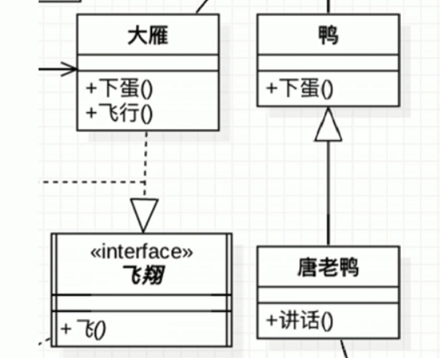

* UML是一种开放的方法
* 用于说明,可视化,构建和编写一个正在开发的面向对象的,软件密集系统的制品的开放方法
* 

* 箭头表示关联或依赖的关系

  * 关联关系

    * 表示一个类对象和另一个类对象又关联;通常是一个类中有另一个类对象做为属性

    * 用实线表示

  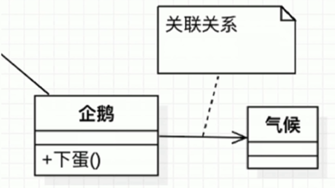

  * 依赖关系

    * 表示一种使用关系,一个类需要借助另一个类来实现功能;一般是一个类使用另一个类做为参数使用或者返回值

    * 用虚线表示

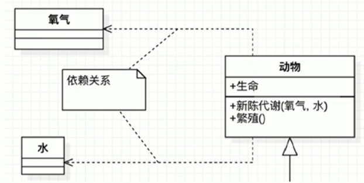

* 空心菱形表示聚合

  * 整体和局部的关系,两者有着独立的生命周期,是has a的关系
  * 是弱关系

  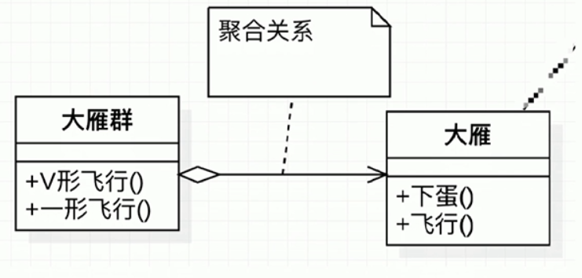

* 实心菱形表示组合

  * 整体与局部的关系,两者有相同的生命周期,是contains a的关系
  * 强关系
  * 其中数字的表达为,有多少个实例

  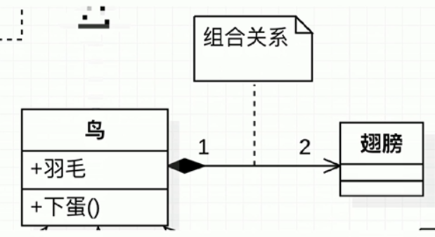

* 具体类图的表示:

  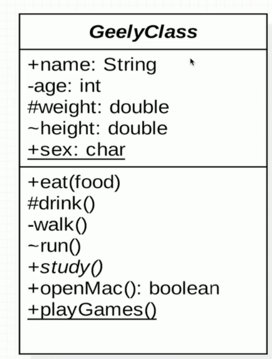

  * +:public的权限
  * -:private的权限
  * ~:default的权限
  * #:protect的权限
  * 下划线:表示static
  * 冒号:后面代表属性的类型或方法返回值类型
  * 斜体(如:study()):表示方法是abstract的
  * 类名为斜体:表示是抽象类

#### UML时序图

显示对象之间交互的图,这些对象是按时间顺序排列的

基本元素:

* 角色:可以是人或者其他系统，子系统

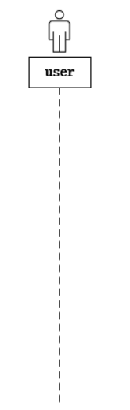

* 对象:交互的主体，接受发送消息的主体，最基本的元素

  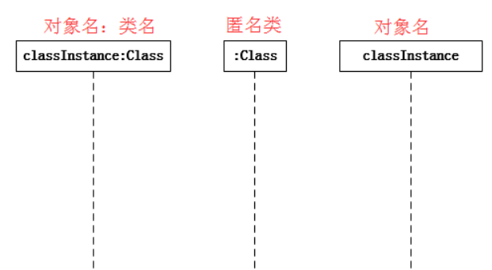

* 生命线:角色和对象下面垂直的虚线。代表角色和对象在一段时间类存在

* 激活:对象操作执行时期，处于激活的状态。使用条状矩形表示，附着于对象生命线上

  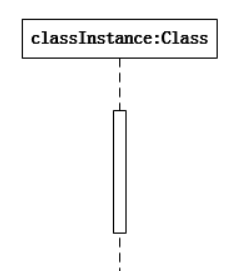

* 消息:对象之间发出的交互

  * 同步消息:发送人需要等待消息的响应。实心箭头表示

    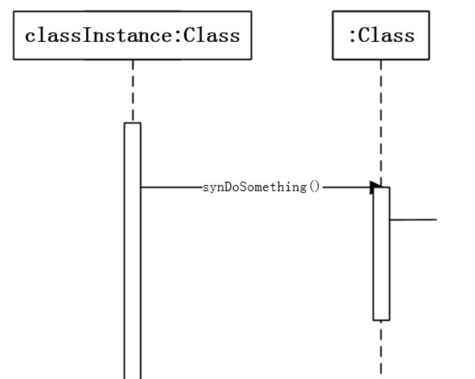

  * 异步消息:发送不需等待消息的响应。线性箭头表示。

    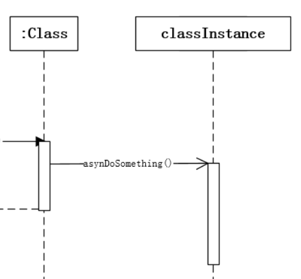

  * 返回消息:虚线的线性箭头表示

    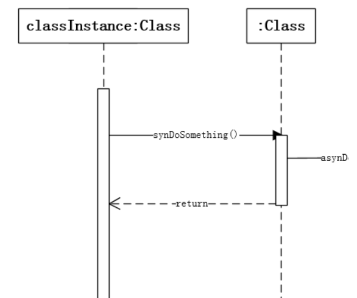

  * 自关联消息:自身调用自身的方法

    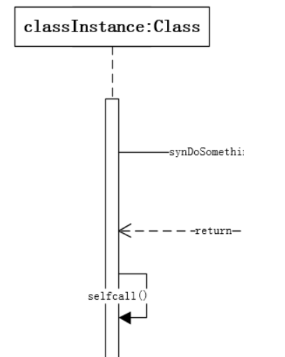

### 软件设计七大原则

* 开闭原则
* 依赖倒置原则
  * 定义：高层模块不应该依赖低层模块，二者都应该依赖其抽象
  * 抽象不应该依赖细节，细节应该依赖抽象
  * 针对接口编程，不要针对实现编程
  * 优点：
    * 减少类间的耦合性
    * 提高系统稳定性
    * 提高代码可读性和可维护性
    * 可降低修改程序所造成的风险
* 